# Avaliação Visual — Gestão de CME (botões, filtros e posicionamento)

> **Documento histórico.** Desde 2026-07-21, o estado atual do módulo `gestao_cme` está
> consolidado em [`casos-de-uso-gestao-cme.md`](casos-de-uso-gestao-cme.md) — ver §11.1
> para o resumo de cada achado abaixo e como foi resolvido (todos os 13 itens foram
> implementados). Mantido aqui como registro das evidências visuais (screenshots em
> `docs/assets/avaliacao-visual-cme/`) e das medições originais — não reflete o
> comportamento atual das telas.

> Data: 2026-07-20 · Complementa `docs/casos-de-uso-gestao-cme.md`.
> Metodologia: aplicação executada localmente (Django dev server, SQLite), populada com
> dados sintéticos (turmas, alunos, abrigos, movimentações, empréstimos — sem relação com
> dados reais de produção) e navegada com Chromium via Playwright, autenticado como
> superusuário. Viewports testados: desktop 1440×900 e mobile 390×844 (iPhone 12/13).
> Todas as capturas estão em `docs/assets/avaliacao-visual-cme/`.
>
> Diferente da auditoria de casos de uso (que leu código), este documento é baseado em
> **observação direta das telas renderizadas** — cada achado abaixo foi visto na tela, não
> inferido do código, e depois confirmado no CSS/template para apontar a causa exata.

---

## Resumo executivo

| # | Achado | Severidade | Onde |
|---|---|---|---|
| 1 | Toda tabela de listagem é mais larga que o próprio container e esconde a coluna de Ações | **Alta** | Movimentações, Alunos por turma, Abrigos, Materiais, Kits, Empréstimos (as 6 listagens do módulo) |
| 2 | Dropdown de busca de aluno empurra os campos abaixo (layout shift a cada tecla) | **Alta** | Registrar entrada, Registrar saída, Novo empréstimo |
| 3 | Ordem/destaque dos botões "Registrar entrada" e "Registrar retirada" é invertida entre o Portal e o restante do CME | **Média** | Portal vs. menu lateral do CME |
| 4 | Coluna "Última atualização" em Abrigos está estruturalmente sempre vazia | **Média** | Tela Abrigos |
| 5 | "Novo empréstimo" só atualiza turmas, não alunos, mas usa o mesmo buscador de aluno | **Média** | Tela Novo empréstimo |
| 6 | Coluna "Quantidade" do kit convive com "Disponíveis" sem diferença clara e nunca é usada pelo fluxo de empréstimo | **Baixa** | Tela Kits |
| 7 | Métricas do Portal (exceto o alerta) não são clicáveis, ao contrário dos KPIs da Visão Geral do CME | **Baixa** | Portal |
| 8 | Filtro de período da Visão Geral aparece em dois lugares com aparências diferentes | **Baixa** | Visão Geral do CME |

---

## 1 · [Alta] Tabelas mais largas que o container — coluna de Ações sempre parcialmente escondida

**O que se vê:** em toda tela de listagem do módulo, ao carregar a página em um notebook
comum (1440px de largura), a tabela é cortada à direita. A rolagem horizontal existe (barra
fina, pouco perceptível), mas nada na tela avisa que há mais colunas — o usuário só descobre
arrastando a tabela por tentativa.

| Estado inicial (coluna de Ações fora da tela) | Rolado até o fim (coluna inicial esconde) |
|---|---|
| 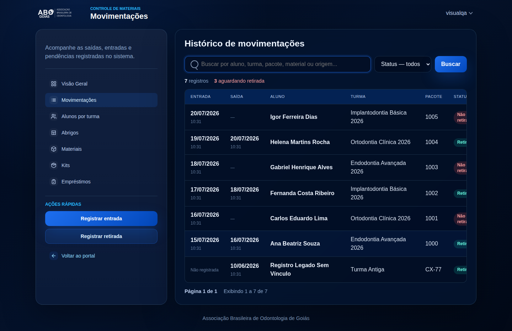 | 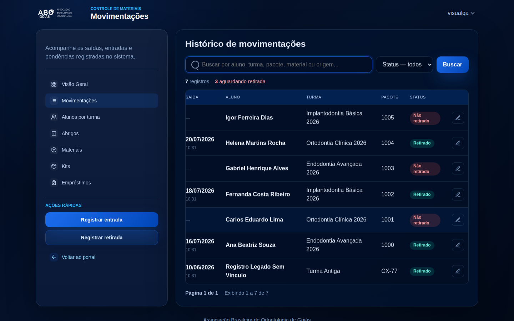 |

O mesmo ocorre em Materiais — ao rolar para alcançar o ícone de editar, a coluna
"Material"/"Identificação" desaparece à esquerda:

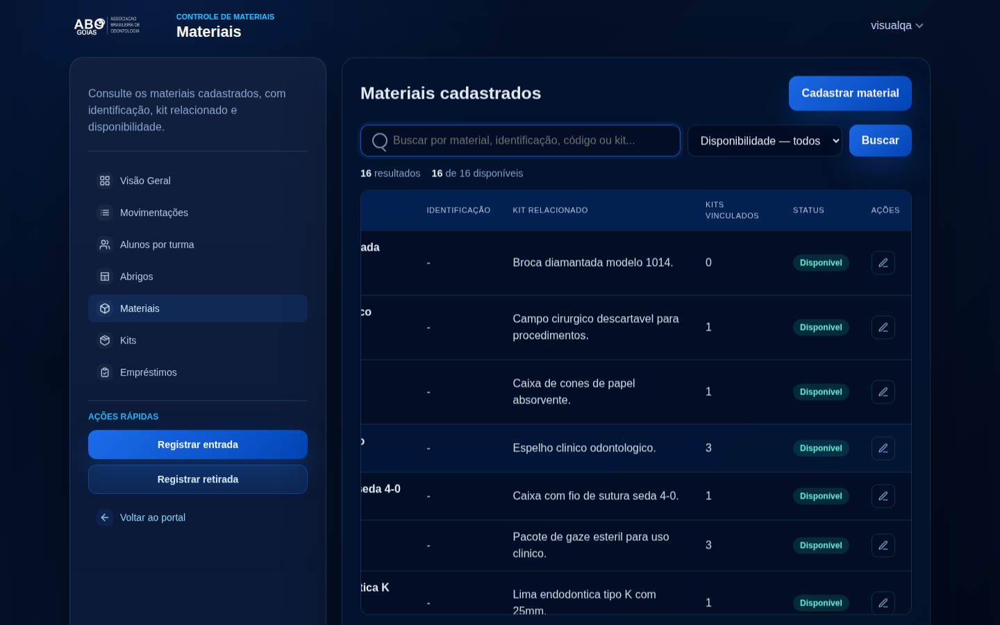

**Medido diretamente no navegador** (`scrollWidth` vs. `clientWidth` do wrapper da tabela,
nas 6 telas de listagem, a 1440px de viewport):

| Tela | Largura do container | Largura exigida pela tabela | Overflow |
|---|---|---|---|
| Movimentações | 792px | 920px | **128px** |
| Alunos por turma | 792px | 920px | **128px** |
| Abrigos | 792px | 920px | **128px** |
| Materiais | 792px | 920px | **128px** |
| Kits | 792px | 920px | **128px** |
| Empréstimos | 792px | 920px | **128px** |

O número é idêntico nas seis telas porque a causa é uma única regra global:

```css
/* static/css/components.css:1028 */
.data-table {
    min-width: 920px;
}
```

Essa `min-width` fixa é aplicada à classe `.data-table` usada por **todas** as tabelas do
módulo, independentemente de quantas colunas cada uma tem. O wrapper que deveria rolar
(`.data-table-wrap`, `overflow-x: auto`) tem sua largura definida pelo card em que está —
792px nesse layout — então qualquer tabela sempre excede o espaço disponível pelos mesmos
128px, mesmo tabelas com poucas colunas (Empréstimos, Abrigos).

**No celular (390px) o problema é mais grave** — sem espaço nenhum de sobra, a tabela mostra
2-3 das 5-7 colunas e a coluna de Ações fica completamente fora do viewport inicial, sem
nenhuma pista visual de que existe mais conteúdo ao lado:

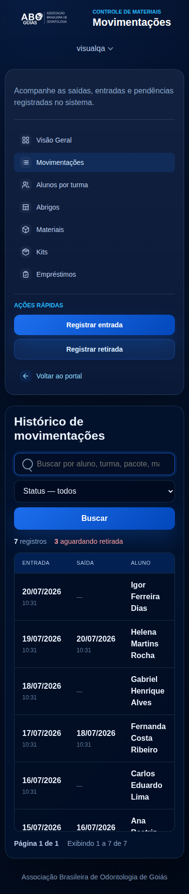

**Impacto:** em qualquer listagem, para editar/excluir um registro o usuário precisa (a)
localizar a linha certa, (b) rolar para a direita para achar o botão de ação, perdendo de
vista as colunas que confirmam que é a linha certa (data, nome do aluno, turma), e (c) rolar
de volta para conferir. É um atrito repetido em **toda** ação de edição/exclusão do módulo.

**Recomendação:**
- Remover o `min-width: 920px` fixo e global de `.data-table`; se algum caso específico
  precisar de largura mínima, aplicar por tabela (classe própria), não pela regra genérica.
- Ou, mais robusto: manter a coluna de Ações fixa (`position: sticky; right: 0`) para que
  role junto com o conteúdo mas continue sempre visível — padrão comum em tabelas com scroll
  horizontal.
- Adicionar uma pista visual de rolagem (sombra/gradiente na borda direita do
  `.data-table-wrap` quando há conteúdo cortado) para quem não notar a barra de rolagem fina.

---

## 2 · [Alta] Busca de aluno empurra o formulário para baixo a cada tecla digitada

**O que se vê:** ao digitar no campo "Buscar aluno por nome ou matrícula..." em Registrar
entrada, Registrar saída ou Novo empréstimo, a lista de resultados aparece **entre** o campo
de busca e os campos seguintes do formulário — não como um menu flutuante sobre o resto da
tela. Cada letra digitada muda a altura da lista e desloca "Quantidade de pacotes", "Data e
hora" e "Observações" para baixo:

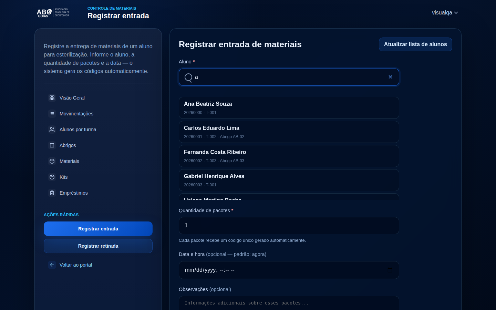

**Causa no CSS:**

```css
/* static/css/components.css:297 */
.search-results-wrap {
    margin-top: 8px;   /* sem position: absolute — participa do fluxo normal do documento */
}
.search-results {
    max-height: 300px;
    overflow-y: auto;
}
```

Sem `position: absolute` (ancorado ao campo de busca) e um `z-index` para flutuar sobre o
restante do formulário, o componente de resultados empurra tudo abaixo dele. Como esse é o
**primeiro campo** do formulário em Registrar entrada/Novo empréstimo, o formulário inteiro
"pula" a cada busca.

**Impacto:** desorienta o usuário (o campo que ele ia preencher em seguida muda de posição
na tela) e é mais perceptível em conexões/máquinas mais lentas, onde o salto acontece de
forma visível após cada resposta do HTMX.

**Recomendação:** tornar `.search-results-wrap` um overlay posicionado (`position: absolute`,
ancorado ao campo pai que já teria `position: relative`), com `z-index` acima dos campos
seguintes — padrão comum de autocomplete, evita o layout shift sem mudar o comportamento de
busca/seleção já implementado.

---

## 3 · [Média] Ordem dos botões "Registrar entrada" / "Registrar retirada" inconsistente

**Portal** (`gestao_cme/templates/gestao_cme/portal.html:84-86`) — "Registrar retirada"
aparece **primeiro**, como botão primário (azul cheio); "Registrar entrada" vem depois, como
secundário:

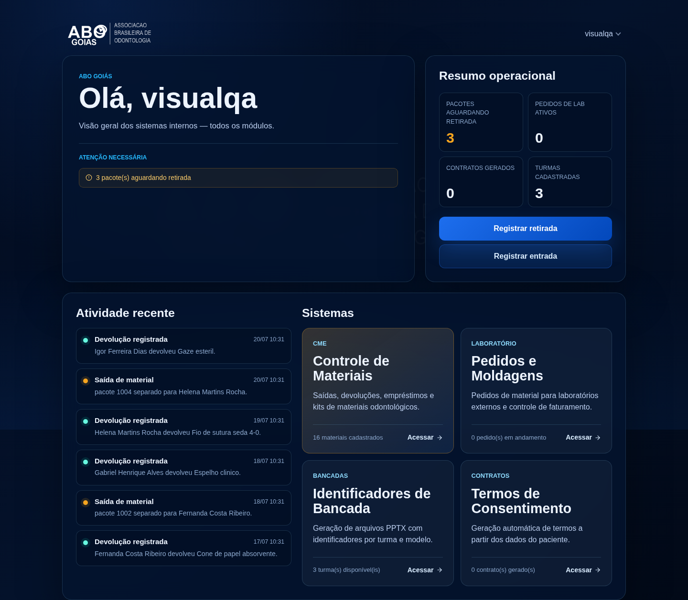

**Menu lateral do CME**, presente em todas as outras telas do módulo
(`gestao_cme/templates/gestao_cme/partials/menu.html:17-18`) — a ordem é invertida:
"Registrar entrada" primeiro/primário, "Registrar retirada" depois/secundário:

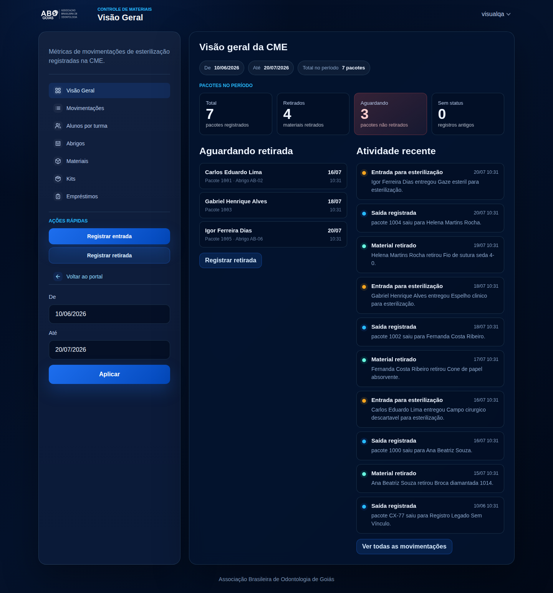

Como o ciclo real de um pacote sempre começa pela entrada (UC-03) e só depois pode ter uma
retirada (UC-04), a ordem do menu lateral segue a lógica operacional; a do Portal é a exceção.
Um usuário que aprende "entrada primeiro" navegando pelo CME encontra a ordem trocada assim
que volta à tela inicial — pequena fricção, mas sistemática (aparece em toda visita ao
Portal).

**Recomendação:** unificar a ordem (e qual delas é o botão primário) entre o Portal e o menu
lateral do CME — confirmar com o time qual ação é de fato mais frequente no dia a dia para
decidir qual dos dois deve ser o botão primário.

---

## 4 · [Média] Coluna "Última atualização" em Abrigos nunca mostra nada

Na tela Abrigos, toda linha mostra "-" na coluna "Última atualização", para todos os 8
abrigos de exemplo, sem exceção:

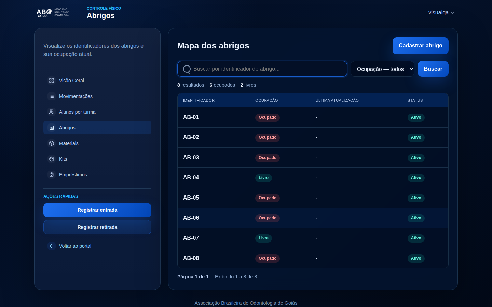

**Causa:** o template usa `abrigo.ultima_sincronizacao`
(`gestao_cme/templates/gestao_cme/armarios.html:82`), campo que só é preenchido quando um
registro é sincronizado com o **Eduq**. Mas `Abrigo` não tem nenhuma integração com o Eduq —
só `Turma` e `Aluno` são sincronizados (`services/eduq_sync.py`). Ou seja, essa coluna está
ligada a um campo que, para este modelo, nunca é escrito por nenhum fluxo do sistema — vai
mostrar "-" permanentemente, em qualquer ambiente.

**Recomendação:** remover a coluna (ela não carrega informação nova) ou, se a intenção era
mostrar quando o abrigo foi editado pela última vez, trocar a referência para
`abrigo.atualizado_em` (herdado de `ModeloBase`, atualizado a cada `save()` — esse sim
sempre tem valor).

---

## 5 · [Média] "Novo empréstimo" só sincroniza turmas, mas depende da mesma busca de aluno das outras telas

Registrar entrada e Registrar saída oferecem o botão **"Atualizar lista de alunos"**, que
sincroniza turmas **e** alunos com o Eduq. Novo empréstimo, que usa exatamente o mesmo
componente de busca de aluno, só oferece **"Atualizar turmas"**:

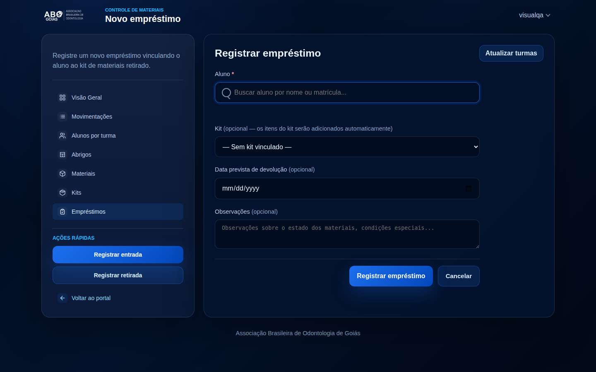

Comparar com Registrar entrada, onde o botão equivalente já traz alunos junto:

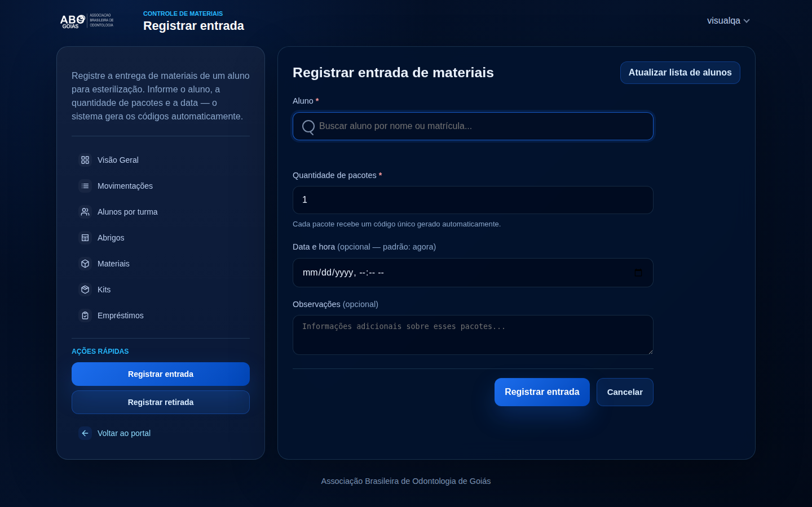

**Impacto:** se um coordenador for criar um empréstimo para um aluno matriculado há pouco
(ainda não sincronizado), a busca não vai encontrá-lo — e, diferente das outras duas telas,
aqui não há como corrigir isso sem sair da tela de empréstimo. É uma lacuna funcional, não só
visual: falta a mesma ação que já existe nas telas irmãs.

**Recomendação:** trocar o botão de Novo empréstimo por um equivalente ao "Atualizar lista de
alunos" das outras telas (a view `atualizar_alunos_eduq` já existe e faz exatamente isso).

---

## 6 · [Baixa] Coluna "Quantidade" do kit ao lado de "Disponíveis" sem diferença aparente

Na listagem de Kits, cada linha mostra "Quantidade: 0" e, ao lado, "Disponíveis" com a
contagem real de materiais do kit (5, 5, 5, 4 nos dados de exemplo):

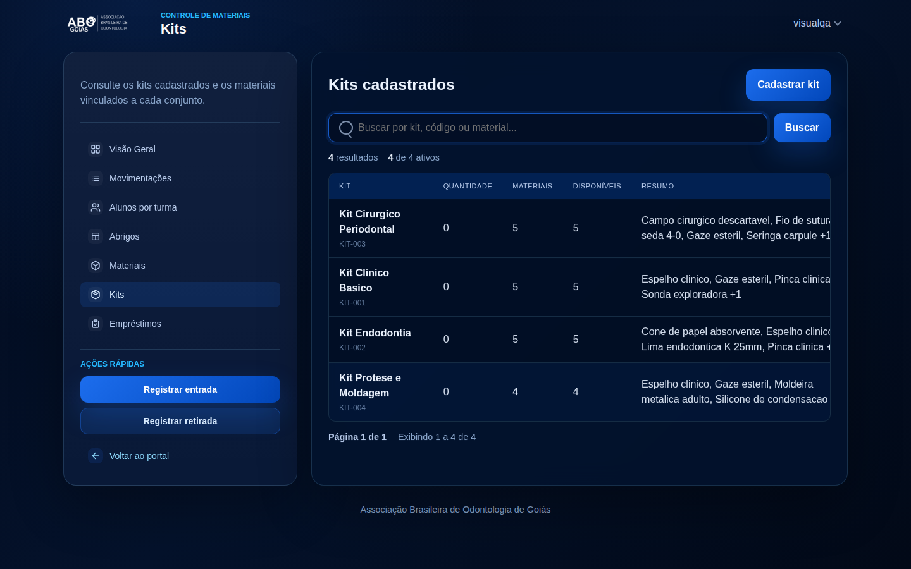

**Causa:** `Kit.quantidade` é um campo numérico preenchido manualmente no cadastro (formulário
`KitForm`), mas nada no fluxo de empréstimo (criar/devolver) o incrementa ou decrementa — ele
fica estático a partir do valor informado na criação (aqui, 0 em todos, porque o cadastro
via interface não pede esse número de forma guiada). Ao lado, "Disponíveis" é calculado a
partir dos materiais do kit e do campo `disponivel` de cada material — um número que se
comporta de forma completamente diferente.

**Impacto:** duas colunas numéricas adjacentes respondendo "quantos há?" com significados
diferentes e sem explicação visível tendem a ser lidas como contraditórias por quem não
conhece o modelo de dados.

**Recomendação:** ou remover "Quantidade" da listagem operacional (mantendo-a só no
Admin/cadastro), ou adicionar um rótulo/tooltip explicando a diferença — mesma abordagem já
usada para a coluna "Status" em Alunos por turma (ícone de informação com `title`).

**Resolvido em 2026-07-20:** adicionado tooltip (mesmo padrão `.th-with-hint`/`.th-hint` da
coluna Status) em "Quantidade", "Materiais" e "Disponíveis". "Quantidade" voltou a ser o
estoque cadastrado do kit, digitado manualmente no formulário — uma sincronização
automática com "Disponíveis" implementada numa rodada anterior foi revertida a pedido do
time, para que as duas colunas voltassem a responder perguntas distintas ("quantos kits
existem" vs. "quantos materiais da composição estão livres agora").

---

## 7 · [Baixa] Métricas do Portal não são clicáveis (exceto o alerta)

Os quatro números do card "Resumo operacional" no Portal (Pacotes aguardando retirada,
Pedidos de lab ativos, Contratos gerados, Turmas cadastradas — ver captura do achado 3) são
`<div>`s estáticos (`gestao_cme/templates/gestao_cme/portal.html:54-77`), sem link. O alerta
logo acima ("3 pacote(s) aguardando retirada") **é** um link (`portal.html:35-36`).

Compare com a Visão Geral do CME, onde todo KPI é clicável e abre a listagem já filtrada
(implementado na rodada 3 de melhorias, ver `melhorias-cme-contratos-2026-07.md`, item 13).

**Recomendação:** aplicar o mesmo padrão — pelo menos "Pacotes aguardando retirada" e "Turmas
cadastradas" apontam diretamente para telas existentes (Movimentações filtrado por pendentes,
Alunos por turma) e ganhariam o mesmo tratamento de link do card da Visão Geral.

---

## 8 · [Baixa] Filtro de período da Visão Geral aparece em dois lugares diferentes

No topo do conteúdo principal da Visão Geral, o período atual aparece como dois "chips"
somente leitura — "De 10/06/2026" / "Até 20/07/2026". O controle que de fato permite mudar
essas datas (dois campos + botão "Aplicar") fica na barra lateral esquerda, abaixo da
navegação e das ações rápidas:


**Impacto:** o usuário vê o filtro ativo em um lugar (topo do conteúdo) e precisa procurar em
outro, mais distante e abaixo de vários outros elementos de navegação, para alterá-lo. Não é
incorreto, mas o link visual entre "o que está filtrado" e "onde eu mudo isso" é fraco.

**Recomendação:** aproximar os dois — por exemplo, tornar os chips do topo clicáveis (abrindo
o mesmo formulário) ou mover o formulário de data para perto dos chips, deixando a barra
lateral só para navegação e ações rápidas.

**Resolvido em 2026-07-20:** o formulário de data foi movido da barra lateral para o topo do
conteúdo principal (`.filter-bar`, mesmo padrão usado em Movimentações/Empréstimos) e os três
chips somente leitura foram removidos — agora existe um único lugar para ver e alterar o
período. Os campos passaram de texto livre (`dd/mm/aaaa`) para `<input type="date">`, com
calendário nativo do navegador; o formato trafegado na URL também mudou de `dd/mm/aaaa` para
ISO (`aaaa-mm-dd`, o formato que o próprio `<input type="date">` envia), com o helper
`_parse_data_iso` (`views.py`, antigo `_parse_data_br`) compartilhado entre Visão Geral e
Movimentações para manter o link entre os KPIs e a listagem detalhada funcionando.

---

## Anexo — telas capturadas

| Tela | Rota |
|---|---|
| Login | `/login/` |
| Portal | `/` |
| Visão Geral (CME) | `/gestao-cme/visao-geral/` |
| Movimentações | `/gestao-cme/movimentacoes/` |
| Registrar entrada | `/gestao-cme/nova-entrada/` |
| Registrar saída | `/gestao-cme/nova-saida/` |
| Alunos por turma | `/alunos-por-turma/` |
| Abrigos (listar/editar) | `/abrigos/`, `/abrigos/<pk>/editar/` |
| Materiais (listar/editar) | `/materiais/`, `/materiais/<pk>/editar/` |
| Kits (listar/novo) | `/kits/`, `/kits/novo/` |
| Empréstimos (listar/novo) | `/emprestimos/`, `/emprestimos/novo/` |
| Editar movimentação | `/gestao-cme/<pk>/editar/` |
| Cadastrar aluno / turma | `/alunos-por-turma/novo/`, `/turmas/nova/` |
| Modal de confirmação de exclusão | acionado em Materiais → Editar → "Excluir material" |

Capturas em desktop (1440×900) e um subconjunto também em mobile (390×844): Portal,
Movimentações, Registrar entrada, Alunos por turma, Materiais, Empréstimos.

**Observação sobre os dados usados:** como o ambiente local não tinha turmas/alunos/
movimentações/abrigos cadastrados (só materiais e kits vêm na fixture `dados_exemplo`), foram
criados dados sintéticos apenas para esta avaliação visual (turmas, alunos, abrigos,
movimentações e dois empréstimos fictícios). Esses dados existiram somente no ambiente
efêmero desta sessão e não afetam nenhum ambiente real.
