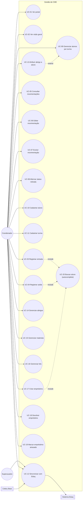

# Casos de Uso — Gestão e Controle de Materiais em Esterilização (CME)

> Documento gerado a partir de análise autônoma do código-fonte (`abo-goias/gestao_cme`),
> cruzando `models.py`, `views.py`, `forms.py`, `urls.py`, `permissoes.py`,
> `integrations/eduq.py`, templates e os documentos já produzidos pelo time
> (`auditoria-gestao-cme.md`, `melhorias-cme-contratos-2026-07.md`).
> Data: 2026-07-20 · Escopo: aplicação `gestao_cme` (app label legado `core`).
>
> Este documento **não implementa mudanças** — é a base de referência para priorizar
> melhorias de usabilidade e sistêmicas. Pontos que exigem decisão de negócio estão
> marcados explicitamente na seção 7 e **não devem ser resolvidos por suposição**.

---

## 1. Visão geral do sistema

A CME (Central de Material e Esterilização) da ABO Goiás controla o ciclo de vida de
pacotes de instrumentais odontológicos entregues por alunos de pós-graduação para
esterilização, além de cadastros de apoio (turmas, alunos, materiais, kits, armários,
abrigos individuais) e um fluxo paralelo de **empréstimo de kits**.

O sistema depende de uma integração externa, o **Eduq** (sistema acadêmico), fonte de
verdade para turmas e alunos. Não há cadastro de aluno "do zero" pensado como fluxo
principal — o cadastro manual existe como exceção para cobrir lacunas da sincronização.

Módulos internos do app (mapeados às rotas em `gestao_cme/urls.py`):

| Módulo | Rota principal | Função |
|---|---|---|
| Portal | `/` | Landing page com resumo cross-módulo (CME, Lab, Contratos) e tarefas pendentes |
| Visão Geral (Dashboard CME) | `/gestao-cme/visao-geral/` | KPIs de pacotes por período, atividade recente |
| Movimentações | `/gestao-cme/movimentacoes/` | Histórico completo de entradas/saídas, com edição e exclusão |
| Registrar entrada | `/gestao-cme/nova-entrada/` | Dá baixa de N pacotes de um aluno para esterilização |
| Registrar saída | `/gestao-cme/nova-saida/` | Confirma retirada de pacotes já esterilizados |
| Alunos por turma | `/alunos-por-turma/` | Cadastro acadêmico, atribuição de abrigo, sincronização Eduq |
| Abrigos | `/abrigos/` | Espaços físicos individuais de guarda |
| Materiais | `/materiais/` | Catálogo de itens controlados |
| Kits | `/kits/` | Conjuntos de materiais para empréstimo |
| Empréstimos | `/emprestimos/` | Ciclo de empréstimo de kit/material a um aluno |

---

## 2. Atores

| Ator | Natureza | Descrição |
|---|---|---|
| **Coordenador (operador CME)** | Humano, autenticado | Usuário do dia a dia: registra entradas/saídas, cadastra alunos/materiais, gerencia empréstimos. Hoje **sem distinção de permissão** — qualquer usuário autenticado tem acesso total às telas do CME (ver §6). |
| **Superusuário / Administrador** | Humano, autenticado | Acesso irrestrito, inclusive ao Django Admin (única forma de ajustar quantidade por material em um kit). Em `emprestimos_visiveis`, vê todos os empréstimos; coordenador comum só vê os próprios. |
| **Sistema Eduq** | Ator externo (API) | Fonte de verdade de turmas e alunos. Suporta apenas `listar_turmas()` e `listar_alunos(codigo_turma)` — **não** oferece busca de aluno por nome. |
| **Celery Beat (agendador)** | Ator de sistema | Dispara `sincronizar_eduq_task` diariamente às 04:00, sem intervenção humana. |
| **Aluno de pós-graduação** | Ator passivo (sujeito do registro) | Não acessa o sistema; é o titular dos pacotes, empréstimos e abrigo. Aparece nos casos de uso apenas como dado manipulado por outro ator. |

---

## 3. Diagrama de casos de uso

---

## 4. Casos de uso detalhados

Cada caso de uso traz: ator, pré-condições, fluxo principal, fluxos alternativos/exceção,
pós-condições, regras de negócio e — quando aplicável — a oportunidade de melhoria já
associada a ele (referenciando o backlog da seção 6).

### UC-01 · Acessar o portal inicial

- **Ator primário:** Coordenador / Superusuário.
- **View/rota:** `views.portal` → `/`
- **Pré-condição:** usuário autenticado (`@login_required`).
- **Fluxo principal:**
  1. Usuário acessa a raiz do sistema.
  2. Sistema agrega contadores dos módulos CME, Laboratório e Contratos (pacotes
     pendentes, materiais, turmas, pedidos de lab ativos, faturamento pendente, contratos
     gerados).
  3. Sistema monta uma lista de **tarefas pendentes** (pacotes aguardando retirada,
     faturamento de lab, moldagens sem pedido, envios de contrato ao Dental Office com
     falha) e uma lista de **atividade recente** (últimos eventos de todos os módulos,
     ordenados por data).
  4. Portal é renderizado com os cartões de resumo e os dois blocos.
- **Pós-condição:** usuário tem visão consolidada e pode navegar a qualquer módulo.
- **Observação sistêmica:** `apps_disponiveis` é um `set` fixo no código
  (`{"cme", "lab", "bancadas", "contratos"}`) — o próprio código já assinala isso como
  "ponto único de controle de visibilidade... quando grupos de permissão forem
  implementados, basta filtrar este set". Hoje **todo usuário autenticado vê todos os
  apps**, independente de função. Ver §6.

### UC-02 · Consultar a Visão Geral (Dashboard CME)

- **Ator primário:** Coordenador / Superusuário.
- **View/rota:** `views.cme_dashboard` → `/gestao-cme/visao-geral/`
- **Fluxo principal:**
  1. Usuário acessa a Visão Geral.
  2. Sem filtro de data informado, o sistema usa o intervalo **do primeiro registro até
     hoje** (não recorta o mês atual).
  3. Sistema calcula 4 KPIs mutuamente exclusivos e exaustivos: **Total**, **Retirados**,
     **Aguardando**, **Sem status** — todos a partir da mesma função `linhas_de_pacote()`
     usada pela listagem de movimentações (UC-05), garantindo que os números batam.
  4. Sistema lista até 10 pacotes aguardando retirada e até 12 eventos de atividade
     recente (que, diferente dos KPIs, contam eventos — não pacotes — para não esconder
     saídas do feed).
  5. Cada KPI é um link que abre a listagem de movimentações (UC-05) já filtrada e no
     mesmo intervalo de datas.
- **Fluxo alternativo:** usuário informa `data_inicio`/`data_fim` (formato `dd/mm/aaaa`);
  datas inválidas são silenciosamente descartadas (campo volta vazio, sem alertar o
  usuário — ver melhoria U-01 em §6).
- **Regra de negócio:** Total = Retirados + Aguardando + Sem status (garantida pela
  fonte única `linhas_de_pacote()`).
- **Risco sistêmico já registrado (B-07 da auditoria):** com o padrão "todo o histórico",
  a Visão Geral varre a tabela inteira a cada carga; sem índice em `data_hora` isso
  degrada com o crescimento do volume.

### UC-03 · Registrar entrada de pacotes para esterilização

- **Ator primário:** Coordenador.
- **View/rota:** `views.registrar_entrada` → `/gestao-cme/nova-entrada/`
- **Inclui:** UC-20 (Buscar aluno via autocomplete).
- **Pré-condição:** existe ao menos um aluno ativo cadastrado (via Eduq ou manual).
- **Fluxo principal:**
  1. Coordenador busca o aluno pelo autocomplete (nome/matrícula).
  2. Informa a **quantidade** de pacotes (1 a 50) e, opcionalmente, data/hora e
     observações (data/hora padrão = agora).
  3. Ao confirmar, o sistema gera um código sequencial por pacote —
     `max(código numérico existente) + n` — e cria N registros `Movimentacao(ENTRADA,
     retirado=False)` em uma única transação atômica.
  4. Sistema grava a confirmação (códigos gerados, aluno, abrigo, quantidade, data/hora)
     na **sessão** (não em `messages`) e redireciona (padrão POST/redirect/GET) para a
     mesma tela, onde a confirmação é exibida até o operador etiquetar os pacotes.
  5. Se o aluno não tiver abrigo cadastrado, o sistema **avisa mas não bloqueia** o
     registro.
- **Fluxo de exceção:** formulário inválido → erros exibidos, aluno selecionado é
  preservado (reconsulta por `pk` para repopular o chip do autocomplete).
- **Pós-condição:** N `Movimentacao` criadas com `origem=MANUAL`, `arquivo_origem="painel"`.
- **Risco sistêmico já registrado (B-07):** a geração de código varre **todas** as
  movimentações a cada chamada, **sem lock** — duas entradas concorrentes podem gerar
  código duplicado (`pacote_codigo` não tem `unique` constraint).
- **Melhoria de usabilidade associada:** nenhum contador visual de "quantos pacotes
  faltam etiquetar" além da lista de códigos — ver U-02 em §6.

### UC-04 · Registrar saída (retirada) de pacotes esterilizados

- **Ator primário:** Coordenador.
- **View/rota:** `views.registrar_saida` → `/gestao-cme/nova-saida/`
- **Inclui:** UC-20 (Buscar aluno, restrito a alunos com pendência via `pendencias=1`).
- **Fluxo principal (dois passos):**
  1. **Passo 1 — seleção do aluno:** tela sem `aluno_id` mostra o autocomplete e uma
     lista de "alunos com pendências" pré-calculada (`Aluno` com ao menos uma
     `Movimentacao(ENTRADA, retirado=False)`).
  2. **Passo 2 — confirmação de pacotes:** com `aluno_id`, o sistema lista os pacotes
     pendentes daquele aluno especificamente, ordenados por data de entrada.
  3. Coordenador marca os pacotes a retirar (checkbox) e confirma.
  4. Sistema cria uma `Movimentacao(SAIDA)` **por pacote selecionado**, vinculando-a
     explicitamente à entrada via `entrada_origem` (self-FK), e marca a entrada
     correspondente como `retirado=True` — tudo em uma transação atômica.
  5. Mensagem de sucesso com contagem e horário; redireciona para Movimentações (UC-05).
- **Fluxo de exceção:** nenhum pacote selecionado → mensagem de erro, permanece na tela.
- **Regra de negócio central:** o vínculo entrada↔saída é **gravado explicitamente**
  (não inferido por `pacote_codigo`, que não é confiável — ver docstring de
  `Movimentacao` e item 10 de `melhorias-cme-contratos-2026-07.md`).
- **Pós-condição:** para cada pacote retirado, existem 2 registros ligados (ENTRADA +
  SAIDA), exibidos como **1 linha** em UC-05.

### UC-05 · Consultar movimentações (histórico de pacotes)

- **Ator primário:** Coordenador / Superusuário.
- **View/rota:** `views.home` → `/gestao-cme/movimentacoes/`
- **Fluxo principal:**
  1. Sistema lista **uma linha por pacote**: cada linha é uma `ENTRADA` com colunas
     "Entrada" (sempre preenchida) e "Saída" (preenchida se já retirado). SAIDAs já
     vinculadas a uma entrada **não** viram linha própria.
  2. Registros **LEGADO** sem vínculo reconstruível aparecem como linha solta (só
     entrada, ou só saída, conforme o caso), sinalizado como "sem registro" em vez de
     inventar um par.
  3. Filtros disponíveis: texto livre (nome, matrícula, turma, código do pacote,
     material, arquivo de origem — todos acento-insensível via `nome_normalizado`),
     status (Retirado / Não retirado / Sem status), aluno específico (vindo de UC-09),
     intervalo de datas.
  4. Cada linha permite: alternar status de retirada (UC-08), editar (UC-06), excluir
     (UC-07).
- **Regra de negócio:** filtro de "Movimentação" (Entrada/Saída) foi **removido**
  deliberadamente na consolidação por pacote — não fazia mais sentido com uma linha por
  pacote; o filtro de Status cobre a mesma necessidade.
- **Pós-condição:** nenhuma (somente leitura, exceto pelas ações de linha).

### UC-06 · Editar movimentação

- **Ator primário:** Coordenador.
- **View/rota:** `views.editar_movimentacao` → `/gestao-cme/<pk>/editar/`
- **Fluxo principal:** edita `pacote_codigo`, `data_hora` e `observacoes` de um registro
  específico (ENTRADA ou SAIDA); aluno/turma/material **não são editáveis** aqui.
- **Pós-condição:** registro atualizado; mensagem de sucesso; volta para UC-05.
- **Observação:** não há trilha de auditoria (quem editou, valor anterior) — ver U-06.

### UC-07 · Excluir movimentação

- **Ator primário:** Coordenador.
- **View/rota:** `views.excluir_movimentacao` (POST) → `/gestao-cme/<pk>/excluir/`
- **Fluxo principal:**
  1. Se a movimentação é uma **SAIDA**, o sistema restaura a(s) `ENTRADA`
     correspondente(s) do mesmo aluno/pacote para `retirado=False` antes de excluir —
     evita que o pacote "suma" do fluxo de pendências.
  2. Registro é excluído permanentemente (hard delete, sem soft-delete/lixeira).
- **Regra de negócio:** exclusão de SAIDA é uma operação com efeito colateral em outro
  registro — comportamento correto, mas **irreversível e sem confirmação visível no
  código atual além do `data-confirm` do template** (verificar consistência de modal em
  todas as chamadas — ver U-05).

### UC-08 · Alternar status de retirada manualmente

- **Ator primário:** Coordenador.
- **View/rota:** `views.alternar_retirado` (POST) → `/gestao-cme/<pk>/alternar-retirado/`
- **Fluxo principal:** cicla o campo `retirado` em três estados: `None → True → False →
  None`. Usado como correção manual pontual, fora do fluxo padrão de UC-03/UC-04.
- **Risco:** alternar o status **não** cria/edita o vínculo `entrada_origem` nem a
  `Movimentacao` de SAIDA correspondente — pode gerar uma ENTRADA marcada como
  `retirado=True` sem uma SAIDA real (o sistema já lida com essa lacuna exibindo
  "Retirado — sem data" em UC-05, mas é uma divergência de dados introduzida
  manualmente). Não há aviso na UI sobre essa consequência — ver U-07.

### UC-09 · Gerenciar alunos por turma

- **Ator primário:** Coordenador / Superusuário.
- **View/rota:** `views.alunos_por_turma` → `/alunos-por-turma/`
- **Estende:** UC-13 (atribuição de abrigo é feita inline nesta tela).
- **Fluxo principal:**
  1. Lista alunos agrupados/filtráveis por turma, com busca textual acento-insensível,
     filtro de status (Ativo/Inativo/Todos) e total de movimentações por aluno.
  2. Exibe a data da última sincronização com o Eduq (turmas e alunos).
  3. Coluna "Movimentações" é clicável e abre UC-05 já filtrado por aquele aluno.
  4. Coluna "Abrigo" é editável inline (UC-13).
  5. Se a turma selecionada tem origem `EDUQ`, exibe botão de sincronização específica
     daquela turma (UC-12).
- **Observação de usabilidade já mapeada:** o campo "Status" tem ambiguidade (situação
  de matrícula do aluno vs. vínculo com turma ativa) — **já mitigado** com tooltip
  (`melhorias-cme-contratos-2026-07.md`, item 3), mas vale validar se a ambiguidade
  conceitual de fato desapareceu ou só ganhou uma explicação.

### UC-10 · Cadastrar aluno manualmente

- **Ator primário:** Coordenador.
- **View/rota:** `views.cadastrar_aluno` → `/alunos-por-turma/novo/`
- **Fluxo principal:** formulário com nome, matrícula (única), turma, CPF, e-mail,
  telefone. Cria com `origem=MANUAL`.
- **Regra de negócio:** matrícula duplicada é bloqueada por validação de formulário
  (`clean_matricula`), não só por constraint de banco — mensagem de erro amigável.
- **Risco sistêmico:** cadastro manual e sincronização Eduq **escrevem no mesmo
  namespace de matrícula**. Se o Eduq depois sincronizar um aluno com a mesma matrícula
  cadastrada manualmente, o comportamento de `update_or_create` da sincronização deve
  ser conferido (não auditado neste documento — recomenda-se checar
  `services/eduq_sync.py`).

### UC-11 · Cadastrar turma manualmente

- **Ator primário:** Coordenador.
- **View/rota:** `views.cadastrar_turma` → `/turmas/nova/`
- **Fluxo principal:** análogo a UC-10, com código único de turma.

### UC-12 · Sincronizar cadastros com o Eduq

- **Ator primário:** Coordenador / Superusuário (acionamento manual); **Celery Beat**
  (acionamento automático diário às 04:00).
- **Views/rotas:**
  - `sincronizar_turmas_eduq` (POST) → botão em `alunos_por_turma`.
  - `sincronizar_alunos_turma` (POST, por turma) → botão em `alunos_por_turma`.
  - `atualizar_alunos_eduq` (POST, turmas + alunos) → botão em `registrar_entrada` /
    `registrar_saida`.
  - `atualizar_turmas_eduq` (POST, só turmas) → botão em `criar_emprestimo`.
  - `gestao_cme/tasks.py::sincronizar_eduq_task` (Celery Beat, 04:00 diária).
- **Fluxo principal:** chama `services.eduq_sync.sincronizar_eduq`, que autentica e
  consulta a API Eduq, faz `update_or_create` de turmas/alunos e retorna contadores
  (criados/atualizados/erros) exibidos via `messages`.
- **Fluxo de exceção:** `EduqAPIError` (config/autenticação/rede) → mensagem de erro,
  nenhuma alteração parcial visível ao usuário além do que já foi persistido.
- **Limitação estrutural conhecida:** a API Eduq **não expõe busca de aluno por nome**
  — só `listar_turmas()`/`listar_alunos(codigo_turma)`. Por isso a busca de aluno em
  UC-20 é **sempre local** (depende de sincronização prévia), diferente do padrão usado
  no módulo de Laboratório (que busca ao vivo no Dental Office). Isso já está registrado
  como pendência de negócio (ver §7, item 6).
- **Risco sistêmico:** o botão manual "Atualizar alunos" roda o sync **de forma síncrona
  no request** — pode ser lento com muitas turmas (43 turmas hoje). Já identificado no
  backlog da auditoria como candidato a mover para fila assíncrona.

### UC-13 · Atribuir ou remover abrigo de um aluno

- **Ator primário:** Coordenador.
- **View/rota:** `views.atribuir_abrigo` (POST) → `/alunos-por-turma/<aluno_id>/abrigo/`
- **Fluxo principal:**
  1. Na tela de UC-09, o coordenador escolhe um abrigo (ou "nenhum") para um aluno.
  2. Sistema grava o vínculo e **recalcula a ocupação** do abrigo anterior e do novo
     abrigo (`_sincronizar_ocupacao_abrigo`), em transação atômica.
- **Regra de negócio:** "ocupado" é derivado — `True` sse existe ≥1 aluno **ativo**
  vinculado. Não há relação abrigo↔material no schema; "ocupação" é só sobre alunos.
- **Pós-condição:** coluna "Ocupação" em UC-14 reflete o novo estado sem ação manual
  adicional.

### UC-14 · Gerenciar abrigos

- **Ator primário:** Coordenador / Superusuário.
- **Views/rotas:** `views.armarios` (listar, `/abrigos/`), `cadastrar_abrigo` (`/abrigos/novo/`),
  `editar_abrigo` (`/abrigos/<pk>/editar/`), `excluir_abrigo` (POST, `/abrigos/<pk>/excluir/`).
- **Fluxo principal (edição):**
  1. Tela mostra o resumo dos alunos atualmente vinculados ao abrigo.
  2. Salvar exige **confirmação dupla obrigatória** via modal, listando quem ocupa o
     abrigo hoje — para evitar reatribuição acidental de um abrigo já em uso.
  3. Excluir é irreversível; como `Aluno.abrigo` usa `on_delete=SET_NULL`, os alunos
     vinculados **não são apagados**, apenas desvinculados — o modal de confirmação
     informa quantos alunos serão afetados.
- **Pós-condição (exclusão):** abrigo removido; alunos antes vinculados ficam com
  `abrigo=None`.

### UC-15 · Gerenciar materiais

- **Ator primário:** Coordenador / Superusuário.
- **Views/rotas:** `views.materiais` (`/materiais/`), `cadastrar_material`
  (`/materiais/novo/`), `editar_material` (`/materiais/<pk>/editar/`), `excluir_material`
  (POST, `/materiais/<pk>/excluir/`).
- **Fluxo principal (edição/exclusão):**
  1. Edição permite alterar todos os campos, incluindo `ativo` (inativação, reversível).
  2. Tela de edição calcula e exibe quantas **unidades estão atualmente em empréstimo**
     (soma de `ItemEmprestimo.quantidade` com `Emprestimo.status` em
     `{EMPRESTADO, ATRASADO}`), como aviso antes de qualquer exclusão.
  3. Exclusão tenta `material.delete()`; se há vínculo protegido (empréstimo, kit,
     estoque de armário — todos `on_delete=PROTECT`), o sistema captura `ProtectedError`
     e orienta a **inativar** em vez de excluir.
- **Regra de negócio:** `Material` é protegido contra exclusão em cascata — dado
  histórico de empréstimos/kits nunca é perdido silenciosamente.

### UC-16 · Gerenciar kits

- **Ator primário:** Coordenador / Superusuário.
- **Views/rotas:** `views.kits` (`/kits/`), `cadastrar_kit` (`/kits/novo/`).
- **Fluxo principal (cadastro):**
  1. Coordenador informa nome, código único, descrição, quantidade operacional e
     seleciona materiais (checkbox múltiplo).
  2. Cada material selecionado vira um `KitMaterial` com **quantidade fixa = 1**.
- **Limitação conhecida (decisão de negócio pendente):** ajustar a quantidade de um
  material específico dentro do kit (≠ 1) só é possível pelo **Django Admin** — a
  interface operacional não oferece essa opção ainda. Ver §7, item 1.
- **Observação:** não existe fluxo de **edição** ou **exclusão** de kit pela interface
  operacional (só cadastro) — apenas listagem e criação. Avaliar se isso é lacuna ou
  decisão deliberada (mesmo padrão do Admin-only para ajuste de quantidade).

### UC-17 · Criar empréstimo de kit/material

- **Ator primário:** Coordenador.
- **View/rota:** `views.criar_emprestimo` → `/emprestimos/novo/`
- **Inclui:** UC-20 (autocomplete de aluno, padronizado com UC-03).
- **Fluxo principal:**
  1. Coordenador busca o aluno, opcionalmente escolhe um kit, data prevista de
     devolução e observações.
  2. Sistema cria o `Emprestimo` com `status=EMPRESTADO`,
     `coordenador_usuario=request.user` (nome exibido vem de
     `get_full_name() or username`).
  3. Se um kit foi escolhido, o sistema **copia automaticamente** cada `KitMaterial` do
     kit para `ItemEmprestimo` do novo empréstimo, preservando a quantidade definida no
     kit.
- **Regra de negócio (visibilidade):** um coordenador comum só enxerga (em UC-18/UC-19 e
  na listagem de empréstimos) os empréstimos que **ele mesmo** registrou
  (`coordenador_usuario=request.user`); superusuário vê todos.
- **Observação:** empréstimo **sem kit** é permitido (`kit` opcional) — nesse caso não
  há `ItemEmprestimo` algum gerado automaticamente; não há tela para adicionar itens
  avulsos ao empréstimo pela interface operacional (só via kit).

### UC-18 · Devolver empréstimo

- **Ator primário:** Coordenador (dono do empréstimo) / Superusuário.
- **View/rota:** `views.devolver_emprestimo` (POST) → `/emprestimos/<pk>/devolver/`
- **Fluxo principal:** marca `status=DEVOLVIDO` e `data_devolucao=agora`.
- **Fluxo de exceção:** empréstimo já devolvido → mensagem de erro, nenhuma alteração.
- **Regra de negócio:** a busca usa `emprestimos_visiveis(request)` — coordenador não
  pode devolver empréstimo de outro coordenador (404 implícito via `DoesNotExist`).

### UC-19 · Marcar empréstimo como atrasado

- **Ator primário:** Coordenador (dono do empréstimo) / Superusuário.
- **View/rota:** `views.marcar_emprestimo_atrasado` (POST) →
  `/emprestimos/<pk>/marcar-atrasado/`
- **Fluxo principal:** só permitido a partir do status `EMPRESTADO`; muda para
  `ATRASADO`.
- **Observação sistêmica:** a marcação de atraso é **manual** — não há job automático
  que compare `data_prevista_devolucao` com a data atual e marque atrasados sozinho.
  Ver melhoria U-08 em §6.

### UC-20 · Buscar aluno via autocomplete *(caso de uso incluído / componente compartilhado)*

- **Ator primário:** Coordenador (indiretamente, via UC-03, UC-04, UC-17).
- **View/rota:** `views.buscar_alunos` (HTMX) → `/alunos/buscar/`
- **Fluxo principal:**
  1. Componente HTMX dispara a cada digitação (com debounce no client), filtra alunos
     ativos locais por nome normalizado ou matrícula.
  2. Com `pendencias=1` (usado só em UC-04), restringe a alunos com pacote pendente de
     retirada.
  3. Busca `limite + 1` registros para sinalizar "há mais resultados" sem precisar de
     `count()` extra.
- **Regra de negócio:** busca é **exclusivamente local** — não consulta o Eduq ao vivo
  (diferente do componente equivalente em Gestão de Laboratório, que combina base local
  + busca ao vivo no Dental Office). Um aluno recém-matriculado só aparece depois de uma
  sincronização (manual ou às 04:00).

---

## 5. Regras de negócio transversais

1. **Origem do dado (`OrigemDados`)** — todo cadastro relevante (`Turma`, `Aluno`,
   `Material`, `Kit`, `Abrigo`, `Movimentacao`) carrega `origem ∈ {MANUAL, EDUQ, LEGADO,
   EXEMPLO}`. Registros `EXEMPLO` são **sistematicamente excluídos** de listagens,
   métricas e buscas — usados só para demonstração/testes, nunca aparecem em produção
   real.
2. **Vínculo explícito entrada↔saída** — `Movimentacao.entrada_origem` é a única fonte
   confiável para parear o ciclo de um pacote; pareamento por `pacote_codigo` foi
   deliberadamente rejeitado (não é único e, em dados legados, representa o código do
   *material*, não do pacote).
3. **Integridade referencial diferenciada por risco de perda de dado:**
   - `PROTECT` em `Material` (via `KitMaterial`, `ItemEmprestimo`, `EstoqueArmario`) e em
     `Turma`/`Kit` como FK de `Aluno`/`Emprestimo` — impede exclusão que apagaria
     histórico.
   - `SET_NULL` em `Aluno.abrigo`, `Movimentacao.aluno/turma/material`,
     `Emprestimo.coordenador_usuario` — exclusão do lado "um" não deve travar nem
     apagar o histórico do lado "muitos", só desvincula.
4. **Busca acento-insensível** — campo derivado `nome_normalizado` (mixin
   `NomeNormalizadoMixin`), recalculado em todo `save()`, cobre cadastro manual,
   sincronização e admin. Escolhido em vez de `unaccent` do PostgreSQL para se comportar
   igual em SQLite (dev/testes).
5. **Fonte única de verdade para KPIs vs. listagem** — `linhas_de_pacote()` é usada tanto
   pela Visão Geral (UC-02) quanto pela listagem de Movimentações (UC-05); qualquer nova
   métrica de pacotes deve reusar essa função para não divergir.

---

## 6. Backlog de melhorias de usabilidade e sistêmicas

Consolidado a partir (a) da auditoria existente (`auditoria-gestao-cme.md`), (b) do que
já foi implementado em `melhorias-cme-contratos-2026-07.md`, e (c) de lacunas
identificadas nesta análise que **ainda não constavam** nos documentos anteriores. Itens
já resolvidos foram omitidos; o objetivo é apontar o que resta.

### 6.1 Usabilidade

| ID | Caso de uso | Problema | Impacto | Sugestão |
|---|---|---|---|---|
| U-01 | UC-02 | Data inválida no filtro de período é descartada silenciosamente (campo some, sem mensagem) | Usuário não entende por que o filtro "não aplicou" | Exibir erro de validação inline, como já ocorre nos formulários de cadastro |
| U-02 | UC-03 | Após gerar N pacotes, a tela mostra os códigos mas não há indicação de progresso de etiquetagem física (quantos já foram etiquetados) | Risco de trocar/pular etiqueta em lotes grandes (até 50) | Checklist interativo opcional na tela de confirmação |
| U-03 | UC-05 / UC-08 | Alternar status de retirada manualmente (UC-08) não avisa que isso pode descolar o registro do vínculo `entrada_origem`/SAIDA real | Divergência de dados sem o operador perceber a causa | Tooltip/confirmação explicando a consequência antes de aplicar |
| U-04 | UC-16 | Não há edição nem exclusão de kit pela interface operacional (só criação) | Correção de kit errado exige Admin, fora do fluxo do coordenador | Avaliar se cadastro incompleto é aceitável ou se falta CRUD completo (decisão de negócio, ver §7.1) |
| U-05 | UC-06/UC-07 | Exclusão de movimentação é irreversível e sem trilha de auditoria (quem excluiu, quando) | Dificulta investigar divergências no histórico de esterilização — sensível para rastreabilidade de material esterilizado | Registrar log de auditoria mínimo (usuário, timestamp, ação) nas exclusões/edições |
| U-06 | UC-06 | Edição de movimentação não versiona o valor anterior | Mesma lacuna de rastreabilidade do item acima | Idem — histórico de alterações |
| U-07 | UC-19 | Marcação de atraso é 100% manual; nada compara `data_prevista_devolucao` com hoje | Empréstimos atrasados podem passar despercebidos | Job periódico (Celery Beat) que sinaliza (não necessariamente muda o status sozinho) empréstimos vencidos, com alerta no portal (UC-01), no mesmo padrão já usado para contratos pendentes |
| U-08 | UC-12 / UC-20 | Rótulo "Atualizar lista de alunos" nas telas de entrada/saída também sincroniza turmas — nome impreciso (já observado na rodada 3 de melhorias, não corrigido) | Confunde o operador sobre o que o botão realmente faz | Renomear para "Atualizar alunos e turmas" |
| U-09 | UC-13/UC-14 | Não há como ver, a partir da tela de Abrigos (UC-14), o histórico de quem já ocupou um abrigo — só a ocupação atual | Perda de contexto para investigar trocas de abrigo | Tela ou seção de histórico de ocupação (mesmo que simples, via `Aluno.atualizado_em` não é suficiente hoje) |
| U-10 | Global | Nenhuma tela relatada acima expõe estado de carregamento além do spinner de busca (A-06 já corrigido) para **ações de escrita** (submits de POST fora dos forms padrão, como alternar retirado, atribuir abrigo) | Cliques duplos podem gerar ações repetidas em conexões lentas | Desabilitar botão + spinner nos POSTs de ação rápida (mesmo padrão do `.js-loading-submit`) |

### 6.2 Melhorias sistêmicas (arquitetura, dados, integrações)

| ID | Área | Problema | Recomendação |
|---|---|---|---|
| S-01 | Geração de código de pacote (UC-03) | `max(código numérico)+n` varre toda a tabela **sem lock** — risco de colisão sob concorrência (B-07 da auditoria, ainda em backlog) | Sequência dedicada (`AutoField`/sequence de banco) ou lock explícito na transação |
| S-02 | Permissões (UC-01 a UC-19) | `permissoes.py` define grupos (`recepcao`, `coordenacao`, `gestao`) e o decorator `requer_grupo`, mas **nenhuma view do projeto o utiliza** — hoje qualquer usuário autenticado tem acesso total a todas as ações do CME, inclusive exclusões irreversíveis | Definir a matriz de permissão por grupo (o que cada grupo pode ver/fazer) e aplicar `requer_grupo` nas views sensíveis (exclusões, edição de abrigo/material, sincronização) — decisão de negócio necessária, ver §7.2 |
| S-03 | Sincronização Eduq (UC-12) | Botão manual roda o sync **de forma síncrona no request** (identificado no backlog anterior, ainda não corrigido) | Mover para tarefa assíncrona (Celery) com feedback de progresso, ou pelo menos um `select_for_update`/lock para evitar disparos concorrentes duplicando trabalho |
| S-04 | Dashboard (UC-02) | Período padrão "todo o histórico" implica varredura completa da tabela a cada carga; sem índice em `data_hora` (apontado como risco desde a rodada 3) | Adicionar índice em `Movimentacao.data_hora` (e possivelmente índice composto com `tipo`/`retirado`) |
| S-05 | Rótulo do app (`apps.py`) | `label = "core"` legado, divergente do nome funcional "Gestão de CME" (B-06 do backlog, decisão pendente desde a auditoria original) | Decidir explicitamente: manter por compatibilidade ou planejar migração de app label/tabelas |
| S-06 | Usuário de teste (`0011_remover_usuario_coordenador_teste`) | Já removida a criação automática do usuário `coordenador.teste` (B-05 fechado), mas vale confirmar que nenhum ambiente de produção ainda depende dele | Checklist de deploy: confirmar ausência do usuário de teste em produção |
| S-07 | Integração Eduq (UC-12/UC-20) | Sem endpoint de busca de aluno por nome no Eduq — busca de UC-20 é estritamente local e depende de sincronização prévia (já registrado como pendência de negócio) | Ver §7.2, item "Busca CME" — decisão do fornecedor Eduq, fora do controle da equipe |
| S-08 | Empréstimos sem itens (UC-17) | Empréstimo sem kit não tem fluxo de adicionar `ItemEmprestimo` avulso pela interface | Avaliar se o caso de uso "emprestar material avulso, sem kit" é real na operação; se for, precisa de tela própria |
| S-09 | Observabilidade | Erros de integração Eduq não têm logging estruturado (B-08 do backlog original, ainda aberto) | Padronizar logging de falhas de integração (Eduq e demais) para facilitar diagnóstico sem depender de `messages` na UI |

---

## 7. Pontos que exigem aprovação/decisão de negócio antes de agir

Estes itens **não foram resolvidos por suposição** neste documento — cada um tem mais de
uma solução tecnicamente válida e a escolha depende de como a CME opera no mundo real.
Alguns já constavam como pendência nos documentos anteriores da equipe e são reafirmados
aqui; outros são novos, identificados nesta análise.

1. **Quantidade por material no cadastro de kit (UC-16).** Hoje a interface cria itens
   de kit sempre com quantidade 1; ajuste fino só no Admin. Perguntar: a operação
   precisa definir quantidade > 1 já na criação pela interface, ou o fluxo atual
   (quantidade 1 + ajuste posterior no Admin) é aceitável permanentemente?
2. **Edição/exclusão de kit pela interface operacional (U-04).** Falta esse CRUD hoje.
   É lacuna a preencher ou decisão deliberada de manter simples (só criação +
   inativação futura)?
3. **Matriz de permissões por grupo (S-02).** `recepcao`/`coordenacao`/`gestão` existem
   como esqueleto, sem regra aplicada. É preciso que o time de negócio defina: quem pode
   excluir movimentação/material/abrigo, quem pode sincronizar com o Eduq, quem só
   consulta. Sem essa definição, qualquer implementação de controle de acesso seria
   arbitrária.
4. **Busca de aluno ainda não sincronizado (UC-20/S-07).** Duas opções possíveis:
   (a) sincronizar a turma sob demanda antes de buscar, ou (b) verificar com o
   fornecedor do Eduq se existe/pode existir endpoint de busca por nome. Nenhuma foi
   implementada — decisão preexistente, reafirmada aqui.
5. **Grafia "Eduq" vs. "EDUQ" na interface do CME.** Pendência transversal já registrada
   pela equipe de Contratos; impacta diretamente os textos de UC-12 no CME.
6. **Auditoria de edição/exclusão de movimentação (U-05/U-06).** Antes de desenhar a
   solução técnica (log simples vs. versionamento completo), confirmar com a área
   operacional/qualidade se há exigência regulatória de rastreabilidade de quem alterou
   registros de esterilização — isso muda o nível de detalhe exigido (ex.: se precisa
   constar em auditorias externas de biossegurança).
7. **Job automático para empréstimo atrasado (U-07).** Definir a regra de negócio: o
   sistema deve **mudar o status automaticamente** ao vencer o prazo, ou apenas **alertar**
   e deixar a decisão de marcar como atrasado com o coordenador (como é hoje,
   manualmente)?

---

## 8. Matriz de rastreabilidade (Caso de uso × View × Template)

| UC | View (`views.py`) | Template |
|---|---|---|
| UC-01 | `portal` | `portal.html` |
| UC-02 | `cme_dashboard` | `dashboard_cme.html` |
| UC-03 | `registrar_entrada` | `registrar_entrada.html` |
| UC-04 | `registrar_saida` | `registrar_saida.html` |
| UC-05 | `home` | `home.html` |
| UC-06 | `editar_movimentacao` | `editar_movimentacao.html` |
| UC-07 | `excluir_movimentacao` | — (ação POST a partir de `home.html`) |
| UC-08 | `alternar_retirado` | — (ação POST a partir de `home.html`) |
| UC-09 | `alunos_por_turma` | `alunos_por_turma.html` |
| UC-10 | `cadastrar_aluno` | `cadastrar_aluno.html` |
| UC-11 | `cadastrar_turma` | `cadastrar_turma.html` |
| UC-12 | `sincronizar_turmas_eduq`, `sincronizar_alunos_turma`, `atualizar_alunos_eduq`, `atualizar_turmas_eduq`, `tasks.sincronizar_eduq_task` | botões em `alunos_por_turma.html`, `registrar_entrada.html`, `registrar_saida.html`, `criar_emprestimo.html` |
| UC-13 | `atribuir_abrigo` | ação inline em `alunos_por_turma.html` |
| UC-14 | `armarios`, `cadastrar_abrigo`, `editar_abrigo`, `excluir_abrigo` | `armarios.html`, `form_abrigo.html` |
| UC-15 | `materiais`, `cadastrar_material`, `editar_material`, `excluir_material` | `materiais.html`, `form_material.html` |
| UC-16 | `kits`, `cadastrar_kit` | `kits.html`, `form_kit.html` |
| UC-17 | `criar_emprestimo` | `criar_emprestimo.html` |
| UC-18 | `devolver_emprestimo` | ação em `emprestimos.html` |
| UC-19 | `marcar_emprestimo_atrasado` | ação em `emprestimos.html` |
| UC-20 | `buscar_alunos` | `partials/_aluno_results.html` |

---

## 9. Glossário

| Termo | Significado |
|---|---|
| **CME** | Central de Material e Esterilização |
| **Pacote** | Unidade física de instrumental entregue para esterilização; identificado por `pacote_codigo` |
| **Abrigo** | Espaço individual de guarda atribuído a um aluno |
| **Armário** | Local físico de armazenamento de materiais em estoque (distinto de Abrigo) |
| **Kit** | Conjunto pré-definido de materiais, usado em empréstimos |
| **Eduq** | Sistema acadêmico externo, fonte de turmas e alunos |
| **Origem (`OrigemDados`)** | Proveniência de um registro: `MANUAL`, `EDUQ`, `LEGADO`, `EXEMPLO` |
| **Entrada** | Movimentação que registra a entrega de um pacote para esterilização |
| **Saída** | Movimentação que registra a retirada de um pacote já esterilizado |
| **Retirado** | Campo booleano (`True`/`False`/`None`) que indica se o pacote já foi retirado |

---

## 10. Próximos passos sugeridos

1. Validar este documento com a coordenação da CME, priorizando os itens de §7 (decisões
   de negócio) antes de qualquer implementação.
2. Transformar os itens de §6 aprovados em tarefas técnicas, seguindo o mesmo formato já
   usado em `melhorias-cme-contratos-2026-07.md`.
3. Reavaliar S-02 (permissões) como prioridade estrutural: hoje é o maior risco
   sistêmico do módulo — controle de acesso inexistente sobre operações irreversíveis
   (exclusão de movimentação, material, abrigo).
