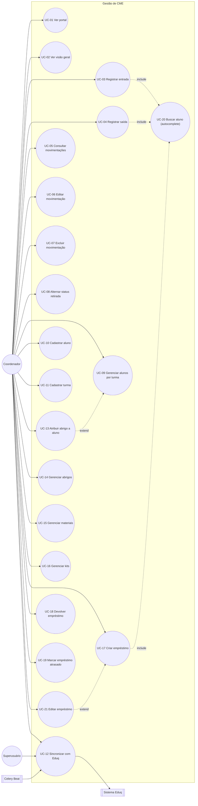

# Casos de Uso — Gestão e Controle de Materiais em Esterilização (CME)

> Documento gerado a partir de análise autônoma do código-fonte (`abo-goias/gestao_cme`),
> cruzando `models.py`, `views.py`, `forms.py`, `urls.py`, `permissoes.py`,
> `integrations/eduq.py`, templates e os documentos já produzidos pelo time.
> Data: 2026-07-20 · Última atualização: 2026-07-21 · Escopo: aplicação `gestao_cme`
> (app label legado `core`).
>
> Este documento nasceu como referência de priorização, sem implementar mudanças —
> pontos que exigiam decisão de negócio foram marcados explicitamente na seção 7,
> sem resolvê-los por suposição. Ao longo de 2026-07-20/21 as decisões de §7 foram
> tomadas e implementadas, seguidas por duas rodadas de auditoria/ajuste visual
> (13 + 4 itens). **Atualização de 2026-07-21: unificação da documentação** — este
> passou a ser o **documento único e atual** de referência para o módulo `gestao_cme`,
> consolidando o estado mais recente de todas as rodadas anteriores. Ver §11 para o
> histórico condensado e o índice dos demais documentos.

## 0. Documentos relacionados (índice)

| Documento | Data | Conteúdo | Status |
|---|---|---|---|
| **`casos-de-uso-gestao-cme.md`** (este arquivo) | 2026-07-20/21 | Casos de uso, regras de negócio, backlog e histórico consolidado — referência única e atual do módulo | ✅ Vigente |
| `auditoria-gestao-cme.md` | 2026-07-13 | Auditoria inicial de backend (bugs, fluxos testados, backlog original) | Histórico — conteúdo relevante incorporado a §5/§6/§11 |
| `melhorias-cme-contratos-2026-07.md` | 2026-07-15 | Rodadas 1–3 de melhorias (CME **e** Gestão de Contratos) | Histórico (parte de CME) — incorporado a §11; a parte de Contratos permanece como referência daquele módulo |
| `avaliacao-visual-gestao-cme.md` | 2026-07-20 | Auditoria visual com screenshots (13 itens: tabelas, autocomplete, mini-menu, filtros, etc.) | Histórico — todos os itens resolvidos, resumo em §11.1 |
| `ajustes-visuais-gestao-cme-rodada-2.md` | 2026-07-21 | Rodada 2 de ajustes visuais (4 itens: filtro por turma, rótulos de contagem, paginação, sobreposição do filtro de período) | Histórico — todos os itens resolvidos, resumo em §11.2 |

Os documentos marcados "Histórico" continuam no repositório como registro (inclusive
as evidências visuais em `docs/assets/avaliacao-visual-cme/`), mas **não devem ser lidos
como descrição do comportamento atual** do sistema — para isso, use este arquivo.

---

## 1. Visão geral do sistema

A CME (Central de Material e Esterilização) da ABO Goiás controla o ciclo de vida de
pacotes de instrumentais odontológicos entregues por alunos de pós-graduação para
esterilização, além de cadastros de apoio (turmas, alunos, materiais, kits, armários,
abrigos individuais) e um fluxo paralelo de **empréstimo de kits**.

O sistema depende de uma integração externa, o **Eduq** (sistema acadêmico), fonte de
verdade para turmas e alunos. Não há cadastro de aluno "do zero" pensado como fluxo
principal — o cadastro manual existe como exceção para cobrir lacunas da sincronização.

Módulos internos do app (mapeados às rotas em `gestao_cme/urls.py`):

| Módulo | Rota principal | Função |
|---|---|---|
| Portal | `/` | Landing page com resumo cross-módulo (CME, Lab, Contratos) e tarefas pendentes |
| Visão Geral (Dashboard CME) | `/gestao-cme/visao-geral/` | KPIs de pacotes por período, atividade recente |
| Movimentações | `/gestao-cme/movimentacoes/` | Histórico completo de entradas/saídas, com edição e exclusão |
| Registrar entrada | `/gestao-cme/nova-entrada/` | Dá baixa de N pacotes de um aluno para esterilização |
| Registrar saída | `/gestao-cme/nova-saida/` | Confirma retirada de pacotes já esterilizados |
| Alunos por turma | `/alunos-por-turma/` | Cadastro acadêmico, atribuição de abrigo, sincronização Eduq |
| Abrigos | `/abrigos/` | Espaços físicos individuais de guarda |
| Materiais | `/materiais/` | Catálogo de itens controlados |
| Kits | `/kits/` | Conjuntos de materiais para empréstimo |
| Empréstimos | `/emprestimos/` | Ciclo de empréstimo de kit/material a um aluno |

---

## 2. Atores

| Ator | Natureza | Descrição |
|---|---|---|
| **Coordenador (operador CME)** | Humano, autenticado | Usuário do dia a dia: registra entradas/saídas, cadastra alunos/materiais, gerencia empréstimos. Hoje **sem distinção de permissão** — qualquer usuário autenticado tem acesso total às telas do CME (ver §6). |
| **Superusuário / Administrador** | Humano, autenticado | Acesso irrestrito, inclusive ao Django Admin (única forma de ajustar quantidade por material em um kit). Em `emprestimos_visiveis`, vê todos os empréstimos; coordenador comum só vê os próprios. |
| **Sistema Eduq** | Ator externo (API) | Fonte de verdade de turmas e alunos. Suporta apenas `listar_turmas()` e `listar_alunos(codigo_turma)` — **não** oferece busca de aluno por nome. |
| **Celery Beat (agendador)** | Ator de sistema | Dispara `sincronizar_eduq_task` diariamente às 04:00, sem intervenção humana. |
| **Aluno de pós-graduação** | Ator passivo (sujeito do registro) | Não acessa o sistema; é o titular dos pacotes, empréstimos e abrigo. Aparece nos casos de uso apenas como dado manipulado por outro ator. |

---

## 3. Diagrama de casos de uso

---

## 4. Casos de uso detalhados

Cada caso de uso traz: ator, pré-condições, fluxo principal, fluxos alternativos/exceção,
pós-condições, regras de negócio e — quando aplicável — a oportunidade de melhoria já
associada a ele (referenciando o backlog da seção 6).

### UC-01 · Acessar o portal inicial

- **Ator primário:** Coordenador / Superusuário.
- **View/rota:** `views.portal` → `/`
- **Pré-condição:** usuário autenticado (`@login_required`).
- **Fluxo principal:**
  1. Usuário acessa a raiz do sistema.
  2. Sistema agrega contadores dos módulos CME, Laboratório e Contratos (pacotes
     pendentes, materiais, turmas, pedidos de lab ativos, faturamento pendente, contratos
     gerados).
  3. Sistema monta uma lista de **tarefas pendentes** (pacotes aguardando retirada,
     faturamento de lab, moldagens sem pedido, envios de contrato ao Dental Office com
     falha) e uma lista de **atividade recente** (últimos eventos de todos os módulos,
     ordenados por data).
  4. Portal é renderizado com os cartões de resumo e os dois blocos.
- **Pós-condição:** usuário tem visão consolidada e pode navegar a qualquer módulo.
- **Observação sistêmica:** `apps_disponiveis` é um `set` fixo no código
  (`{"cme", "lab", "bancadas", "contratos"}`) — o próprio código já assinala isso como
  "ponto único de controle de visibilidade... quando grupos de permissão forem
  implementados, basta filtrar este set". Hoje **todo usuário autenticado vê todos os
  apps**, independente de função. Ver §6.

### UC-02 · Consultar a Visão Geral (Dashboard CME)

> **Atualizado em 2026-07-20/21** — filtro de período redesenhado (itens 8, 11 e R2-4).

- **Ator primário:** Coordenador / Superusuário.
- **View/rota:** `views.cme_dashboard` → `/gestao-cme/visao-geral/`
- **Fluxo principal:**
  1. Usuário acessa a Visão Geral.
  2. Sem filtro de data informado, o sistema usa o intervalo **do primeiro registro até
     hoje** (não recorta o mês atual).
  3. Sistema calcula 4 KPIs mutuamente exclusivos e exaustivos: **Total**, **Retirados**,
     **Aguardando**, **Sem status** — todos a partir da mesma função `linhas_de_pacote()`
     usada pela listagem de movimentações (UC-05), garantindo que os números batam.
  4. Sistema lista até 10 pacotes aguardando retirada e até 12 eventos de atividade
     recente (que, diferente dos KPIs, contam eventos — não pacotes — para não esconder
     saídas do feed).
  5. Cada KPI é um link que abre a listagem de movimentações (UC-05) já filtrada e no
     mesmo intervalo de datas.
- **Filtro de período (widget compartilhado `partials/filtro_periodo.html`):** um único
  controle **"Período"**, no topo da barra de filtros (`.filter-bar`), com dois campos
  `<input type="date">` ("De"/"Até", formato ISO `aaaa-mm-dd`) e botão "Aplicar". É um
  `
` colapsável — só expande quando o usuário clica; quando há filtro ativo,
  mostra um indicador (ponto) no resumo e um botão "Todo o período" para limpar. Ao
  abrir, o painel ocupa a linha inteira da barra de filtros e **empurra** o restante do
  conteúdo para baixo (não sobrepõe nada) — ver R2-4 em §11.2. O mesmo componente é
  reusado, com a mesma aparência e comportamento, em Movimentações (UC-05) e Empréstimos
  (UC-19).
- **Regra de negócio:** Total = Retirados + Aguardando + Sem status (garantida pela
  fonte única `linhas_de_pacote()`).
- **Risco sistêmico já registrado (B-07 da auditoria):** com o padrão "todo o histórico",
  a Visão Geral varre a tabela inteira a cada carga; sem índice em `data_hora` isso
  degrada com o crescimento do volume.

### UC-03 · Registrar entrada de pacotes para esterilização

- **Ator primário:** Coordenador.
- **View/rota:** `views.registrar_entrada` → `/gestao-cme/nova-entrada/`
- **Inclui:** UC-20 (Buscar aluno via autocomplete).
- **Pré-condição:** existe ao menos um aluno ativo cadastrado (via Eduq ou manual).
- **Fluxo principal:**
  1. Coordenador busca o aluno pelo autocomplete (nome/matrícula).
  2. Informa a **quantidade** de pacotes (1 a 50) e, opcionalmente, data/hora e
     observações (data/hora padrão = agora).
  3. Ao confirmar, o sistema gera um código sequencial por pacote —
     `max(código numérico existente) + n` — e cria N registros `Movimentacao(ENTRADA,
     retirado=False)` em uma única transação atômica.
  4. Sistema grava a confirmação (códigos gerados, aluno, abrigo, quantidade, data/hora)
     na **sessão** (não em `messages`) e redireciona (padrão POST/redirect/GET) para a
     mesma tela, onde a confirmação é exibida até o operador etiquetar os pacotes.
  5. Se o aluno não tiver abrigo cadastrado, o sistema **avisa mas não bloqueia** o
     registro.
- **Fluxo de exceção:** formulário inválido → erros exibidos, aluno selecionado é
  preservado (reconsulta por `pk` para repopular o chip do autocomplete).
- **Pós-condição:** N `Movimentacao` criadas com `origem=MANUAL`, `arquivo_origem="painel"`.
- **Risco sistêmico já registrado (B-07):** a geração de código varre **todas** as
  movimentações a cada chamada, **sem lock** — duas entradas concorrentes podem gerar
  código duplicado (`pacote_codigo` não tem `unique` constraint).
- **Melhoria de usabilidade associada:** nenhum contador visual de "quantos pacotes
  faltam etiquetar" além da lista de códigos — ver U-02 em §6.

### UC-04 · Registrar saída (retirada) de pacotes esterilizados

- **Ator primário:** Coordenador.
- **View/rota:** `views.registrar_saida` → `/gestao-cme/nova-saida/`
- **Inclui:** UC-20 (Buscar aluno, restrito a alunos com pendência via `pendencias=1`).
- **Fluxo principal (dois passos):**
  1. **Passo 1 — seleção do aluno:** tela sem `aluno_id` mostra o autocomplete e uma
     lista de "alunos com pendências" pré-calculada (`Aluno` com ao menos uma
     `Movimentacao(ENTRADA, retirado=False)`).
  2. **Passo 2 — confirmação de pacotes:** com `aluno_id`, o sistema lista os pacotes
     pendentes daquele aluno especificamente, ordenados por data de entrada.
  3. Coordenador marca os pacotes a retirar (checkbox) e confirma.
  4. Sistema cria uma `Movimentacao(SAIDA)` **por pacote selecionado**, vinculando-a
     explicitamente à entrada via `entrada_origem` (self-FK), e marca a entrada
     correspondente como `retirado=True` — tudo em uma transação atômica.
  5. Mensagem de sucesso com contagem e horário; redireciona para Movimentações (UC-05).
- **Fluxo de exceção:** nenhum pacote selecionado → mensagem de erro, permanece na tela.
- **Regra de negócio central:** o vínculo entrada↔saída é **gravado explicitamente**
  (não inferido por `pacote_codigo`, que não é confiável — ver docstring de
  `Movimentacao` e item 10 de `melhorias-cme-contratos-2026-07.md`).
- **Pós-condição:** para cada pacote retirado, existem 2 registros ligados (ENTRADA +
  SAIDA), exibidos como **1 linha** em UC-05.

### UC-05 · Consultar movimentações (histórico de pacotes)

> **Atualizado em 2026-07-20/21** — filtro de período (item 11), rótulos de contagem
> condicionados ao filtro ativo (item 12), botões Buscar/Limpar tudo lado a lado
> (item 13) e painel do filtro de período sem sobreposição (R2-4).

- **Ator primário:** Coordenador / Superusuário.
- **View/rota:** `views.home` → `/gestao-cme/movimentacoes/`
- **Fluxo principal:**
  1. Sistema lista **uma linha por pacote**: cada linha é uma `ENTRADA` com colunas
     "Entrada" (sempre preenchida) e "Saída" (preenchida se já retirado). SAIDAs já
     vinculadas a uma entrada **não** viram linha própria.
  2. Registros **LEGADO** sem vínculo reconstruível aparecem como linha solta (só
     entrada, ou só saída, conforme o caso), sinalizado como "sem registro" em vez de
     inventar um par.
  3. Filtros disponíveis: texto livre (nome, matrícula, turma, código do pacote,
     material, arquivo de origem — todos acento-insensível via `nome_normalizado`),
     status (Retirado / Não retirado / Sem status), aluno específico (vindo de UC-09),
     e período (mesmo widget "Período" colapsável descrito em UC-02).
  4. O resumo de resultados mostra "N aguardando retirada"/"N retirados" **apenas**
     quando o filtro de Status correspondente está selecionado (não como atalho
     permanente), com a mesma cor do badge da coluna Status (`.meta-warn`/`.meta-success`).
  5. Cada linha permite: alternar status de retirada (UC-08), editar (UC-06), excluir
     (UC-07).
  6. A paginação (rodapé da tabela, compartilhada por todas as listagens do módulo —
     ver §5) oferece atalhos textuais **"« Primeira"** e **"Última »"**, além de
     Anterior/Próxima e números de página.
- **Regra de negócio:** filtro de "Movimentação" (Entrada/Saída) foi **removido**
  deliberadamente na consolidação por pacote — não fazia mais sentido com uma linha por
  pacote; o filtro de Status cobre a mesma necessidade.
- **Pós-condição:** nenhuma (somente leitura, exceto pelas ações de linha).

### UC-06 · Editar movimentação

> **Atualizado em 2026-07-20** — implementa a decisão de negócio §7.6.

- **Ator primário:** Coordenador.
- **View/rota:** `views.editar_movimentacao` → `/gestao-cme/<pk>/editar/`
- **Fluxo principal:** edita `pacote_codigo`, `data_hora` e `observacoes` de um registro
  específico (ENTRADA ou SAIDA); aluno/turma/material **não são editáveis** aqui. Ao
  salvar, grava um `RegistroAuditoriaMovimentacao(acao=EDICAO)` com usuário, pacote e
  timestamp.
- **Pós-condição:** registro atualizado; mensagem de sucesso; volta para UC-05.
- **Trilha de auditoria:** a tela exibe um bloco "Histórico de alterações" com cada
  edição/exclusão já registrada para aquele pacote (ação, autor, data/hora). Consulta
  completa também disponível no Django Admin (somente leitura).

### UC-07 · Excluir movimentação

> **Atualizado em 2026-07-20** — implementa a decisão de negócio §7.6.

- **Ator primário:** Coordenador.
- **View/rota:** `views.excluir_movimentacao` (POST) → `/gestao-cme/<pk>/excluir/`
- **Fluxo principal:**
  1. Grava um `RegistroAuditoriaMovimentacao(acao=EXCLUSAO)` com usuário, pacote e
     timestamp **antes** de excluir — a cópia textual do pacote/aluno sobrevive à
     exclusão da movimentação original (a FK usa `SET_NULL`).
  2. Se a movimentação é uma **SAIDA**, o sistema restaura a(s) `ENTRADA`
     correspondente(s) do mesmo aluno/pacote para `retirado=False` antes de excluir —
     evita que o pacote "suma" do fluxo de pendências.
  3. Registro é excluído permanentemente (hard delete, sem soft-delete/lixeira).
- **Regra de negócio:** exclusão de SAIDA é uma operação com efeito colateral em outro
  registro — comportamento correto, mas **irreversível e sem confirmação visível no
  código atual além do `data-confirm` do template** (verificar consistência de modal em
  todas as chamadas — ver U-05).
- **Trilha de auditoria mínima (usuário, ação, timestamp):** implementada — ver
  `RegistroAuditoriaMovimentacao` em `models.py` e §7.6. Não inclui, por decisão de
  escopo ("mínimo"), o valor anterior do campo editado (versionamento completo) — só
  quem fez o quê e quando.

### UC-08 · Alternar status de retirada manualmente

- **Ator primário:** Coordenador.
- **View/rota:** `views.alternar_retirado` (POST) → `/gestao-cme/<pk>/alternar-retirado/`
- **Fluxo principal:** cicla o campo `retirado` em três estados: `None → True → False →
  None`. Usado como correção manual pontual, fora do fluxo padrão de UC-03/UC-04.
- **Risco:** alternar o status **não** cria/edita o vínculo `entrada_origem` nem a
  `Movimentacao` de SAIDA correspondente — pode gerar uma ENTRADA marcada como
  `retirado=True` sem uma SAIDA real (o sistema já lida com essa lacuna exibindo
  "Retirado — sem data" em UC-05, mas é uma divergência de dados introduzida
  manualmente). Não há aviso na UI sobre essa consequência — ver U-07.

### UC-09 · Gerenciar alunos por turma

> **Atualizado em 2026-07-21 (R2-1/R2-2).**

- **Ator primário:** Coordenador / Superusuário.
- **View/rota:** `views.alunos_por_turma` → `/alunos-por-turma/`
- **Estende:** UC-13 (atribuição de abrigo é feita inline nesta tela).
- **Fluxo principal:**
  1. Lista alunos com busca textual acento-insensível (por nome, matrícula, e-mail
     **ou turma** — nome/código) e filtro de status (Ativo/Inativo/Todos).
  2. Exibe a data da última sincronização com o Eduq (turmas e alunos) e o total de
     alunos exibidos; se houver alunos sem abrigo, mostra a contagem em destaque.
  3. Coluna "Movimentações" é clicável e abre UC-05 já filtrado por aquele aluno.
  4. Coluna "Abrigo" é editável inline (UC-13).
  5. Um único botão **"Sincronizar alunos e turmas"** (`atualizar_alunos_eduq`) busca
     primeiro todas as turmas na API e, em seguida, todos os alunos de cada turma
     (UC-12) — sempre visível, sem depender de nenhuma turma selecionada.
- **Removido em 2026-07-21 (R2-1):** o `<select>` dedicado de filtro por turma foi
  retirado da barra de filtros — a busca textual já cobre nome/código de turma, e o
  dropdown era redundante (era também a maior causa de a barra de filtros dessa tela
  precisar quebrar linha). Junto com ele saíram: o chip removível de "Turma", os
  botões condicionais "Sincronizar turmas"/"Sincronizar alunos de \<turma\>" (que só
  apareciam com uma turma selecionada) — substituídos pelo botão único do item 5
  acima — e, em R2-2, o rótulo de contagem "N turmas" no resumo de resultados (não
  fazia mais sentido sem nenhum filtro de turma na tela para ele se referir).
- **Observação de usabilidade já mapeada:** o campo "Status" tem ambiguidade (situação
  de matrícula do aluno vs. vínculo com turma ativa) — **já mitigado** com tooltip
  (`melhorias-cme-contratos-2026-07.md`, item 3), mas vale validar se a ambiguidade
  conceitual de fato desapareceu ou só ganhou uma explicação.

### UC-10 · Cadastrar aluno manualmente

> **Navegação atualizada em 2026-07-20 (item 9)** — ver nota abaixo.

- **Ator primário:** Coordenador.
- **View/rota:** `views.cadastrar_aluno` → `/alunos-por-turma/novo/`
- **Fluxo principal:** formulário com nome, matrícula (única), turma, CPF, e-mail,
  telefone. Cria com `origem=MANUAL`.
- **Regra de negócio:** matrícula duplicada é bloqueada por validação de formulário
  (`clean_matricula`), não só por constraint de banco — mensagem de erro amigável.
- **Risco sistêmico:** cadastro manual e sincronização Eduq **escrevem no mesmo
  namespace de matrícula**. Se o Eduq depois sincronizar um aluno com a mesma matrícula
  cadastrada manualmente, o comportamento de `update_or_create` da sincronização deve
  ser conferido (não auditado neste documento — recomenda-se checar
  `services/eduq_sync.py`).

### UC-11 · Cadastrar turma manualmente

- **Ator primário:** Coordenador.
- **View/rota:** `views.cadastrar_turma` → `/turmas/nova/`
- **Fluxo principal:** análogo a UC-10, com código único de turma.
- **Navegação (item 9, 2026-07-20):** os links "Cadastrar aluno" (UC-10) e "Cadastrar
  turma" (UC-11) deixaram de ficar como botões soltos no topo da tela de Alunos por
  turma e passaram a ser um **mini-menu** (`partials/side_link_group.html`) sob o item
  "Alunos por turma" da navegação lateral: clicar no item principal navega direto para
  a listagem (UC-09), que já mostra o submenu automaticamente por estar ativo; um ícone
  de seta (chevron) permite abrir/fechar o submenu manualmente a qualquer momento,
  independente de qual tela está ativa. O mesmo padrão de mini-menu foi aplicado aos
  demais itens de cadastro do módulo (Abrigos, Materiais, Kits, Empréstimos).

### UC-12 · Sincronizar cadastros com o Eduq

> **Atualizado em 2026-07-21 (R2-1)** — botões consolidados, ver abaixo.

- **Ator primário:** Coordenador / Superusuário (acionamento manual); **Celery Beat**
  (acionamento automático diário às 04:00).
- **Views/rotas acionadas por botão hoje:**
  - `atualizar_alunos_eduq` (POST, turmas **e** alunos) — botão em `alunos_por_turma`
    ("Sincronizar alunos e turmas", UC-09), `registrar_entrada` e `registrar_saida`
    ("Atualizar lista de alunos").
  - `gestao_cme/tasks.py::sincronizar_eduq_task` (Celery Beat, 04:00 diária) — mesma
    função de serviço (`sincronizar_eduq`, turmas + alunos), disparo automático.
- **Views/rotas removidas em 2026-07-21 (limpeza de código morto):** as views
  `sincronizar_turmas_eduq` e `sincronizar_alunos_turma` (com suas rotas em `urls.py`)
  haviam ficado órfãs depois que R2-1 removeu o filtro por turma de `alunos_por_turma`
  (elas serviam ao botão condicional "Sincronizar turmas"/"Sincronizar alunos de
  \<turma\>" daquela tela, que dependia de uma turma selecionada) — foram removidas,
  junto com os 3 testes que só existiam para exercitá-las. `atualizar_turmas_eduq` (só
  turmas, usado antes em `criar_emprestimo`) já havia sido removida em rodada anterior,
  quando o botão de Novo Empréstimo passou a usar `atualizar_alunos_eduq` (item 5 da
  avaliação visual, ver §11.1). Ver S-10 em §6.2 (agora resolvido).
- **Rótulo do botão (U-08):** **parcialmente resolvido.** Em `alunos_por_turma` o botão
  foi renomeado para "Sincronizar alunos e turmas" (preciso — descreve as duas etapas).
  Em `registrar_entrada`, `registrar_saida` e `criar_emprestimo` o mesmo botão **continua**
  rotulado "Atualizar lista de alunos", que é impreciso pelo mesmo motivo original (também
  sincroniza turmas) — renomear essas três telas ficou fora do escopo das rodadas já
  feitas.
- **Fluxo principal:** chama `services.eduq_sync.sincronizar_eduq(client,
  sincronizar_turmas=True, sincronizar_alunos=True, ...)`, que busca **todas as turmas**
  na API (`client.listar_turmas()`) e, em seguida, para **cada turma**, busca seus alunos
  (`client.listar_alunos(codigo_turma)`), fazendo `update_or_create` de turmas/alunos e
  retornando contadores (criados/atualizados/erros) exibidos via `messages`.
- **Fluxo de exceção:** `EduqAPIError` (config/autenticação/rede) → mensagem de erro,
  nenhuma alteração parcial visível ao usuário além do que já foi persistido.
- **Limitação estrutural conhecida:** a API Eduq **não expõe busca de aluno por nome**
  — só `listar_turmas()`/`listar_alunos(codigo_turma)`. Por isso a busca de aluno em
  UC-20 é **sempre local** (depende de sincronização prévia), diferente do padrão usado
  no módulo de Laboratório (que busca ao vivo no Dental Office). Isso já está registrado
  como pendência de negócio (ver §7, item 6).
- **Risco sistêmico:** o botão manual "Atualizar alunos" roda o sync **de forma síncrona
  no request** — pode ser lento com muitas turmas (43 turmas hoje). Já identificado no
  backlog da auditoria como candidato a mover para fila assíncrona (S-03).

### UC-13 · Atribuir ou remover abrigo de um aluno

- **Ator primário:** Coordenador.
- **View/rota:** `views.atribuir_abrigo` (POST) → `/alunos-por-turma/<aluno_id>/abrigo/`
- **Fluxo principal:**
  1. Na tela de UC-09, o coordenador escolhe um abrigo (ou "nenhum") para um aluno.
  2. Sistema grava o vínculo e **recalcula a ocupação** do abrigo anterior e do novo
     abrigo (`_sincronizar_ocupacao_abrigo`), em transação atômica.
- **Regra de negócio:** "ocupado" é derivado — `True` sse existe ≥1 aluno **ativo**
  vinculado. Não há relação abrigo↔material no schema; "ocupação" é só sobre alunos.
- **Pós-condição:** coluna "Ocupação" em UC-14 reflete o novo estado sem ação manual
  adicional.

### UC-14 · Gerenciar abrigos

> **Atualizado em 2026-07-21 (R2-2)** — rótulo de contagem condicionado ao filtro ativo.

- **Ator primário:** Coordenador / Superusuário.
- **Views/rotas:** `views.armarios` (listar, `/abrigos/`), `cadastrar_abrigo` (`/abrigos/novo/`),
  `editar_abrigo` (`/abrigos/<pk>/editar/`), `excluir_abrigo` (POST, `/abrigos/<pk>/excluir/`).
- **Listagem:** busca textual, filtro de ocupação (`?ocupacao=ocupado|livre`); o resumo
  de resultados mostra "N ocupado(s)" (`.meta-warn`) apenas com `ocupacao=ocupado`
  selecionado, e "N livre(s)" (`.meta-success`) apenas com `ocupacao=livre` — mesmo
  conceito aplicado em Materiais (UC-15) e Kits (UC-16): o rótulo de contagem só
  aparece quando o filtro correspondente está ativo, em vez de sempre visível.
- **Fluxo principal (edição):**
  1. Tela mostra o resumo dos alunos atualmente vinculados ao abrigo.
  2. Salvar exige **confirmação dupla obrigatória** via modal, listando quem ocupa o
     abrigo hoje — para evitar reatribuição acidental de um abrigo já em uso.
  3. Excluir é irreversível; como `Aluno.abrigo` usa `on_delete=SET_NULL`, os alunos
     vinculados **não são apagados**, apenas desvinculados — o modal de confirmação
     informa quantos alunos serão afetados.
- **Pós-condição (exclusão):** abrigo removido; alunos antes vinculados ficam com
  `abrigo=None`.

### UC-15 · Gerenciar materiais

> **Atualizado em 2026-07-21 (R2-2)** — rótulo de contagem condicionado ao filtro ativo.

- **Ator primário:** Coordenador / Superusuário.
- **Views/rotas:** `views.materiais` (`/materiais/`), `cadastrar_material`
  (`/materiais/novo/`), `editar_material` (`/materiais/<pk>/editar/`), `excluir_material`
  (POST, `/materiais/<pk>/excluir/`).
- **Listagem:** busca textual, filtro de disponibilidade (`?disponibilidade=disponivel|indisponivel`);
  o resumo mostra "N de M disponíve(is)" (`.meta-success`) só com o filtro
  "disponível" ativo, e "N de M indisponíve(is)" (`.meta-warn`) só com "indisponível"
  ativo (mesmo conceito de UC-14/UC-16).
- **Fluxo principal (edição/exclusão):**
  1. Edição permite alterar todos os campos, incluindo `ativo` (inativação, reversível).
  2. Tela de edição calcula e exibe quantas **unidades estão atualmente em empréstimo**
     (soma de `ItemEmprestimo.quantidade` com `Emprestimo.status` em
     `{EMPRESTADO, ATRASADO}`), como aviso antes de qualquer exclusão.
  3. Exclusão tenta `material.delete()`; se há vínculo protegido (empréstimo, kit,
     estoque de armário — todos `on_delete=PROTECT`), o sistema captura `ProtectedError`
     e orienta a **inativar** em vez de excluir.
- **Regra de negócio:** `Material` é protegido contra exclusão em cascata — dado
  histórico de empréstimos/kits nunca é perdido silenciosamente.

### UC-16 · Gerenciar kits

> **Atualizado em 2026-07-20** — implementa as decisões de negócio §7.1 e §7.2.
> **Revisado em 2026-07-20** (avaliação da auditoria visual, item 6): a
> sincronização automática de `Kit.quantidade` foi **revertida** — ver ponto 4
> abaixo. **Atualizado em 2026-07-21 (R2-2):** ganhou filtro de Status
> (Ativo/Inativo/Todos), que faltava em relação a Abrigos/Materiais — ver ponto 5.

- **Ator primário:** Coordenador / Superusuário.
- **Views/rotas:** `views.kits` (`/kits/`), `cadastrar_kit` (`/kits/novo/`),
  `editar_kit` (`/kits/<pk>/editar/`), `excluir_kit` (POST, `/kits/<pk>/excluir/`).
- **Fluxo principal (cadastro e edição):**
  1. Coordenador informa nome, código único, descrição e **quantidade em estoque**
     (`Kit.quantidade`), e seleciona os materiais do kit (checkbox múltiplo) — em
     edição, os materiais já vinculados vêm pré-marcados.
  2. **Cada material selecionado tem sua própria quantidade**, digitada ao lado do
     checkbox (decisão de negócio: quantidade > 1 já na criação, pela própria tela —
     não depende mais do Django Admin).
  3. Ao salvar, o sistema sincroniza os itens do kit (`KitMaterial`) com a seleção:
     cria/atualiza os marcados com a quantidade informada e remove os que foram
     desmarcados — o mesmo fluxo serve para criar e para editar.
  4. **`Kit.quantidade` é o estoque cadastrado do kit** — quantas unidades físicas
     desse kit existem, informado manualmente e **independente** da disponibilidade
     dos materiais da composição. Decisão de negócio revista: uma versão anterior
     desta rodada sincronizava automaticamente `Kit.quantidade` para ser sempre igual
     a "Disponíveis"; ao revisar a auditoria visual, a equipe decidiu reverter — os
     dois números respondem perguntas diferentes ("quantos kits existem" vs. "quantos
     materiais da composição estão livres agora") e cada coluna do listing (Kit,
     Quantidade, Materiais, Disponíveis) ganhou um tooltip explicando seu significado
     em vez de forçar os números a coincidir.
- **Fluxo principal (exclusão):** botão "Excluir kit" na tela de edição, com
  confirmação; se o kit está referenciado por algum `Emprestimo` (`Emprestimo.kit` é
  `PROTECT`), a exclusão é bloqueada e a tela orienta a marcar o kit como inativo —
  mesmo tratamento de `excluir_material`. A tela de edição também mostra quantos
  empréstimos ativos usam o kit, como aviso antes de excluir.
- **Pós-condição (exclusão):** kit removido; `KitMaterial` associados são apagados em
  cascata (`on_delete=CASCADE`); empréstimos que já usaram o kit não são afetados
  (histórico preservado, exclusão só é possível quando não há vínculo ativo).
- **Listagem (R2-2):** busca textual e filtro de Status (`?status=ativo|inativo`); o
  resumo mostra "N de M ativo(s)" (`.meta-success`) só com "ativo" selecionado, e "N de
  M inativo(s)" (`.meta-warn`) só com "inativo" selecionado — mesmo conceito de
  UC-14/UC-15. Antes desta rodada, Kits era a única das três listagens sem filtro de
  Status.

### UC-17 · Criar empréstimo de kit/material

- **Ator primário:** Coordenador.
- **View/rota:** `views.criar_emprestimo` → `/emprestimos/novo/`
- **Inclui:** UC-20 (autocomplete de aluno, padronizado com UC-03).
- **Fluxo principal:**
  1. Coordenador busca o aluno, opcionalmente escolhe um kit, data prevista de
     devolução e observações.
  2. Sistema cria o `Emprestimo` com `status=EMPRESTADO`,
     `coordenador_usuario=request.user` (nome exibido vem de
     `get_full_name() or username`).
  3. Se um kit foi escolhido, o sistema **copia automaticamente** cada `KitMaterial` do
     kit para `ItemEmprestimo` do novo empréstimo, preservando a quantidade definida no
     kit.
- **Regra de negócio (visibilidade):** um coordenador comum só enxerga (em UC-18/UC-19 e
  na listagem de empréstimos) os empréstimos que **ele mesmo** registrou
  (`coordenador_usuario=request.user`); superusuário vê todos.
- **Observação:** empréstimo **sem kit** é permitido (`kit` opcional) — nesse caso não
  há `ItemEmprestimo` algum gerado automaticamente; não há tela para adicionar itens
  avulsos ao empréstimo pela interface operacional (só via kit).

### UC-18 · Devolver empréstimo

- **Ator primário:** Coordenador (dono do empréstimo) / Superusuário.
- **View/rota:** `views.devolver_emprestimo` (POST) → `/emprestimos/<pk>/devolver/`
- **Fluxo principal:** marca `status=DEVOLVIDO` e `data_devolucao=agora`.
- **Fluxo de exceção:** empréstimo já devolvido → mensagem de erro, nenhuma alteração.
- **Regra de negócio:** a busca usa `emprestimos_visiveis(request)` — coordenador não
  pode devolver empréstimo de outro coordenador (404 implícito via `DoesNotExist`).

### UC-19 · Empréstimo atrasado (automático) e marcação manual

> **Atualizado em 2026-07-20/21** — decisão de negócio §7.7; filtro de período e
> paginação adicionados à listagem de Empréstimos (item 11, R2-3, R2-4).

- **Ator primário:** Sistema (automático); Coordenador (dono do empréstimo) /
  Superusuário (ação manual, como caso excepcional).
- **Serviço:** `services.emprestimos.marcar_emprestimos_atrasados()` — muda para
  `ATRASADO` todo `Emprestimo` com `status=EMPRESTADO` e `data_prevista_devolucao`
  anterior a hoje. Ignora empréstimos sem data prevista definida (não há como saber se
  estão atrasados) e não mexe em empréstimos já `DEVOLVIDO`.
- **Gatilhos:**
  1. **A cada carregamento da listagem de Empréstimos** (`views.emprestimos`) — garante
     que o status exibido está sempre correto, mesmo entre execuções da tarefa
     periódica.
  2. **Tarefa periódica diária** (`tasks.marcar_emprestimos_atrasados_task`, Celery
     Beat, 06:00) — cobre o caso de ninguém visitar a listagem; `data_prevista_devolucao`
     é um campo de data (não hora), então periodicidade diária é suficiente.
- **Filtro de período e paginação (`views.emprestimos`):** a listagem ganhou o mesmo
  widget "Período" das UC-02/UC-05 (filtrando por `data_emprestimo`, via
  `_filtrar_por_intervalo(..., campo="data_emprestimo")`), e a paginação compartilhada
  traz os atalhos "« Primeira"/"Última »". Cada linha oferece, além de "Devolver"/marcar
  atrasado, o ícone de editar (UC-21), agrupados em `.actions-group` para alinhamento
  vertical consistente.
- **Alerta visual:** a listagem de Empréstimos já traz o badge "Atrasado"
  (`badge-atrasado`) e o contador clicável "N atrasado(s)" no resumo — como o status
  agora é atualizado automaticamente, esses indicadores refletem o atraso real sem
  ação do coordenador.
- **View/rota (ação manual mantida):** `views.marcar_emprestimo_atrasado` (POST) →
  `/emprestimos/<pk>/marcar-atrasado/`, só permitida a partir do status `EMPRESTADO`.
  Continua disponível para casos excepcionais (ex.: sem `data_prevista_devolucao`
  definida, ou necessidade operacional de marcar atraso antes do prazo formal).

### UC-20 · Buscar aluno via autocomplete *(caso de uso incluído / componente compartilhado)*

> **Atualizado em 2026-07-20** — implementa a decisão de negócio §7.4.

- **Ator primário:** Coordenador (indiretamente, via UC-03, UC-04, UC-17).
- **View/rota:** `views.buscar_alunos` (HTMX) → `/alunos/buscar/`
- **Fluxo principal:**
  1. Componente HTMX dispara a cada digitação (com debounce no client), filtra alunos
     ativos locais por nome normalizado ou matrícula.
  2. Com `pendencias=1` (usado só em UC-04), restringe a alunos com pacote pendente de
     retirada.
  3. Busca `limite + 1` registros para sinalizar "há mais resultados" sem precisar de
     `count()` extra.
- **Fluxo alternativo — busca sem resultado:** quando a busca não encontra nenhum aluno,
  o fragmento oferece um mini-formulário para **sincronizar a turma do aluno sob
  demanda** (`views.sincronizar_turma_busca`, POST →
  `/alunos/sincronizar-turma-busca/`) — decisão de negócio: como o Eduq não tem busca de
  aluno por nome (só `listar_alunos` por turma), esta é a forma de encontrar, ali mesmo,
  um aluno que ainda não foi sincronizado, sem precisar sair da tela de entrada/saída/
  empréstimo. Reaproveita a sincronização por turma já usada em UC-12
  (`_sincronizar_alunos_da_turma`), com `next` apontando de volta para a página de
  origem (lida do cabeçalho `HX-Current-URL` do HTMX).
- **Regra de negócio:** busca é **exclusivamente local** — não consulta o Eduq ao vivo
  (diferente do componente equivalente em Gestão de Laboratório, que combina base local
  + busca ao vivo no Dental Office). Um aluno recém-matriculado só aparece depois de uma
  sincronização (manual, sob demanda pela turma, ou às 04:00).

### UC-21 · Editar empréstimo *(adicionado em 2026-07-21)*

- **Ator primário:** Coordenador (dono do empréstimo) / Superusuário.
- **Estende:** UC-17 (Criar empréstimo) — mesma tela de listagem (UC-19), ação de linha.
- **View/rota:** `views.editar_emprestimo` → `/emprestimos/<pk>/editar/`
- **Pré-condição:** o empréstimo é visível ao usuário (`emprestimos_visiveis(request)` —
  coordenador comum só edita os próprios; superusuário edita qualquer um), mesma regra
  de visibilidade de UC-18/UC-19.
- **Fluxo principal:**
  1. A partir da listagem de Empréstimos, o coordenador abre a tela de edição de um
     empréstimo específico.
  2. A tela mostra um resumo somente leitura (aluno, kit, data do empréstimo, status
     atual em badge) e um formulário (`EditarEmprestimoForm`) com apenas dois campos
     editáveis: **data prevista de devolução** e **observações**. Aluno, kit e itens do
     empréstimo não são editáveis aqui (corrigir isso exigiria desfazer/refazer o
     empréstimo, fora do escopo desta tela).
  3. Ao salvar, o registro é atualizado e o coordenador retorna à listagem (UC-19) com
     mensagem de sucesso.
- **Detalhe de implementação relevante:** o campo de data usa
  `default_if_none:""|stringformat:"s"` no template para pré-preencher o
  `<input type="date">` — sem esse filtro, o Django localiza o objeto `date` para
  português ("27 de Julho de 2026"), formato que o `<input type="date">` não reconhece
  e que fazia o campo aparecer vazio ao abrir a tela.
- **Ação de linha associada (correção de bug, mesma rodada):** o botão de editar
  empréstimo foi agrupado com os botões existentes "Devolver"/"Atrasado" da listagem
  (`.actions-group`) — antes desse ajuste, os botões ficavam desalinhados verticalmente
  entre si.
- **Pós-condição:** `Emprestimo.data_prevista_devolucao`/`observacoes` atualizados;
  demais campos (aluno, kit, status, itens) inalterados.

---

## 5. Regras de negócio transversais

1. **Origem do dado (`OrigemDados`)** — todo cadastro relevante (`Turma`, `Aluno`,
   `Material`, `Kit`, `Abrigo`, `Movimentacao`) carrega `origem ∈ {MANUAL, EDUQ, LEGADO,
   EXEMPLO}`. Registros `EXEMPLO` são **sistematicamente excluídos** de listagens,
   métricas e buscas — usados só para demonstração/testes, nunca aparecem em produção
   real.
2. **Vínculo explícito entrada↔saída** — `Movimentacao.entrada_origem` é a única fonte
   confiável para parear o ciclo de um pacote; pareamento por `pacote_codigo` foi
   deliberadamente rejeitado (não é único e, em dados legados, representa o código do
   *material*, não do pacote).
3. **Integridade referencial diferenciada por risco de perda de dado:**
   - `PROTECT` em `Material` (via `KitMaterial`, `ItemEmprestimo`, `EstoqueArmario`) e em
     `Turma`/`Kit` como FK de `Aluno`/`Emprestimo` — impede exclusão que apagaria
     histórico.
   - `SET_NULL` em `Aluno.abrigo`, `Movimentacao.aluno/turma/material`,
     `Emprestimo.coordenador_usuario` — exclusão do lado "um" não deve travar nem
     apagar o histórico do lado "muitos", só desvincula.
4. **Busca acento-insensível** — campo derivado `nome_normalizado` (mixin
   `NomeNormalizadoMixin`), recalculado em todo `save()`, cobre cadastro manual,
   sincronização e admin. Escolhido em vez de `unaccent` do PostgreSQL para se comportar
   igual em SQLite (dev/testes).
5. **Fonte única de verdade para KPIs vs. listagem** — `linhas_de_pacote()` é usada tanto
   pela Visão Geral (UC-02) quanto pela listagem de Movimentações (UC-05); qualquer nova
   métrica de pacotes deve reusar essa função para não divergir.
6. **Rótulo de contagem só aparece com o filtro correspondente ativo** *(adicionado em
   2026-07-21)* — em Movimentações (UC-05), Abrigos (UC-14), Materiais (UC-15) e Kits
   (UC-16), os rótulos de contagem ao lado de "N resultados" (ex.: "N ocupados", "N
   disponíveis", "N de M ativos") só aparecem quando o filtro de status/situação
   correspondente está selecionado — não como atalho permanente — usando a mesma cor do
   badge da coluna de status (`.meta-warn`/`.meta-success`). Em Alunos por turma (UC-09)
   o rótulo de contagem por turma foi **removido** (não gated) porque o filtro que ele
   descrevia deixou de existir (R2-1).
7. **Paginação com atalhos de primeira/última página** *(adicionado em 2026-07-21,
   R2-3)* — `templates/partials/paginacao.html`, compartilhado por **todas** as
   listagens do módulo (e também por `gestao_lab`/`gestao_contratos`), sempre oferece
   "« Primeira" e "Última »" ao lado de "Anterior"/"Próxima", com rótulo textual (não só
   o símbolo) para maior descoberta, desabilitados quando não aplicável.
8. **Filtro de período: widget único e reusado** *(item 8/11, corrigido em R2-4)* —
   `partials/filtro_periodo.html`, um `
` colapsável ("Período") com dois
   `<input type="date">`, reusado sem alteração visual em Visão Geral (UC-02),
   Movimentações (UC-05) e Empréstimos (UC-19). Ao abrir, ocupa a linha inteira da
   barra de filtros e empurra o conteúdo abaixo para baixo — nunca sobrepõe nem
   ultrapassa a borda do painel de resultados (bug corrigido na rodada 2, ver §11.2).

---

## 6. Backlog de melhorias de usabilidade e sistêmicas

Consolidado a partir (a) da auditoria existente (`auditoria-gestao-cme.md`), (b) do que
já foi implementado em `melhorias-cme-contratos-2026-07.md`, e (c) de lacunas
identificadas nesta análise que **ainda não constavam** nos documentos anteriores. Itens
já resolvidos foram omitidos; o objetivo é apontar o que resta.

### 6.1 Usabilidade

| ID | Caso de uso | Problema | Impacto | Sugestão | Status |
|---|---|---|---|---|---|
| U-01 | UC-02 | Data inválida no filtro de período é descartada silenciosamente (campo some, sem mensagem) | Usuário não entende por que o filtro "não aplicou" | Exibir erro de validação inline, como já ocorre nos formulários de cadastro | 🟡 **Mitigado em 2026-07-20** — os campos passaram de texto livre (`dd/mm/aaaa`) para `<input type="date">` nativo (item 8/11), cujo próprio calendário do navegador já impede a maioria das entradas inválidas por digitação. Não há, porém, mensagem de validação inline explícita se uma data malformada chegar por URL manual — o campo simplesmente ignora o valor |
| U-02 | UC-03 | Após gerar N pacotes, a tela mostra os códigos mas não há indicação de progresso de etiquetagem física (quantos já foram etiquetados) | Risco de trocar/pular etiqueta em lotes grandes (até 50) | Checklist interativo opcional na tela de confirmação | Em aberto |
| U-03 | UC-05 / UC-08 | Alternar status de retirada manualmente (UC-08) não avisa que isso pode descolar o registro do vínculo `entrada_origem`/SAIDA real | Divergência de dados sem o operador perceber a causa | Tooltip/confirmação explicando a consequência antes de aplicar | Em aberto |
| U-04 | UC-16 | Não há edição nem exclusão de kit pela interface operacional (só criação) | Correção de kit errado exige Admin, fora do fluxo do coordenador | — | ✅ **Resolvido em 2026-07-20** — ver UC-16 (`editar_kit`/`excluir_kit`) |
| U-05 | UC-06/UC-07 | Exclusão de movimentação é irreversível e sem trilha de auditoria (quem excluiu, quando) | Dificulta investigar divergências no histórico de esterilização | — | ✅ **Resolvido em 2026-07-20** — ver UC-06/UC-07 (`RegistroAuditoriaMovimentacao`) |
| U-06 | UC-06 | Edição de movimentação não versiona o valor anterior | Mesma lacuna de rastreabilidade do item acima | — | ✅ **Parcialmente resolvido em 2026-07-20** — auditoria mínima (usuário/ação/quando) implementada; **não** inclui o valor anterior do campo (versionamento completo ficou fora do escopo "mínimo" definido na decisão de negócio) |
| U-07 | UC-19 | Marcação de atraso é 100% manual; nada compara `data_prevista_devolucao` com hoje | Empréstimos atrasados podem passar despercebidos | — | ✅ **Resolvido em 2026-07-20** — ver UC-19 (`marcar_emprestimos_atrasados`, automático) |
| U-08 | UC-12 / UC-20 | Rótulo "Atualizar lista de alunos" nas telas de entrada/saída também sincroniza turmas — nome impreciso (já observado na rodada 3 de melhorias, não corrigido) | Confunde o operador sobre o que o botão realmente faz | Renomear para "Atualizar alunos e turmas" | 🟡 **Parcialmente resolvido em 2026-07-21 (R2-1)** — em Alunos por turma (UC-09) o botão foi consolidado e renomeado para "Sincronizar alunos e turmas". Em `registrar_entrada`, `registrar_saida` e `criar_emprestimo` o rótulo continua "Atualizar lista de alunos" (mesmo problema, ainda em aberto nessas três telas) |
| U-09 | UC-13/UC-14 | Não há como ver, a partir da tela de Abrigos (UC-14), o histórico de quem já ocupou um abrigo — só a ocupação atual | Perda de contexto para investigar trocas de abrigo | Tela ou seção de histórico de ocupação (mesmo que simples, via `Aluno.atualizado_em` não é suficiente hoje) | Em aberto |
| U-10 | Global | Nenhuma tela relatada acima expõe estado de carregamento além do spinner de busca (A-06 já corrigido) para **ações de escrita** (submits de POST fora dos forms padrão, como alternar retirado, atribuir abrigo) | Cliques duplos podem gerar ações repetidas em conexões lentas | Desabilitar botão + spinner nos POSTs de ação rápida (mesmo padrão do `.js-loading-submit`) | Em aberto |

### 6.2 Melhorias sistêmicas (arquitetura, dados, integrações)

| ID | Área | Problema | Recomendação | Status |
|---|---|---|---|---|
| S-01 | Geração de código de pacote (UC-03) | `max(código numérico)+n` varre toda a tabela **sem lock** — risco de colisão sob concorrência (B-07 da auditoria, ainda em backlog) | Sequência dedicada (`AutoField`/sequence de banco) ou lock explícito na transação | Em aberto |
| S-02 | Permissões (UC-01 a UC-19) | `permissoes.py` define grupos (`recepcao`, `coordenacao`, `gestao`) e o decorator `requer_grupo`, mas **nenhuma view do projeto o utiliza** — hoje qualquer usuário autenticado tem acesso total a todas as ações do CME, inclusive exclusões irreversíveis | Definir a matriz de permissão por grupo (o que cada grupo pode ver/fazer) e aplicar `requer_grupo` nas views sensíveis (exclusões, edição de abrigo/material, sincronização) | **Decisão registrada em 2026-07-20: não implementar agora** (ver §7.3). Continua documentado como necessidade — nenhuma view ganhou `requer_grupo` nesta rodada, o acesso continua igual para todo usuário autenticado |
| S-03 | Sincronização Eduq (UC-12) | Botão manual roda o sync **de forma síncrona no request** (identificado no backlog anterior, ainda não corrigido) | Mover para tarefa assíncrona (Celery) com feedback de progresso, ou pelo menos um `select_for_update`/lock para evitar disparos concorrentes duplicando trabalho | Em aberto |
| S-04 | Dashboard (UC-02) | Período padrão "todo o histórico" implica varredura completa da tabela a cada carga; sem índice em `data_hora` (apontado como risco desde a rodada 3) | Adicionar índice em `Movimentacao.data_hora` (e possivelmente índice composto com `tipo`/`retirado`) | Em aberto |
| S-05 | Rótulo do app (`apps.py`) | `label = "core"` legado, divergente do nome funcional "Gestão de CME" (B-06 do backlog, decisão pendente desde a auditoria original) | Decidir explicitamente: manter por compatibilidade ou planejar migração de app label/tabelas | Em aberto |
| S-06 | Usuário de teste (`0011_remover_usuario_coordenador_teste`) | Já removida a criação automática do usuário `coordenador.teste` (B-05 fechado), mas vale confirmar que nenhum ambiente de produção ainda depende dele | Checklist de deploy: confirmar ausência do usuário de teste em produção | Em aberto |
| S-07 | Integração Eduq (UC-12/UC-20) | Sem endpoint de busca de aluno por nome no Eduq — busca de UC-20 é estritamente local e depende de sincronização prévia | Ver §7.4 | ✅ **Contornado em 2026-07-20** — a limitação em si (Eduq sem busca por nome) continua existindo e está fora do controle da equipe, mas o fluxo agora oferece sincronizar a turma sob demanda a partir da busca vazia (ver UC-20, `sincronizar_turma_busca`) |
| S-08 | Empréstimos sem itens (UC-17) | Empréstimo sem kit não tem fluxo de adicionar `ItemEmprestimo` avulso pela interface | Avaliar se o caso de uso "emprestar material avulso, sem kit" é real na operação; se for, precisa de tela própria | Em aberto |
| S-09 | Observabilidade | Erros de integração Eduq não têm logging estruturado (B-08 do backlog original, ainda aberto) | Padronizar logging de falhas de integração (Eduq e demais) para facilitar diagnóstico sem depender de `messages` na UI | Em aberto |
| S-10 | Sincronização Eduq (UC-12) *(identificado em 2026-07-21)* | `views.sincronizar_turmas_eduq` e `views.sincronizar_alunos_turma` (com suas rotas em `urls.py`) haviam ficado **órfãs** — nenhum template as chamava mais desde que R2-1 removeu o filtro por turma (e o botão condicional que dependia dele) de Alunos por turma | Remover a view/rota morta | ✅ **Resolvido em 2026-07-21** — as duas views, suas rotas e os 3 testes que só as exercitavam foram removidos; junto, uma limpeza mais ampla removeu `_contexto_movimentacao`, `_salvar_movimentacao` e `MovimentacaoForm` (código morto de uma versão anterior de registrar entrada/saída, não usados por nenhuma view atual). `_sincronizar_alunos_da_turma` foi mantida por ainda servir `sincronizar_turma_busca` (UC-20) |

---

## 7. Decisões de negócio

> **Atualizado em 2026-07-20.** As sete pendências abaixo foram levadas ao time de
> negócio e decididas; os itens 1, 2, 4, 6 e 7 foram implementados nesta mesma rodada
> (ver UC-16, UC-19, UC-20, UC-06/UC-07). O item 3 foi decidido como "não implementar
> agora", mas **continua documentado** como necessidade futura (S-02). O item 5 não
> exigiu mudança de código — a grafia decidida já era a praticada em todo o app.

1. **Quantidade por material no cadastro de kit (UC-16) — decidido: sim, quantidade > 1
   já na criação pela interface.** Implementado: cada material selecionado no formulário
   de kit tem um campo de quantidade próprio, usado tanto na criação quanto na edição.
   **Revisado em 2026-07-20:** a sincronização automática de `Kit.quantidade` com o
   número de materiais disponíveis foi revertida — `Kit.quantidade` voltou a ser
   digitado manualmente no formulário, representando o estoque cadastrado do kit
   (quantas unidades físicas existem), independente da disponibilidade dos materiais
   da composição. A confusão entre "Quantidade" e "Disponíveis" na listagem foi
   resolvida com tooltips explicando cada coluna (ver item 6 da avaliação visual), não
   forçando os dois números a coincidir.
2. **Edição/exclusão de kit pela interface operacional (U-04) — decidido: sim,
   implementar.** `editar_kit` e `excluir_kit` adicionados, com o mesmo tratamento de
   `ProtectedError` já usado em materiais (bloqueia exclusão de kit vinculado a
   empréstimo, orienta inativar).
3. **Matriz de permissões por grupo (S-02) — decidido: não implementar agora.** Os
   grupos (`recepcao`/`coordenacao`/`gestao`) e o decorator `requer_grupo` continuam
   prontos, mas nenhuma view foi restringida nesta rodada — o acesso continua igual para
   todo usuário autenticado. **Mantido documentado em S-02** como a maior lacuna
   estrutural do módulo (nenhum controle sobre quem pode excluir movimentação, material,
   abrigo ou kit), para ser retomado quando o time de negócio definir a matriz de quem
   pode fazer o quê.
4. **Busca de aluno ainda não sincronizado (UC-20/S-07) — decidido: opção (a),
   sincronizar a turma sob demanda antes de buscar.** A opção (b) (endpoint de busca por
   nome no Eduq) foi descartada porque o fornecedor não oferece esse recurso. Implementado
   em `sincronizar_turma_busca`: quando a busca de aluno não encontra ninguém, a tela
   oferece escolher a turma e sincronizar ali mesmo, sem sair do formulário de
   entrada/saída/empréstimo.
5. **Grafia "Eduq" vs. "EDUQ" na interface do CME — decidido: "Eduq".** Verificado que o
   app já usa consistentemente essa grafia em todo texto voltado ao usuário (título da
   integração, mensagens de sucesso/erro de sincronização, rótulos de botão) — não havia
   nenhuma ocorrência de "EDUQ" em maiúsculas fora de identificadores de código
   (`OrigemDados.EDUQ`, variáveis de configuração como `EDUQ_DOMINIO`), que não são texto
   de interface. **Nenhuma mudança de código foi necessária**; a pendência transversal
   citada em `melhorias-cme-contratos-2026-07.md` fica resolvida do lado do CME com o
   padrão já praticado.
6. **Auditoria de edição/exclusão de movimentação (U-05/U-06) — decidido: implementar o
   mínimo (usuário, ação, timestamp).** Novo modelo `RegistroAuditoriaMovimentacao`,
   gravado em `editar_movimentacao` e `excluir_movimentacao`, com FK `SET_NULL` para a
   movimentação (sobrevive à exclusão, com cópia textual do pacote/aluno). Exposto na
   tela de edição ("Histórico de alterações") e no Django Admin (somente leitura).
   Versionamento completo (valor anterior de cada campo) ficou fora do escopo definido.
7. **Job automático para empréstimo atrasado (U-07) — decidido: mudar o status
   automaticamente ao vencer o prazo, com alerta visual na listagem.** Implementado em
   `services.emprestimos.marcar_emprestimos_atrasados()`, chamado a cada carregamento da
   listagem de Empréstimos e por uma tarefa Celery Beat diária (06:00, para cobrir quem
   não visita a tela). O badge "Atrasado" e o contador já existentes na listagem passam a
   refletir o atraso real automaticamente. A marcação manual (`marcar_emprestimo_atrasado`)
   foi mantida para casos excepcionais.

---

## 8. Matriz de rastreabilidade (Caso de uso × View × Template)

| UC | View (`views.py`) | Template |
|---|---|---|
| UC-01 | `portal` | `portal.html` |
| UC-02 | `cme_dashboard` | `dashboard_cme.html` |
| UC-03 | `registrar_entrada` | `registrar_entrada.html` |
| UC-04 | `registrar_saida` | `registrar_saida.html` |
| UC-05 | `home` | `home.html` |
| UC-06 | `editar_movimentacao` | `editar_movimentacao.html` |
| UC-07 | `excluir_movimentacao` | — (ação POST a partir de `home.html`) |
| UC-08 | `alternar_retirado` | — (ação POST a partir de `home.html`) |
| UC-09 | `alunos_por_turma` | `alunos_por_turma.html` |
| UC-10 | `cadastrar_aluno` | `cadastrar_aluno.html` |
| UC-11 | `cadastrar_turma` | `cadastrar_turma.html` |
| UC-12 | `atualizar_alunos_eduq`, `tasks.sincronizar_eduq_task` | botões em `alunos_por_turma.html`, `registrar_entrada.html`, `registrar_saida.html`, `criar_emprestimo.html` |
| UC-13 | `atribuir_abrigo` | ação inline em `alunos_por_turma.html` |
| UC-14 | `armarios`, `cadastrar_abrigo`, `editar_abrigo`, `excluir_abrigo` | `armarios.html`, `form_abrigo.html` |
| UC-15 | `materiais`, `cadastrar_material`, `editar_material`, `excluir_material` | `materiais.html`, `form_material.html` |
| UC-16 | `kits`, `cadastrar_kit`, `editar_kit`, `excluir_kit` | `kits.html`, `form_kit.html` |
| UC-17 | `criar_emprestimo` | `criar_emprestimo.html` |
| UC-18 | `devolver_emprestimo` | ação em `emprestimos.html` |
| UC-19 | `emprestimos` (auto), `marcar_emprestimo_atrasado` (manual), `tasks.marcar_emprestimos_atrasados_task` | `emprestimos.html` |
| UC-20 | `buscar_alunos`, `sincronizar_turma_busca` | `partials/_aluno_results.html` |
| UC-21 | `editar_emprestimo` | `editar_emprestimo.html` |

---

## 9. Glossário

| Termo | Significado |
|---|---|
| **CME** | Central de Material e Esterilização |
| **Pacote** | Unidade física de instrumental entregue para esterilização; identificado por `pacote_codigo` |
| **Abrigo** | Espaço individual de guarda atribuído a um aluno |
| **Armário** | Local físico de armazenamento de materiais em estoque (distinto de Abrigo) |
| **Kit** | Conjunto pré-definido de materiais, usado em empréstimos |
| **Eduq** | Sistema acadêmico externo, fonte de turmas e alunos |
| **Origem (`OrigemDados`)** | Proveniência de um registro: `MANUAL`, `EDUQ`, `LEGADO`, `EXEMPLO` |
| **Entrada** | Movimentação que registra a entrega de um pacote para esterilização |
| **Saída** | Movimentação que registra a retirada de um pacote já esterilizado |
| **Retirado** | Campo booleano (`True`/`False`/`None`) que indica se o pacote já foi retirado |
| **RegistroAuditoriaMovimentacao** | Trilha mínima (usuário, ação, timestamp) de edições e exclusões de `Movimentacao` |
| **Período ativo** (`periodo_ativo`) | Indica se o usuário informou algum filtro de data (`data_inicio`/`data_fim`) explicitamente — controla se o widget "Período" aparece expandido e se o botão "Todo o período" é exibido |

---

## 10. Próximos passos sugeridos

> Atualizado em 2026-07-21 após a unificação da documentação e as rodadas de auditoria
> visual (13 + 4 itens, ver §11).

1. ~~Validar este documento com a coordenação da CME, priorizando os itens de §7~~ —
   **feito**: as 7 decisões de §7 foram tomadas; itens 1, 2, 4, 6 e 7 estão
   implementados (ver UC-16, UC-19, UC-20, UC-06/UC-07).
2. ~~Auditoria visual e ajustes de usabilidade (13 itens + rodada 2 de 4 itens)~~ —
   **feito**: todos os 17 itens das duas rodadas foram implementados, testados e
   enviados (ver §11.1/§11.2 para o resumo de cada um).
3. Itens ainda "Em aberto" em §6.1/§6.2 (usabilidade e sistêmicos) seguem como backlog
   de priorização — nenhum é bloqueante para o uso normal do sistema hoje. Destaques:
   - **S-02 (permissões) continua sendo o maior risco sistêmico do módulo** — decisão
     de negócio foi "não implementar agora" (§7.3), não "não é um risco". Controle de
     acesso segue inexistente sobre operações irreversíveis (exclusão de movimentação,
     material, abrigo, kit) para qualquer usuário autenticado. Prioridade para retomar
     assim que o time de negócio definir a matriz de quem pode fazer o quê.
   - **U-08 (rótulo do botão de sincronização)** parcialmente resolvido — falta
     renomear em `registrar_entrada`/`registrar_saida`/`criar_emprestimo`.
   - ~~**S-10 (views órfãs de sincronização por turma)**~~ — **feito**: views, rotas e
     testes órfãos removidos em 2026-07-21, junto com outro código morto encontrado na
     mesma limpeza (`_contexto_movimentacao`, `_salvar_movimentacao`, `MovimentacaoForm`).
4. Suíte completa do projeto (634 testes) segue verde após todas as rodadas; qualquer
   nova alteração em `templates/partials/paginacao.html` ou nos partials compartilhados
   de filtro/autocomplete deve rodar a suíte **completa** (não só `gestao_cme`), por
   serem reusados também por `gestao_lab` e `gestao_contratos`.

---

## 11. Histórico consolidado de auditorias e ajustes visuais

> Seção adicionada em 2026-07-21 na unificação da documentação. Resume o que cada
> rodada anterior encontrou e como foi resolvido, para que este arquivo seja
> suficiente sem precisar abrir os documentos históricos listados em §0.

### 11.0 Antes das rodadas visuais — auditoria de backend e melhorias (2026-07-13 a 07-15)

`auditoria-gestao-cme.md` (2026-07-13) auditou o backend recém após a integração real
com o Eduq (43 turmas) e encontrou, entre outros: busca sensível a acento (crítico,
corrigido com `nome_normalizado`), botões de ação quebrados por vazamento de CSS em
formulários `form-stack` (corrigido), ausência de autocomplete de aluno (implementado
com HTMX), ausência de exclusão de material (implementada com tratamento de
`ProtectedError`), e o backlog sistêmico ainda hoje aberto (B-06 label `core`, B-07
geração de código de pacote sem lock, B-08 logging de integração — refletidos em
S-05/S-01/S-09 de §6.2).

`melhorias-cme-contratos-2026-07.md` (2026-07-15) implementou, em três rodadas, a maior
parte do que a auditoria listou: botão de cadastro de kit, confirmação dupla ao editar
abrigo, tooltip no campo Status, padronização do botão "Limpar tudo", sincronização
abrigo↔ocupação, movimentações clicáveis por aluno, autocomplete padronizado no
formulário de empréstimo, ícones no lugar de texto em "Editar", exclusão de abrigo,
consolidação da listagem de movimentações em uma linha por pacote (com o vínculo
explícito `entrada_origem` — ver regra transversal 2 em §5), botão de atualizar turmas
no formulário de empréstimo (depois substituído, ver item 5 abaixo), KPIs clicáveis da
Visão Geral e período padrão "todo o histórico". Esses resultados estão refletidos nos
casos de uso correspondentes (UC-05, UC-09, UC-13, UC-14, UC-17, UC-02) e não são
repetidos aqui em detalhe.

### 11.1 Rodada 1 — auditoria visual com screenshots (`avaliacao-visual-gestao-cme.md`, 2026-07-20)

Feita por observação direta das telas renderizadas (Playwright, desktop 1440×900 e
mobile 390×844), encontrou 8 achados; os itens 9–13 abaixo vieram de pedidos diretos
complementares na mesma rodada. **Todos os 13 itens foram implementados, testados e
enviados:**

| # | Achado / pedido | Severidade | Resolução |
|---|---|---|---|
| 1 | Toda tabela de listagem era mais larga que o container, escondendo a coluna de Ações (`min-width: 920px` fixo em `.data-table`) | Alta | Coluna de Ações fixada (`position: sticky; right: 0`) + indicador visual de rolagem, nas 6 listagens |
| 2 | Autocomplete de aluno empurrava o formulário para baixo a cada tecla (sem `position: absolute`) | Alta | `.search-results-wrap` convertido em overlay posicionado sobre o formulário |
| 3 | Ordem dos botões "Registrar entrada"/"Registrar retirada" invertida entre Portal e menu lateral | Média | Ordem unificada (entrada primeiro, consistente com o ciclo operacional) |
| 4 | Coluna "Última atualização" em Abrigos sempre vazia (`ultima_sincronizacao`, campo que só existe para Turma/Aluno) | Média | Coluna trocada para `atualizado_em` (sempre populado) |
| 5 | "Novo empréstimo" só sincronizava turmas, não alunos, apesar de usar o mesmo autocomplete das outras telas | Média | Botão trocado para `atualizar_alunos_eduq` (turmas + alunos), igual a Registrar entrada/saída — `atualizar_turmas_eduq` removida |
| 6 | Colunas "Quantidade" e "Disponíveis" de Kits pareciam contraditórias, sem explicação | Baixa | Tooltips explicando cada coluna; `Kit.quantidade` mantido como estoque cadastrado manual (decisão de negócio revista — ver UC-16, §7.1) |
| 7 | Métricas do Portal (exceto o alerta) não eram clicáveis, ao contrário dos KPIs da Visão Geral | Baixa | Métricas relevantes do Portal viraram links, mesmo padrão da Visão Geral |
| 8 | Filtro de período da Visão Geral aparecia em dois lugares (chips no topo, formulário na barra lateral) | Baixa | Formulário único movido para o topo (`.filter-bar`), chips somente-leitura removidos; datas passaram a `<input type="date">` ISO |
| 9 | *(pedido direto)* Botões "Cadastrar X" no topo das telas | — | Convertidos em mini-menu na navegação lateral (`side_link_group.html`) — ver UC-10/UC-11 |
| 10 | *(pedido direto)* Faltava editar empréstimo; botão de Ações desalinhado | — | `editar_emprestimo` implementado (UC-21); botões agrupados em `.actions-group` |
| 11 | *(pedido direto)* Filtro de período ausente em Movimentações/Empréstimos | — | Widget "Período" (item 8) reusado nas duas telas, com `_filtrar_por_intervalo` generalizado |
| 12 | *(pedido direto)* Rótulos de contagem de Movimentações confusos | — | Rótulos "N aguardando"/"N retirados" só aparecem com o filtro de Status correspondente ativo, na cor do badge |
| 13 | *(pedido direto)* Botões "Buscar"/"Limpar tudo" desalinhados verticalmente | — | "Limpar tudo" movido para dentro do `<form class="filter-bar">`, lado a lado com "Buscar" (`.filter-actions`), nas 6 listagens |

Evidências visuais (antes da correção) preservadas em
`docs/assets/avaliacao-visual-cme/` e referenciadas em `avaliacao-visual-gestao-cme.md`.

### 11.2 Rodada 2 — ajustes visuais (`ajustes-visuais-gestao-cme-rodada-2.md`, 2026-07-21)

Quatro itens adicionais, mesma metodologia da rodada 1. **Todos implementados:**

| # | Ajuste | Resolução |
|---|---|---|
| R2-1 | Remover o filtro por turma de Alunos por turma | `<select name="turma">`, chip e leitura de `turma_id` removidos (busca textual já cobre turma); botões condicionais de sincronização por turma substituídos por um único "Sincronizar alunos e turmas" (ver UC-09/UC-12) |
| R2-2 | Rótulo de contagem só com filtro ativo em Abrigos/Materiais/Kits; e remoção do rótulo de turma em Alunos por turma | Já implementado no commit `d6f1f2a` antes desta rodada (que também adicionou o filtro de Status faltante em Kits); confirmado nas três telas. Rótulo "N turmas" removido de Alunos por turma por não ter mais filtro correspondente |
| R2-3 | Atalhos de primeira/última página nas listagens | Já existiam (`page=1`/`page=num_pages`); tornados mais descobríveis com rótulo textual "« Primeira"/"Última »" em vez de só os símbolos |
| R2-4 | Painel do filtro de período sobrepunha componentes e escapava da borda ao abrir | Causa: `.filter-period-panel` com `position: absolute` e largura calculada pelo próprio botão, não pelo conteúdo. Corrigido convertendo o painel para `position: static` (em fluxo), com `.filter-period[open] { flex-basis: 100% }` — o painel empurra o conteúdo abaixo em vez de sobrepor, e nunca ultrapassa a borda |

Verificado nas três telas afetadas pelo R2-4 (Visão Geral, Movimentações,
Empréstimos) com screenshots mostrando o reflow limpo, sem sobreposição.
