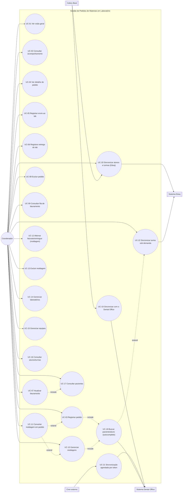

# Casos de Uso — Gestão de Pedidos de Materiais em Laboratório (`gestao_lab`)

> Documento gerado a partir de análise autônoma do código-fonte (`abo-goias/gestao_lab`),
> cruzando `models.py`, `views.py`, `forms.py`, `urls.py`, `admin.py`, `tasks.py`,
> `integrations/dental.py`, `services/dental_sync.py`, `services/cobranca.py`,
> `templatetags/lab_tags.py`, templates e `tests.py` (123 testes), além dos documentos já
> produzidos pelo time (`auditoria-gestao-lab.md`, `melhorias-gestao-lab-2026-07.md`).
> Data: 2026-07-21 · Escopo: aplicação `gestao_lab`.
>
> Metodologia idêntica à usada para `docs/casos-de-uso-gestao-cme.md`: leitura de código e
> comportamento, sem execução visual (Playwright) nesta rodada — uma auditoria visual
> complementar, se desejada, pode seguir o mesmo modelo usado no CME
> (`avaliacao-visual-gestao-cme.md`). Este documento **não implementa nenhuma mudança** —
> pontos que exigem decisão de negócio estão marcados explicitamente na seção 7, sem
> resolvê-los por suposição.
>
> **Atualizado em 2026-07-22** — correção de fonte de dados: a listagem de Alunos usava a
> API do Dental Office, mas nenhum aluno de fato existe lá (o Dental é só clínico,
> pacientes). Os dados reais de alunos vêm do **Eduq**, mesma fonte já usada pelo
> `gestao_cme`. UC-16, UC-18, UC-19 e UC-20 foram reescritos; um novo `TurmaLab` e uma
> nova UC-22 (sincronização de turma sob demanda) foram introduzidos. Ver §11 para o
> histórico da migração, incluindo a remoção dos registros `AlunoLab` de origem Dental
> (nenhum representava um aluno real) e dos `PedidoMaterial`/`Moldagem` vinculados a eles.

## 0. Documentos relacionados

| Documento | Data | Conteúdo |
|---|---|---|
| **`casos-de-uso-gestao-lab.md`** (este arquivo) | 2026-07-21 | Casos de uso, regras de negócio e backlog de usabilidade/sistêmico — referência atual do módulo |
| `auditoria-gestao-lab.md` | 2026-07-13 | Auditoria inicial (bugs A-06 a A-18, backlog B-09 a B-12); a maior parte já foi corrigida — ver referências cruzadas abaixo |
| `melhorias-gestao-lab-2026-07.md` | 2026-07-16 | Nove itens de melhoria (colunas de data, filtro de período, autocomplete, busca ao vivo, menu, textos de login, ícones) — todos implementados |

---

## 1. Visão geral do sistema

O `gestao_lab` controla o fluxo de **pedidos de material odontológico enviados a
laboratórios externos**: um aluno realiza uma moldagem do paciente, o material é
encaminhado a um laboratório parceiro, o laboratório devolve a peça finalizada e, por
fim, o pedido é faturado (ao paciente e ao laboratório). O módulo também sincroniza
**pacientes do Dental Office** (sistema de gestão clínica da ABO Goiás) e **alunos e
turmas do Eduq** (sistema acadêmico — desde 2026-07-22; antes usava o Dental Office, que
nunca teve dado real de aluno, ver §11), e gerencia os cadastros de apoio (laboratórios
parceiros e equipes de coordenação).

O Dental Office é a fonte de verdade de **pacientes**, com busca por nome/celular "ao
vivo" (a aplicação consulta a API a cada tecla, sem gravar nada até o usuário escolher —
ver UC-18, fluxo de paciente). **Alunos**, por outro lado, vêm do **Eduq** — a mesma fonte
usada pelo `gestao_cme` — e herdam a mesma limitação de lá: o Eduq **não tem busca por
nome**, só listagem de alunos por turma. Por isso a busca de aluno é **só local**
(`AlunoLab` já sincronizado), com um botão de sincronizar a turma escolhida quando a busca
não encontra ninguém (UC-18, fluxo de aluno, e UC-22) — mesmo padrão de UX já usado no CME
para turmas/alunos.

Módulos internos do app (rotas em `gestao_lab/urls.py`, todas sob o prefixo
`/laboratorio/`):

| Módulo | Rota principal | Função |
|---|---|---|
| Visão Geral | `/laboratorio/` | KPIs de pedidos por status, próximas entregas, atividade recente |
| Acompanhamento | `/laboratorio/pedidos/` | Listagem de pedidos com filtros de status/período/busca |
| Novo pedido | `/laboratorio/pedidos/novo/` | Registra um pedido de material a um laboratório |
| Detalhe do pedido | `/laboratorio/pedidos/<pk>/` | Linha do tempo do pedido, com ações de envio/entrega/faturamento embutidas |
| Faturamento | `/laboratorio/pedidos/faturamento/` | Fila de pedidos entregues aguardando fechamento financeiro |
| Moldagens | `/laboratorio/moldagens/` | Registro e acompanhamento de moldagens, com conversão em pedido |
| Laboratórios | `/laboratorio/laboratorios/` | Cadastro de laboratórios parceiros |
| Equipes | `/laboratorio/equipes/` | Cadastro de equipes de coordenação |
| Alunos | `/laboratorio/alunos/` | Alunos e turmas sincronizados do Eduq |
| Pacientes | `/laboratorio/pacientes/` | Pacientes sincronizados do Dental Office, com busca ao vivo |

---

## 2. Atores

| Ator | Natureza | Descrição |
|---|---|---|
| **Coordenador (operador de laboratório)** | Humano, autenticado | Usuário do dia a dia: registra pedidos/moldagens, acompanha envios/entregas, fecha faturamento, gerencia laboratórios/equipes. **Sem distinção de permissão** — qualquer usuário autenticado tem acesso total, inclusive a exclusões irreversíveis (ver §6, S-03). Diferente do CME, **nenhum registro tem "dono"**: não existe equivalente a `emprestimos_visiveis` — todo coordenador vê e altera os pedidos de todos. |
| **Superusuário / Administrador** | Humano, autenticado | Mesmo acesso operacional do coordenador nas telas do módulo; adicionalmente, é o único ator que pode **editar os campos principais de um pedido/moldagem já criado** (paciente, aluno, laboratório, equipe, previsão, descrição) — só possível pelo Django Admin, não pela interface operacional (ver U-04). |
| **Sistema Dental Office** | Ator externo (API) | Fonte de verdade de **pacientes**. Suporta busca por nome/celular ao vivo (`GET /customers`) e detalhe de paciente (`GET /customers/{id}`). Desde 2026-07-22, não é mais consultado para alunos (ver §11). |
| **Sistema Eduq** | Ator externo (API) | Fonte de verdade de **alunos e turmas** deste módulo (desde 2026-07-22) — mesmo `EduqClient` já usado pelo `gestao_cme` (`gestao_cme/integrations/eduq.py`), reaproveitado aqui só na camada de integração HTTP; as tabelas locais (`TurmaLab`/`AlunoLab`) são exclusivas do `gestao_lab`, sem FK para `gestao_cme.Turma`/`Aluno`. Só lista alunos por turma (`GET` por turma), sem busca por nome — por isso a busca de aluno (UC-18) é local, com sincronização de turma sob demanda (UC-22). |
| **Celery Beat (agendador)** | Ator de sistema | Dispara `sincronizar_dental_task` (só pacientes) diariamente às 04:30, `sincronizar_eduq_lab_task` (turmas/alunos) às 04:15 e `cobrar_pedidos_atrasados_task` às 09:00 — os dois syncs diários ficam escalonados entre si (e com o sync do Eduq do próprio CME, às 04:00) para não bater na mesma API ao mesmo tempo. |
| **Cron externo (Railway Cron ou similar)** | Ator de sistema, opcional | Pode acionar `/laboratorio/sincronizar-agendado/` via token (`X-Sync-Token`) — redundante com o Celery Beat se ambos estiverem ativos (ver observação em UC-19). |
| **Paciente** | Ator passivo (sujeito do registro) | Não acessa o sistema; titular do pedido/moldagem. |
| **Aluno de pós-graduação** | Ator passivo (sujeito do registro) | Não acessa o sistema; realiza a moldagem e é vinculado ao pedido. |
| **Laboratório externo** | Ator passivo (receptor de comunicação) | Não acessa o sistema; recebe cobranças automáticas por WhatsApp (Z-API) quando tem pedidos atrasados. |

---

## 3. Diagrama de casos de uso



> Nota sobre o diagrama: desde 2026-07-22, pacientes e alunos usam fontes e rotinas
> **independentes** — `Beat --> UC19` (pacientes, Dental, 04:30) e `Beat --> UC20`
> (alunos/turmas, Eduq, 04:15) são setas separadas, sem sobreposição. UC-20 também é
> acionável manualmente pelo coordenador (botão "Sincronizar alunos e turmas" na
> listagem de Alunos, UC-16). UC-22 (sincronizar uma turma específica) só é acionada a
> partir de uma busca de aluno sem resultado (UC-18) — por isso a seta é `-.extend.->`, não
> uma inclusão direta do coordenador. Desde 2026-07-21 (item 10), `Coord` não tem seta
> direta para UC-19: a sincronização completa de pacientes deixou de ter qualquer gatilho
> manual na interface, só rodando pela tarefa agendada.

---

## 4. Casos de uso detalhados

### UC-01 · Consultar a Visão Geral

> **Atualizado em 2026-07-21** — status reformulado para as 4 categorias reais do
> negócio (ver §5, regra 1, e `plano-correcao-status-tipos-gestao-lab.md`); filtro de
> período adicionado (item 1).

- **Ator primário:** Coordenador / Superusuário.
- **View/rota:** `views.dashboard` → `/laboratorio/`
- **Fluxo principal:**
  1. Usuário acessa a Visão Geral.
  2. Sistema calcula as 4 métricas oficiais sobre o **período selecionado** (padrão: 1º
     registro → hoje, ou seja, todo o histórico): **Em dia**, **Atrasado**, **Entregue —
     não faturado**, **Concluídos** — as mesmas 4 categorias de `PedidoMaterial.status`.
  3. Lista até 5 "próximas entregas" (pedidos não entregues, ordenados por
     `previsao_entrega`) e até 6 "pedidos recentes" (ordenados por `criado_em`) — ambas
     também recortadas pelo período selecionado.
  4. Cada card de métrica é um link: Em dia/Atrasado/Concluídos abrem o Acompanhamento
     (UC-02) já filtrado por status; "Entregue — não faturado" abre a fila de
     Faturamento (UC-09), que contém exatamente esses pedidos. Os links propagam o
     mesmo recorte de período usado para contar (`filtro_datas_qs`).
- **Filtro de período (item 1, resolvido):** widget colapsável (`partials/filtro_periodo.html`),
  recorta por `criado_em` (único campo de data relevante nesta página — sem seletor de
  campo, diferente de Acompanhamento/Faturamento). `periodo_ativo` calculado a partir da
  URL antes do preenchimento do padrão "todo o histórico", mesmo cuidado já aplicado nas
  demais páginas.
- **Pós-condição:** nenhuma (somente leitura).
- **Fonte única de verdade:** as 4 métricas vêm diretamente de
  `qs.filter(status=...)` — mesmo campo `status` usado pelo Acompanhamento (UC-02), pelo
  filtro de status e pelo Django Admin. O achado **S-05** (métricas duplicadas entre
  Visão Geral e Acompanhamento) está **resolvido**: a métrica de "entregue e não
  faturado" deixou de ser uma consulta ad-hoc paralela (`entregue=True,
  exclude(faturado_paciente=True, faturado_lab=True)`) e passou a contar diretamente por
  `status=ENTREGUE_NAO_FATURADO` — o mesmo ajuste foi replicado no Portal do `gestao_cme`
  (`views.portal`), que fazia o mesmo cálculo cruzado para o card "pedidos de lab
  aguardando faturamento".

### UC-02 · Consultar o acompanhamento de pedidos

> **Atualizado em 2026-07-21** — status reformulado (ver UC-01, §5 regra 1); filtro de
> período e alinhamento de botões padronizados com o CME (itens 2 e 3); seletor de
> campo de data adicionado ao filtro de período (item 1). "Registrar pedido" passou
> brevemente pelo mini-menu do item "Acompanhamento" (item 11) e voltou para o bloco
> "Ações rápidas" da sidebar — por ser a ação de fluxo principal da tela, não um
> cadastro auxiliar, o mini-menu escondia demais um botão de uso muito frequente
> (ajuste solicitado após o item 11).

- **Ator primário:** Coordenador / Superusuário.
- **View/rota:** `views.acompanhamento_pedidos` → `/laboratorio/pedidos/`
- **Fluxo principal:**
  1. Lista **todos** os pedidos (não só os em aberto — decisão de negócio já validada,
     ver `melhorias-gestao-lab-2026-07.md` item 1+9: um pedido concluído precisa
     continuar aparecendo, senão a coluna "Faturado" nunca teria conteúdo).
  2. Segmentação por status em abas com contagem (`Todos`/`Em dia`/`Atrasados`/`Entregue
     — não faturado`) — os números aparecem sempre, é a natureza de uma navegação por
     abas (diferente do padrão "rótulo só com filtro ativo" do CME, que se aplica a um
     resumo de resultados, não a uma navegação; ver §5, regra 6).
  3. Filtros adicionais: busca textual (paciente, aluno, laboratório, descrição — todos
     acento-insensível via `nome_normalizado`, exceto laboratório/descrição que usam
     `icontains` puro) e período por um campo de data escolhido pelo usuário (Registro,
     Previsão de entrega, Entrega ou Faturamento), com padrão "1º registro → hoje" (mesmo
     conceito do CME).
  4. Colunas: Registro, Previsão (com aviso visual `date-overdue` quando vencida e não
     entregue), Entregue, Faturado (com tooltip "Parcial" indicando qual lado já foi
     faturado), Status, Ações.
  5. Ações por linha: registrar envio (UC-05) ou entrega (UC-06) conforme a etapa atual,
     WhatsApp direto ao laboratório (se tiver número cadastrado), ver detalhe (UC-04),
     excluir (UC-08).
- **Regra de negócio:** filtro de status cobre as 3 categorias "em aberto"
  (`EM_DIA`/`ATRASADO`/`ENTREGUE_NAO_FATURADO`); `CONCLUIDO` não tem aba própria — só
  aparece na aba "Todos" ou por busca textual (mesmo critério de antes da reforma, só
  trocando a categoria do meio).
- **Filtro de período (U-01, resolvido):** deixou de ser dois campos de texto livre
  `dd/mm/aaaa` e passou a reusar o mesmo widget colapsável do CME
  (`partials/filtro_periodo.html`, agora promovido para `templates/partials/` — antes
  vivia só em `gestao_cme/templates/gestao_cme/partials/` — e reusado tal e qual, sem
  nenhuma duplicação de código entre os dois apps). Campos `<input type="date">` (ISO),
  painel só expande quando há filtro ativo (`periodo_ativo`, calculado a partir do que
  veio na URL **antes** do preenchimento do padrão "todo o histórico" — mesmo cuidado já
  aplicado no CME, para o painel não aparecer sempre "ativo").
- **Seletor de campo de data (item 1, resolvido):** como esta página tem várias datas
  relevantes (`criado_em`, `previsao_entrega`, `data_entrega`, `data_faturamento`), o
  widget de período ganhou um `<select name="campo_data">` (Registro / Previsão de
  entrega / Entrega / Faturamento — `?campo_data=`, com fallback para "registro" se vier
  um valor inválido). O helper `_filtrar_por_campo_data()` recorta pelo campo escolhido,
  tratando `criado_em` (`DateTimeField`) e os demais (`DateField`) corretamente.
- **"Buscar"/"Limpar tudo" (U-02, resolvido):** os dois ficam agora dentro do mesmo
  `<form class="filter-bar">`, lado a lado (`.filter-actions`), em vez de "Limpar tudo"
  ficar solto no bloco de chips abaixo — mesmo padrão já usado em todo o CME e nas
  demais listagens do laboratório (Moldagens, Pacientes, Faturamento).
- **Pós-condição:** nenhuma (somente leitura, exceto pelas ações de linha).

### UC-03 · Registrar novo pedido de material

- **Ator primário:** Coordenador.
- **View/rota:** `views.criar_pedido` → `/laboratorio/pedidos/novo/`
- **Inclui:** UC-18 (autocomplete de paciente e aluno).
- **Fluxo principal:**
  1. Coordenador busca e seleciona paciente e aluno (autocomplete independente para cada
     campo), escolhe laboratório e equipe (`<select>` — listas curtas, sem necessidade de
     autocomplete), informa previsão de entrega (`<input type="date">`) e descreve o
     serviço.
  2. Ao salvar, `PedidoMaterial` é criado com `status` calculado automaticamente
     (`EM_DIA`, pois ainda não há envio nem atraso).
  3. **Fluxo alternativo — a partir de uma moldagem:** com `?moldagem=<pk>`, o formulário
     vem pré-preenchido com paciente/aluno da moldagem (chips "pré-preenchido"); ao
     salvar, o pedido é vinculado de volta à moldagem (`Moldagem.pedido_material`), que
     passa a aparecer como "convertida" (UC-11).
- **Pós-condição:** `PedidoMaterial` criado; se veio de moldagem, o vínculo é gravado nos
  dois sentidos.
- **Observação:** diferente do CME (onde `registrar_entrada`/`criar_emprestimo` avisam
  quando o aluno não tem abrigo, mas não bloqueiam), aqui não há avisos adicionais no
  momento da criação — o formulário só valida os campos obrigatórios padrão.

### UC-04 · Consultar detalhe de um pedido

- **Ator primário:** Coordenador / Superusuário.
- **View/rota:** `views.detalhe_pedido` → `/laboratorio/pedidos/<pk>/`
- **Fluxo principal:**
  1. Mostra os dados do pedido (paciente, aluno, laboratório, equipe, previsão,
     descrição, data de registro) e uma **linha do tempo** com três etapas: "Pedido
     criado" (sempre concluída), "Envio ao laboratório" e "Entrega do laboratório".
  2. A etapa **ativa** (a próxima a acontecer) embute o próprio formulário de ação
     (data pré-preenchida com hoje, editável) — não é preciso ir para outra tela.
  3. Quando `entregue=True`, exibe também o formulário de faturamento (UC-07) na mesma
     página.
- **Pós-condição:** nenhuma própria (as ações embutidas têm as pós-condições de
  UC-05/UC-06/UC-07).

### UC-05 · Registrar envio ao laboratório

- **Ator primário:** Coordenador.
- **View/rota:** `views.marcar_envio` (POST) → `/laboratorio/pedidos/<pk>/marcar-envio/`
- **Fluxo principal:** grava `data_envio`. Desde a reforma de status (item 4, ver §5
  regra 1), `data_envio` não influencia mais o `status` calculado — o pedido continua
  "Em dia" ou "Atrasado" (conforme o prazo) até ser de fato entregue.
- **Fluxo de exceção:** data inválida → mensagem de erro, nenhuma alteração.
- **Achado sistêmico (S-01):** o redirecionamento pós-ação usa
  `redirect(request.POST.get("next") or "lab_pedidos")` **sem validar** que `next` seja
  um caminho local — ver detalhamento em §6.2, S-01 (mesmo padrão em UC-06 e UC-07).

### UC-06 · Registrar entrega do laboratório

- **Ator primário:** Coordenador.
- **View/rota:** `views.marcar_entrega` (POST) → `/laboratorio/pedidos/<pk>/marcar-entrega/`
- **Fluxo principal:** grava `entregue=True` e `data_entrega`; `status` recalculado
  (`CONCLUIDO` se já faturado dos dois lados, senão permanece o que era).
- **Fluxo de exceção:** data inválida → mensagem de erro, nenhuma alteração.
- **Pós-condição:** pedido passa a aparecer na fila de faturamento (UC-09), se ainda não
  totalmente faturado.
- **Mesmo achado de S-01** que UC-05 (redirecionamento via `next` não validado).

### UC-07 · Atualizar faturamento de um pedido

> **Atualizado em 2026-07-21** — status reformulado (ver UC-01, §5 regra 1).

- **Ator primário:** Coordenador.
- **Views/rotas:**
  - `views.atualizar_faturamento` (POST) → `/laboratorio/pedidos/<pk>/faturamento/` —
    formulário completo (as duas flags + nota fiscal + vencimento), usado no detalhe do
    pedido (UC-04).
  - `views.alternar_faturado_paciente` / `alternar_faturado_lab` (POST) — toggles
    independentes, usados na fila de faturamento (UC-09), sem passar pelo formulário
    completo.
- **Fluxo principal:** ao marcar as duas flags (`faturado_paciente` e `faturado_lab`)
  como verdadeiras, o `save()` do modelo grava `data_faturamento = hoje` e recalcula
  `status` para `CONCLUIDO`; desfazer qualquer uma delas limpa `data_faturamento` e volta
  o status para `ENTREGUE_NAO_FATURADO` (o pedido continua entregue — "atrasado"/"em dia"
  só se aplicam a pedidos ainda não entregues).
- **Regra de negócio:** `data_faturamento` é **derivada**, nunca editável diretamente —
  mesmo padrão de campo calculado já usado para `status` (ver `models.py::save`).
- **Mesmo achado de S-01** nos três toggles (redirecionamento via `next` não validado).

### UC-08 · Excluir pedido

- **Ator primário:** Coordenador.
- **View/rota:** `views.excluir_pedido` (POST) → `/laboratorio/pedidos/<pk>/excluir/`
- **Fluxo principal:**
  1. Exclusão é **permanente** (hard delete), com modal de confirmação
     (`data-confirm-danger`) explicando a irreversibilidade.
  2. Se o pedido tinha origem numa moldagem (`Moldagem.pedido_material`), o vínculo é
     desfeito (`SET_NULL`) e a moldagem volta a aparecer como "não convertida" em UC-10 —
     avisado explicitamente na mensagem de confirmação e na de sucesso.
- **Regra de negócio:** `PedidoMaterial` não é referenciado por nenhuma outra tabela além
  de `Moldagem` (que usa `SET_NULL`), então a exclusão nunca é bloqueada por
  `ProtectedError` — diferente de `Material`/`Kit` no CME.
- **Pós-condição:** pedido removido; moldagem de origem, se houver, desvinculada.
- **Achado de usabilidade (U-04):** não existe forma de **editar** um pedido (corrigir
  paciente/laboratório errado, ajustar a descrição) pela interface — a única correção
  possível é excluir e recriar, perdendo `data_envio`/`data_entrega`/faturamento já
  preenchidos. A edição só é possível pelo Django Admin (`PedidoMaterialAdmin` permite
  editar todos os campos, exceto `status`). Ver U-04 em §6.1.

### UC-09 · Consultar fila de faturamento

> **Atualizado em 2026-07-21** — filtros por faturamento do paciente/laboratório
> (item 6/8); filtro de período com seletor de campo adicionado (item 1).

- **Ator primário:** Coordenador.
- **View/rota:** `views.pedidos_faturamento` → `/laboratorio/pedidos/faturamento/`
- **Fluxo principal:**
  1. Lista pedidos **entregues** e **não totalmente faturados** (`entregue=True`,
     excluindo os que já têm as duas flags), ordenados pela data de entrega mais antiga
     primeiro (fila FIFO) — exatamente os pedidos com
     `status=ENTREGUE_NAO_FATURADO` (ver UC-01, §5 regra 1).
  2. Filtros: busca textual (paciente, aluno, laboratório), dois selects
     independentes — **Fat. paciente** (Faturado/Não faturado/Todos) e **Fat.
     laboratório** (idem) —, cada um espelhando exatamente uma das duas colunas
     "Fat. Paciente"/"Fat. Lab" da tabela, e período por um campo de data escolhido
     (Registro, Entrega ou Vencimento), com padrão "1º registro → hoje". Os filtros
     podem ser combinados livremente (ex.: "não faturado pelo paciente" **e** "não
     faturado pelo laboratório" **e** um recorte de período por vencimento).
  3. Cada linha permite alternar as duas flags de faturamento inline (checkbox-like
     `.toggle-check`, sem sair da tela) e ir ao detalhe para preencher nota fiscal e
     vencimento (UC-07 completo).
- **Regra de negócio:** um pedido sai desta fila automaticamente assim que as duas flags
  ficam verdadeiras (vira `CONCLUIDO` e deixa de casar com o filtro da queryset) — por
  isso filtrar por "Faturado pelo paciente" aqui sempre mostra só quem falta o lado do
  laboratório (o inverso já saiu da fila).
- **Filtro de período (item 1, resolvido):** mesmo widget colapsável das demais páginas,
  com seletor de campo (`?campo_data=registro|entrega|vencimento`, fallback "registro"
  para valor inválido) — recorta pelo campo escolhido via `_filtrar_por_campo_data()`.
- **Pós-condição:** nenhuma própria (leitura + toggles de UC-07).

### UC-10 · Gerenciar moldagens

> **Decisão de negócio confirmada em 2026-07-21** (ver
> `plano-correcao-status-tipos-gestao-lab.md`, Ponto 2): `Moldagem` **não** representa
> um "tipo de serviço" — é só o mecanismo de pré-registro específico do fluxo de
> moldagem (aluno registra → depois encaminha para virar `PedidoMaterial`). Outros tipos
> de material (aparelhos etc.) são pedidos diretamente, sem etapa prévia equivalente, e
> `PedidoMaterial.descricao_servico` **permanece texto livre** — não haverá campo
> estruturado de tipo/categoria. Nenhuma mudança de código para este ponto.

> **Atualizado em 2026-07-21** — "Nova moldagem" saiu de `panel_actions` (topo da
> página), passou brevemente pelo mini-menu do item "Moldagens" (item 11) e ficou no
> bloco "Ações rápidas" da sidebar — mesmo ajuste e mesmo motivo de "Registrar pedido"
> (ver UC-02): é a ação de fluxo principal da tela, não um cadastro auxiliar.

- **Ator primário:** Coordenador.
- **Views/rotas:** `views.moldagens` (listar, `/laboratorio/moldagens/`),
  `views.criar_moldagem` (`/laboratorio/moldagens/nova/`).
- **Inclui:** UC-18 (autocomplete de paciente e aluno, mesmo componente de UC-03).
- **Fluxo principal:**
  1. Lista moldagens com busca textual, filtro por situação (`faturado`/`não faturado`/
     `entregue`/`não entregue`/`convertida`/`não convertida`) e filtro de período por
     data de registro (item 1 — `criado_em` é o único campo de data do modelo, então o
     widget não tem seletor de campo, diferente de Acompanhamento/Faturamento).
  2. Métricas fixas na barra lateral: total, faturadas, entregues (ao laboratório),
     convertidas, pendentes.
  3. Ações inline por linha: alternar faturado/entregue (UC-12), encaminhar (converter em
     pedido — UC-11), excluir (UC-13).
- **Achado de usabilidade (U-03):** o resumo de resultados mostra "N não convertida(s)"
  (`?filtro=nao_convertida`) sempre que `metricas.pendentes > 0`, **independentemente**
  de o filtro "Não convertida" estar de fato selecionado — o mesmo padrão que o CME
  identificou e corrigiu na rodada 2 (R2-2: rótulo de contagem só quando o filtro
  correspondente está ativo). O mesmo ocorre em Pacientes (UC-17, "N com pedido aberto").
  Ver U-03 em §6.1.
- **Achado de usabilidade (U-04, mesmo de UC-08):** também não há edição de moldagem
  (trocar paciente/aluno) pela interface — só toggles, conversão e exclusão.
- **"Buscar"/"Limpar tudo" (U-02, resolvido em 2026-07-21):** mesma correção de UC-02 —
  os dois ficam lado a lado dentro do `<form class="filter-bar">`.

### UC-11 · Converter moldagem em pedido

- **Ator primário:** Coordenador.
- **Estende:** UC-10 (ação de linha) e UC-03 (reaproveita o formulário de criação).
- **View/rota:** `views.converter_moldagem` (POST) →
  `/laboratorio/moldagens/<pk>/converter/`
- **Fluxo principal:**
  1. Se a moldagem já foi convertida (`pedido_material` preenchido), avisa e não faz
     nada — conversão dupla é bloqueada.
  2. Caso contrário, redireciona para o formulário de novo pedido (UC-03) com
     `?moldagem=<pk>`, que pré-preenche paciente e aluno.
- **Regra de negócio:** a conversão em si **não cria** o `PedidoMaterial` — só prepara o
  formulário; o pedido só existe de fato quando o coordenador confirma o envio em UC-03.
  Se o coordenador desistir no meio do formulário, a moldagem permanece "não convertida".

### UC-12 · Alternar faturado/entregue de uma moldagem

- **Ator primário:** Coordenador.
- **Views/rotas:** `views.alternar_faturado_moldagem` / `alternar_entregue_moldagem`
  (POST) → `/laboratorio/moldagens/<pk>/alternar-faturado/` e `/alternar-entregue/`.
- **Fluxo principal:** cicla o respectivo campo booleano (`faturado`/`entregue`) — ao
  contrário de `Movimentacao.retirado` no CME (três estados `None/True/False`), aqui são
  apenas dois estados (`True`/`False`), sem estado "indefinido".
- **Regra de negócio:** estes dois campos da `Moldagem` são **independentes** dos campos
  homônimos do `PedidoMaterial` gerado a partir dela (não há sincronização automática) —
  o faturamento "de verdade" (que conta para KPIs/faturamento) é sempre o do pedido.
- **Mesmo achado de S-01** (redirecionamento via `next` não validado).

### UC-13 · Excluir moldagem

- **Ator primário:** Coordenador.
- **View/rota:** `views.excluir_moldagem` (POST) →
  `/laboratorio/moldagens/<pk>/excluir/`
- **Fluxo principal:** exclusão permanente, com modal de confirmação. **Não afeta** o
  pedido gerado a partir dela, se existir — a moldagem é o lado "descartável" da relação
  (`Moldagem.pedido_material` é `SET_NULL` só no sentido pedido→moldagem em UC-08; aqui,
  ao excluir a moldagem, o `PedidoMaterial` (se houver) simplesmente perde a referência
  reversa, sem qualquer efeito visível nele).
- **Pós-condição:** moldagem removida; pedido de origem (se houver) inalterado.

### UC-14 · Gerenciar laboratórios

> **Atualizado em 2026-07-21** — "Novo laboratório" movido do topo da página
> (`panel_actions`) para o mini-menu do item "Laboratórios" na navegação lateral,
> mesmo padrão do CME (item 11). Resolve o achado U-06.

- **Ator primário:** Coordenador / Superusuário.
- **Views/rotas:** `views.laboratorios` (listar, `/laboratorio/laboratorios/`),
  `criar_laboratorio` (`/novo/`), `editar_laboratorio` (`/<pk>/editar/`).
- **Fluxo principal:** cadastro com nome, telefone, WhatsApp, e-mail, CNPJ e uma
  multi-seleção de **equipes** (`CheckboxSelectMultiple`) que atendem aquele laboratório.
- **Achado de usabilidade (U-07):** o docstring do modelo `Laboratorio` afirma "**ao menos
  uma equipe deve ser vinculada** no cadastro", mas `LaboratorioForm` define
  `equipes.required = False` — não há validação real que imponha essa regra. Hoje é
  possível cadastrar (e a suíte de testes permite) um laboratório sem nenhuma equipe.
  Nenhum fluxo atual (cobrança automática, listagens) depende de haver ao menos uma
  equipe, então não há bug funcional — mas o dado pode ficar inconsistente com a
  documentação do próprio modelo. Ver U-07 em §6.1.
- **Não há exclusão de laboratório pela interface** (nem pelo Admin há botão dedicado
  além do delete padrão do Django) — diferente de Materiais/Kits no CME, que tratam
  `ProtectedError` explicitamente. Como `Laboratorio` é `PROTECT` em `PedidoMaterial`, um
  laboratório com pedidos vinculados não pode ser apagado via Admin sem antes remover os
  pedidos — comportamento correto por padrão do Django, só não tem uma mensagem
  amigável equivalente à do CME.
- **Pós-condição:** `Laboratorio` criado/atualizado.

### UC-15 · Gerenciar equipes

> **Atualizado em 2026-07-21** — "Nova equipe" movida do topo da página
> (`panel_actions`) para o mini-menu do item "Equipes" na navegação lateral, mesmo
> padrão do CME (item 11). Resolve o achado U-06.

- **Ator primário:** Coordenador / Superusuário.
- **Views/rotas:** `views.equipes` (listar, `/laboratorio/equipes/`), `criar_equipe`
  (`/nova/`), `editar_equipe` (`/<pk>/editar/`).
- **Fluxo principal:** cadastro com nome, coordenador responsável e WhatsApp do
  coordenador.
- **Pós-condição:** `Equipe` criada/atualizada. Mesma observação de UC-14 sobre ausência
  de exclusão pela interface (`Equipe` é `PROTECT` em `PedidoMaterial`).

### UC-16 · Consultar alunos e turmas sincronizados

> **Atualizado em 2026-07-22** — fonte de dados trocada do Dental Office para o **Eduq**
> (nenhum dado de aluno existia de fato no Dental — ver §11); modelo `AlunoLab` ganhou
> `matricula` (era `id_dental`) e um FK para o novo `TurmaLab`; botão de sincronização
> renomeado para "Sincronizar alunos e turmas" (UC-20).
>
> **Atualizado em 2026-07-21** — botão de sincronização trocado de UC-19
> (completa) para UC-20 (só alunos) — item 10 do plano.

- **Ator primário:** Coordenador / Superusuário.
- **View/rota:** `views.alunos_lab` → `/laboratorio/alunos/`
- **Fluxo principal:**
  1. Lista `AlunoLab` ativos, com busca por nome, matrícula **ou nome da turma**
     (`turma__nome__icontains` / `matricula__icontains`, além do `nome_normalizado` já
     existente).
  2. Colunas: Aluno, Celular, Matrícula, Turma, Última atualização.
  3. Mostra a data da última sincronização (agregada, `Max(ultima_sincronizacao)`) e o
     histórico dos 5 últimos `RegistroSync` (compartilhado com UC-17, mesmo modelo de
     auditoria).
  4. Botão "Sincronizar alunos e turmas" (`partials/sync_eduq.html`) dispara **UC-20**
     (`lab_sincronizar_alunos`, agora apontando para `views.sincronizar_alunos_eduq`), com
     `next` de volta para esta tela.
- **Pós-condição:** nenhuma própria (leitura + efeito de UC-20).

### UC-17 · Consultar pacientes sincronizados (com busca ao vivo)

> **Atualizado em 2026-07-21** — listagem unificada (base local + Dental Office numa
> única tabela) e ação "Importar" adicionadas (item 9), no padrão de
> `gestao_contratos.views.contratos`. Resolve o achado U-05.

- **Ator primário:** Coordenador / Superusuário.
- **View/rota:** `views.pacientes` → `/laboratorio/pacientes/`
- **Fluxo principal:**
  1. Lista `Paciente` ativos, com busca por nome/celular e filtro "Pedido — todos / Com
     pedido aberto" (`?pedido=aberto`).
  2. **Coluna "Pedido"**: badge "Pedido em aberto" se o paciente tem algum
     `PedidoMaterial` com status diferente de `CONCLUIDO`, senão "Sem pedido" — decisão
     de negócio já validada (`melhorias-gestao-lab-2026-07.md`, item 5): substituiu a
     antiga coluna "processo em aberto" (`Paciente.processo_aberto`, um flag vindo direto
     do Dental Office sem relação com pedidos do laboratório).
  3. **Busca ao vivo (só na 1ª página, só com termo preenchido):** além da base local, a
     view consulta o Dental Office em tempo real. Os dois conjuntos de resultados
     aparecem **numa única tabela** (`pacientes_unificados`, mesmo conceito de
     `gestao_contratos.views.contratos`), com um selo de origem por linha ("No sistema" /
     "Dental Office") em vez de duas tabelas separadas — quem já está na base local nunca
     aparece duplicado. Aviso "refine a busca" quando há mais páginas na API do que as
     exibidas, e degradação graciosa (mensagem de erro na área de resumo, sem quebrar a
     lista local) se o Dental Office estiver indisponível.
  4. **Ação "Importar" (resolve U-05):** cada linha "Dental Office" ganhou um botão
     "Importar" (POST → `views.importar_paciente_dental`) que materializa o paciente na
     base local (mesma `materializar_paciente` já usada pelo autocomplete de UC-03/UC-10)
     e mostra mensagem de sucesso/erro — sem precisar passar pelo formulário de
     pedido/moldagem só para trazer o paciente para o sistema.
- **Achado de usabilidade (U-03, mesmo de UC-10):** "N com pedido aberto" no resumo de
  resultados aparece sempre que `total_abertos > 0`, mesmo quando o filtro
  `pedido=aberto` já está selecionado (nesse caso o número deixa de acrescentar
  informação nova, pois já é o total filtrado).
- **"Buscar"/"Limpar tudo" (U-02, resolvido em 2026-07-21):** mesma correção de UC-02 —
  os dois ficam lado a lado dentro do `<form class="filter-bar">`.
- **Pós-condição:** nenhuma para a consulta; a ação "Importar" cria (ou reaproveita, se já
  existir) um `Paciente` local.

### UC-18 · Buscar paciente/aluno via autocomplete *(caso de uso incluído / componente compartilhado)*

> **Atualizado em 2026-07-22** — o fluxo de aluno deixou de consultar o Dental Office
> "ao vivo" (nunca teve dado real de aluno) e passou a ser **só local**, com fallback de
> sincronização de turma (UC-22) quando não encontra ninguém — mesmo padrão do CME. O
> fluxo de paciente **não mudou** (continua consultando o Dental Office ao vivo). Os dois
> fluxos agora divergem o bastante para serem descritos separadamente abaixo.

- **Ator primário:** Coordenador (indiretamente, via UC-03 e UC-10).
- **Views/rotas:**
  - `views.buscar_pacientes` (HTMX, GET) → `/laboratorio/buscar-pacientes/`.
  - `views.buscar_alunos_lab` (HTMX, GET) → `/laboratorio/buscar-alunos-lab/`.
  - `views.materializar` (POST) → `/laboratorio/selecionar/paciente/` — grava o paciente
    escolhido (só paciente; aluno nunca precisa materializar, ver abaixo).
  - `views.sincronizar_turma_aluno_busca` (POST) — ver UC-22.
- **Fluxo principal — paciente (inalterado):**
  1. Componente HTMX dispara a cada digitação; `buscar_pacientes` consulta a **base
     local** e, em paralelo, a **API do Dental Office** (1ª página), devolvendo uma lista
     única, sem indicar a origem de cada item.
  2. **Registros locais nunca perdem vaga para remotos**: o corte pelo limite (20 itens)
     preenche primeiro com o que já está no banco; os itens vindos da API só ocupam as
     vagas que sobrarem — corrige um bug já identificado e testado
     (`auditoria-gestao-lab.md`, seção "Busca unificada", bug do corte em 20 itens).
  3. Ao escolher um item **sem pk** (veio só da API), o clique dispara `materializar` —
     grava o paciente localmente (`update_or_create`, sempre com os dados da resposta da
     API, nunca o que o navegador enviou) e devolve o pk recém-criado para o campo oculto
     do formulário. Itens que já têm pk resolvem sem ida à API.
  4. **Degradação suave:** se a API do Dental Office falhar, a busca ainda funciona só
     com a base local, com um aviso `parcial=True` no fragmento.
- **Fluxo principal — aluno (reescrito em 2026-07-22):**
  1. `buscar_alunos_lab` consulta **somente** a base local (`AlunoLab`, acento-insensível
     por nome, mais matrícula/turma) — não há chamada ao Eduq nesta view, porque o Eduq
     não tem endpoint de busca por nome (só listagem por turma).
  2. Todo resultado já tem pk (é sempre um `AlunoLab` já sincronizado) — o clique nunca
     precisa de `materializar` para aluno; o campo oculto é preenchido direto.
  3. **Sem resultado:** o fragmento (`partials/_ac_results_aluno.html`) mostra "Nenhum
     aluno encontrado para "X"." e um aviso de que o Eduq não permite buscar por nome,
     com um `<select>` das turmas existentes no Eduq e um botão "Sincronizar turma" — ver
     UC-22. Depois de sincronizar, o operador digita de novo e o aluno aparece.
- **Regra de negócio central:** os dois fluxos têm limitações opostas nas APIs que
  consultam — Dental Office tem busca por nome/celular (paciente busca "ao vivo"), Eduq
  só lista por turma (aluno busca local + sincronização sob demanda) — por isso o mesmo
  caso de uso (autocomplete) tem dois comportamentos de fundo bem diferentes.
- **Pós-condição:** para paciente, nenhuma até o clique num item sem pk (cria/reaproveita
  `Paciente`); para aluno, nenhuma (leitura local) — a única escrita possível no fluxo de
  aluno é a sincronização de turma (UC-22), acionada à parte.

### UC-19 · Sincronizar pacientes com o Dental Office

> **Atualizado em 2026-07-22** — passou a sincronizar **só pacientes**; alunos saíram
> completamente do escopo desta view/tarefa (nunca deveriam ter estado — ver §11) e
> agora têm rotina própria (UC-20, fonte Eduq).
>
> **Atualizado em 2026-07-21** — a sincronização completa deixou de ter botão na
> interface (item 10): Pacientes já usava busca ao vivo + importação pontual desde o
> item 9 (ver UC-17). Continua acionável pela tarefa agendada (Celery Beat) e pelo
> endpoint de cron externo (UC-21).

- **Ator primário:** **Celery Beat** (acionamento automático diário às 04:30); a rota
  continua exposta e testada, mas **sem nenhum botão na interface** desde o item 10.
- **Views/rotas:**
  - `views.sincronizar_dental` (POST) → `/laboratorio/sincronizar/` — sem ponto de
    entrada na UI atual (ver observação acima); permanece coberta por
    `SincronizarDentalViewTests` para não perder a cobertura de regressão da rota.
  - `gestao_lab/tasks.py::sincronizar_dental_task` (Celery Beat, 04:30 diária).
- **Fluxo principal:** chama `services.dental_sync.executar_sync_e_registrar`, que busca
  **todas as páginas** de `/customers`, faz `update_or_create` em `Paciente` e grava um
  `RegistroSync` com contadores, duração e sucesso/erro — consultável no histórico da
  tela de Pacientes.
- **Fluxo de exceção:** `DentalAPIError` → mensagem de erro; o `RegistroSync` grava
  `sucesso=False` e a mensagem de erro, mesmo em execuções automáticas.
- **Achado sistêmico (S-01, mesmo de UC-05/06/07):** o redirecionamento por `next` aqui
  usa `next_url.startswith("/")`, mais seguro que os toggles de faturamento, mas ainda
  vulnerável a uma URL "protocol-relative" (`//host-externo/...`), que também começa com
  `/` e é tratada pelo navegador como redirecionamento para outro domínio. Ver S-01 em
  §6.2 para o detalhamento e a correção recomendada (comum a todas as views afetadas).
- **Risco sistêmico:** a view roda **de forma síncrona no request** — pode ser lenta com
  uma base grande de pacientes (a auditoria original já registrava isso como candidato a
  mover para fila assíncrona). Hoje o risco só se materializa se algo chamar a rota
  diretamente (não há mais botão na UI que dispare essa execução síncrona).
- **Observação operacional:** se um cron externo continuar chamando
  `/laboratorio/sincronizar-agendado/` (UC-21) além do Celery Beat, a base sincroniza em
  duplicidade — sem quebrar nada, mas sem necessidade (mesmo aviso já registrado em
  `auditoria-gestao-lab.md`).

### UC-20 · Sincronizar alunos e turmas com o Eduq

> **Reescrito em 2026-07-22** — antes chamava `dental_sync.sincronizar_alunos` (endpoint
> `/users` do Dental Office, que nunca teve dado real de aluno). Agora chama o Eduq,
> mesma fonte já usada pelo `gestao_cme`, e sincroniza **turmas e alunos juntos** (não só
> alunos) — por isso o nome mudou de "Atualizar somente a lista de alunos" para
> "Sincronizar alunos e turmas". A rota (`lab_sincronizar_alunos`) e o botão continuam
> nos mesmos três pontos.

- **Ator primário:** Coordenador; também **Celery Beat** (acionamento automático diário
  às 04:15, ver `tasks.sincronizar_eduq_lab_task`).
- **Views/rotas:**
  - `views.sincronizar_alunos_eduq` (POST) → `/laboratorio/sincronizar-alunos/` (mesma
    rota de antes, `lab_sincronizar_alunos`).
  - `gestao_lab/tasks.py::sincronizar_eduq_lab_task` (Celery Beat, 04:15 diária).
- **Fluxo principal:** chama
  `services.eduq_lab_sync.executar_sync_alunos_e_registrar`, que reaproveita o
  `EduqClient` de `gestao_cme.integrations.eduq` para listar **todas as turmas** e, para
  cada uma, seus alunos — fazendo `update_or_create` em `TurmaLab` e `AlunoLab` (por
  `codigo`/`matricula`) e gravando um `RegistroSync` com contadores, duração e
  sucesso/erro. Botão "Sincronizar alunos e turmas" disponível em três pontos, todos com
  a mesma ação de fundo: nos formulários de pedido (UC-03) e moldagem (UC-10) via
  `partials/atualizar_alunos.html`, e na listagem de Alunos (UC-16) via
  `partials/sync_eduq.html`.
- **Fluxo de exceção:** `EduqAPIError` → mensagem de erro; o `RegistroSync` grava
  `sucesso=False` e a mensagem de erro.
- **Regra de negócio:** diferente da versão anterior (Dental, endpoint dedicado só de
  alunos), esta sincronização sempre grava turmas **e** alunos juntos, porque o Eduq só
  lista alunos a partir de uma turma — não existe "sincronizar só alunos" nesta fonte.
  O botão nos formulários de pedido/moldagem cobre o caso de um aluno **recém-matriculado
  no Eduq** ainda não aparecer no autocomplete local (UC-18); para uma turma específica
  ainda não sincronizada, ver UC-22 (mais rápido que sincronizar tudo).
- **Mesmo achado de S-01** (redirecionamento via `next_url.startswith("/")`).

### UC-21 · Sincronização agendada por token *(endpoint de integração)*

- **Ator primário:** Cron externo (Railway Cron ou similar).
- **View/rota:** `views.sincronizar_agendado` (`@csrf_exempt`, POST) →
  `/laboratorio/sincronizar-agendado/`
- **Fluxo principal:**
  1. Autentica por cabeçalho `X-Sync-Token` (ou campo `token` no corpo), comparado com
     `settings.DENTAL_SYNC_TOKEN` via `secrets.compare_digest` (comparação em tempo
     constante, protege contra timing attack).
  2. Sem token configurado ou com token incorreto → `403`, sem revelar detalhes.
  3. Com token válido, executa a mesma sincronização completa de UC-19
     (`executar_sync_e_registrar`, `tipo=AGENDADA`) e devolve o resultado em JSON.
- **Regra de negócio:** endpoint público por design (não usa `@login_required` —
  precisa ser acionável por um serviço externo sem sessão de usuário), mas protegido por
  token secreto; `@csrf_exempt` é necessário e seguro aqui porque a proteção real é o
  token, não o cookie de sessão.
- **Observação:** ver UC-19 para o risco de duplicidade se o Celery Beat também estiver
  ativo. Só cobre pacientes (Dental) — não existe endpoint de cron equivalente para o
  sync de alunos/turmas (Eduq); a rotina de alunos hoje só roda pelo Celery Beat (UC-20)
  ou manualmente.

### UC-22 · Sincronizar turma sob demanda *(fluxo estendido de UC-18)*

> **Novo em 2026-07-22** — mesmo conceito do CME (turma sincronizada sob demanda a
> partir de uma busca de aluno sem resultado), agora replicado no laboratório porque a
> busca de aluno (UC-18) deixou de ter uma API com busca por nome.

- **Ator primário:** Coordenador (sempre a partir de uma busca de aluno sem resultado,
  UC-18).
- **View/rota:** `views.sincronizar_turma_aluno_busca` (POST) →
  `/laboratorio/sincronizar-turma-aluno-busca/`
- **Fluxo principal:**
  1. Quando `buscar_alunos_lab` (UC-18) não encontra ninguém, o fragmento mostra um
     `<select>` com as turmas disponíveis no Eduq (`eduq_lab_sync.listar_turmas_eduq`,
     sem gravar nada) e um botão "Sincronizar turma".
  2. Ao escolher uma turma e confirmar, a view chama
     `eduq_lab_sync.sincronizar_turma_eduq(codigo_turma)` — sincroniza **só aquela
     turma** (mais rápido que UC-20, que sincroniza todas) e seus alunos.
  3. Mensagem de sucesso com os contadores; o operador digita a busca de novo e o aluno
     recém-sincronizado aparece.
- **Fluxo de exceção:** turma inexistente no Eduq (código não encontrado na resposta da
  API) ou `EduqAPIError` → mensagem de erro, nenhuma alteração.
- **Regra de negócio:** existe **porque** o Eduq não tem busca por nome — sincronizar
  uma turma inteira é o único jeito de "achar" um aluno que ainda não está na base local,
  sem precisar rodar a sincronização completa (UC-20).
- **Pós-condição:** `TurmaLab` e os `AlunoLab` daquela turma criados/atualizados.

---

## 5. Regras de negócio transversais

1. **Status derivado automaticamente — 4 categorias exatas** *(reformulado em
   2026-07-21)* — `PedidoMaterial.status` nunca é definido diretamente por um
   formulário (`editable=False`); é sempre recalculado em `save()` por
   `calcular_status()`:
   ```python
   def calcular_status(self) -> str:
       if self.entregue:
           if self.faturado_paciente and self.faturado_lab:
               return self.Status.CONCLUIDO
           return self.Status.ENTREGUE_NAO_FATURADO
       if date.today() > self.previsao_entrega:
           return self.Status.ATRASADO
       return self.Status.EM_DIA
   ```
   As 4 categorias são mutuamente exclusivas e cobrem todo pedido: **Em dia** (não
   entregue, dentro do prazo — inclui tanto "ainda não enviado" quanto "enviado,
   aguardando devolução", que antes da reforma era um status próprio, `A_CONFIRMAR`, hoje
   fundido aqui), **Atrasado** (não entregue, prazo vencido), **Entregue — não faturado**
   (entregue, falta faturar de um lado ou dos dois — categoria nova; antes da reforma
   esse caso caía silenciosamente em "Em dia" por não ter valor próprio, um bug real
   corrigido nesta rodada) e **Concluído** (entregue e faturado dos dois lados). Mesmo
   padrão do CME (`Movimentacao`/`Kit.quantidade` calculados); aqui a Visão Geral e o
   Acompanhamento **já compartilham a mesma fonte** (o campo `status`), sem consulta
   paralela — ver S-05 em §6.2 (resolvido).
2. **`data_faturamento` derivada das duas flags** — preenchida quando
   `faturado_paciente` **e** `faturado_lab` ficam verdadeiras; limpa se qualquer uma for
   desfeita. Backfill histórico (migration `0009`) usou `atualizado_em` como aproximação
   para pedidos já concluídos antes da criação do campo — decisão de negócio já validada,
   com ressalva registrada de que uma fonte melhor (nota fiscal) poderia refinar o dado
   histórico se disponível.
3. **Integridade referencial por `PROTECT`** — `Paciente`, `AlunoLab`, `Laboratorio` e
   `Equipe` são todos `PROTECT` como FK de `PedidoMaterial` e (paciente/aluno) de
   `Moldagem` — nenhum desses cadastros pode ser excluído enquanto tiver pedidos ou
   moldagens vinculados (o Django recusa a exclusão; não há tratamento de
   `ProtectedError` com mensagem amigável na interface, diferente do CME — ver UC-14).
   `Moldagem.pedido_material` é a única relação `SET_NULL` do módulo. Desde 2026-07-22,
   `AlunoLab.turma` também é `PROTECT` em relação a `TurmaLab` — uma turma com alunos
   vinculados não pode ser excluída (na prática, sem consequência hoje: não há exclusão
   de `TurmaLab` pela interface nem pelo fluxo normal de uso).
4. **Origem do dado (`OrigemDados`)** — `Paciente` carrega `origem ∈ {MANUAL, DENTAL}`;
   `AlunoLab`/`TurmaLab` carregam `origem ∈ {MANUAL, EDUQ}` desde 2026-07-22 (era
   `{MANUAL, DENTAL}` — trocado junto da migração de fonte de dados, ver §11). O enum
   `OrigemDados` é compartilhado entre os dois usos; nenhum modelo usa os dois valores
   "errados" para sua fonte (não há `Paciente` com origem `EDUQ` nem `AlunoLab` com
   origem `DENTAL` — a migração `0011` apagou os registros que tinham essa combinação
   inválida).
5. **Busca acento-insensível** — mesmo mixin `NomeNormalizadoMixin` do CME, aplicado a
   `Paciente` e `AlunoLab`; porém as buscas por **laboratório** e **descrição do
   serviço** (Acompanhamento, UC-02) usam `icontains` puro, sem normalização — buscar
   "endodontia" sem acento funciona (não tem acento mesmo), mas o nome de um laboratório
   com acento digitado sem ele não seria encontrado por esse campo especificamente
   (baixo impacto: nomes de laboratório tendem a ser poucos e conhecidos pelo operador).
6. **Rótulo de contagem em navegação por abas vs. resumo de resultados** — o padrão "só
   mostrar quando o filtro está ativo" (consolidado no CME, rodada 2) se aplica a
   **atalhos** dentro do resumo de resultados (`.results-meta`), não a **abas de
   navegação** com contagem própria (como as 4 abas de status do Acompanhamento, UC-02) —
   ali mostrar a contagem de cada aba é o propósito da navegação, não uma inconsistência.
   A distinção importa para não generalizar demais o padrão do CME ao migrar as telas de
   Moldagens/Pacientes (ver U-03 em §6.1, que **são** do tipo "atalho no resumo").
7. **Busca "ao vivo" com materialização só no clique** — diferente do padrão do CME
   (sincronização prévia obrigatória), aqui a API do Dental Office tem busca por nome, e
   a aplicação já explora isso: nenhuma escrita acontece até o operador escolher um
   resultado (ver UC-18). É o padrão mais moderno do ecossistema — compartilhado com
   `gestao_contratos`.
8. **Nenhuma distinção de permissão por grupo/papel** — ao contrário do CME (que já tem
   `permissoes.py` com grupos definidos, mesmo que não aplicados), o `gestao_lab` não
   possui sequer essa infraestrutura — todo acesso é `@login_required` simples, sem
   verificação de grupo/papel em nenhuma view (ver S-03 em §6.2).

---

## 6. Backlog de melhorias de usabilidade e sistêmicas

### 6.1 Usabilidade

| ID | Caso de uso | Problema | Impacto | Sugestão | Status |
|---|---|---|---|---|---|
| U-01 | UC-02 | Filtro de período do Acompanhamento usa dois campos de texto livre `dd/mm/aaaa` em vez de `<input type="date">` com calendário nativo | Mais digitação, mais chance de erro de formato, inconsistente com o padrão já adotado no CME | Migrar para `<input type="date">` (ISO), como já feito no CME (item 8/11 da rodada de 2026-07-20) | ✅ **Resolvido em 2026-07-21** — reusa `partials/filtro_periodo.html` do CME (promovido para `templates/partials/`), ver UC-02 |
| U-02 | UC-02 | "Limpar tudo" fica fora da `<form class="filter-bar">`, podendo ficar desalinhado de "Buscar" quando a barra quebra linha | Mesmo defeito visual já identificado e corrigido no CME (item 13) | Mover "Limpar tudo" para dentro do `.filter-bar`, ao lado de "Buscar" | ✅ **Resolvido em 2026-07-21** — corrigido em Acompanhamento (UC-02), Moldagens (UC-10), Pacientes (UC-17) e Faturamento (UC-09, junto do item 6/8); Alunos/Laboratórios/Equipes não tinham "Limpar tudo" (só busca, sem outro filtro) — nada a corrigir ali |
| U-03 | UC-10 / UC-17 | Rótulos de contagem "N não convertida(s)" (Moldagens) e "N com pedido aberto" (Pacientes) aparecem sempre que a contagem é > 0, mesmo quando o filtro correspondente já está selecionado | Rótulo redundante quando o filtro já está ativo; inconsistente com o padrão já adotado no CME | Gatear a exibição do rótulo por `filtro == "..."`/`pedido_filtro == "aberto"`, como já feito no CME (R2-2) | Em aberto |
| U-04 | UC-08 / UC-10 | Não há edição de `PedidoMaterial`/`Moldagem` (paciente, aluno, laboratório, equipe, previsão, descrição) pela interface operacional — só criação, toggles e exclusão. Corrigir um erro exige excluir e recriar, perdendo envio/entrega/faturamento já preenchidos | Fricção operacional e risco de perda de histórico por um erro de cadastro simples | Tela de edição restrita a esses campos, mesmo padrão do CME para `editar_emprestimo` (UC-21 de `casos-de-uso-gestao-cme.md`) | Em aberto |
| U-05 | UC-17 | Resultados "Encontrados no Dental Office" na tela de Pacientes são somente leitura — não há ação para importar dali | Operador precisa ir a outra tela (pedido/moldagem) para de fato trazer o paciente para a base local | Adicionar um botão "Importar" que chama a mesma `materializar_paciente` já usada pelo autocomplete | ✅ **Resolvido em 2026-07-21** (item 9) — cada linha "Dental Office" da listagem unificada ganhou o botão "Importar" (`views.importar_paciente_dental`) |
| U-06 | UC-14 / UC-15 | Botões "Novo laboratório"/"Nova equipe" ficavam em `panel_actions` (topo da página), diferente do padrão de mini-menu na navegação lateral já adotado no CME para os cadastros do módulo | Inconsistência de padrão de navegação entre módulos — não é um bug, é uma diferença de estilo | Replicar `partials/side_link_group.html` do CME para os cadastros auxiliares | ✅ **Resolvido em 2026-07-21** (item 11) — os 2 botões viraram sub-links dos respectivos mini-menus (Laboratórios, Equipes) em `partials/menu.html`. "Registrar pedido"/"Nova moldagem" também passaram pelos mini-menus de Acompanhamento/Moldagens no item 11, mas voltaram para o bloco "Ações rápidas" da sidebar logo em seguida (ver UC-02/UC-10) — são a ação de fluxo principal de cada tela, não um cadastro auxiliar, então ficam em destaque em vez de escondidos num submenu (mesmo critério do CME para "Registrar entrada"/"Registrar retirada" em Movimentações) |
| U-07 | UC-14 | `LaboratorioForm` permite salvar sem nenhuma equipe vinculada, apesar do docstring do modelo dizer "ao menos uma equipe deve ser vinculada" | Dado pode ficar inconsistente com a documentação do próprio modelo (hoje sem efeito funcional observado) | Tornar `equipes` obrigatório no formulário, ou atualizar o docstring do modelo para refletir a realidade (0 é permitido) | Em aberto — decisão de negócio, ver §7 |
| U-08 | UC-05 a UC-07, UC-12 | Ações de toggle (faturamento, entrega de moldagem) não têm spinner/estado de carregamento — cliques duplos em conexão lenta podem reenviar o POST (idempotente, mas sem feedback visual) | Pequena confusão em conexões lentas, sem risco de dado incorreto (toggle idempotente) | Mesmo padrão `.js-loading-submit` já usado em outros formulários do projeto | Em aberto |

### 6.2 Melhorias sistêmicas (arquitetura, dados, segurança)

| ID | Área | Problema | Recomendação | Status |
|---|---|---|---|---|
| S-01 | Redirecionamento pós-ação (UC-05, UC-06, UC-07, UC-12) | `marcar_envio`, `marcar_entrega`, `atualizar_faturamento`, `alternar_faturado_paciente`, `alternar_faturado_lab`, `alternar_faturado_moldagem` e `alternar_entregue_moldagem` usam `redirect(request.POST.get("next") or "<view>")` **sem validar** que `next` é um caminho local — o helper `redirect()` do Django, quando o valor não casa com nenhuma URL nomeada, devolve a string como veio se ela contiver `/` ou `.`, permitindo redirecionar para um domínio externo (**open redirect**). Views mais cuidadosas do mesmo módulo (`excluir_pedido`, `excluir_moldagem`, `sincronizar_dental`, `sincronizar_alunos_dental`) checam `next_url.startswith("/")`, o que já bloqueia URLs absolutas com `http(s)://`, mas **não** bloqueia URLs "protocol-relative" (`//host-externo/...`), que também começam com `/` e o navegador interpreta como redirecionamento para outro host | Usar `django.utils.http.url_has_allowed_host_and_scheme` (o mesmo helper que o `LoginView` do Django usa para validar `?next=`) em **todas** as views que recebem `next` do cliente, com uma função utilitária única para não repetir a checagem em 11 pontos diferentes | Em aberto — ver §7 (decisão de segurança, prioridade sugerida: alta) |
| S-02 | Busca direcionada (UC-18, legado) | `views.buscar_paciente_dental` (rota `lab_buscar_paciente`) ficou **órfã** — nenhum template a chama desde que `partials/busca_dental.html` foi removido (`melhorias-gestao-lab-2026-07.md`, item 2+3); ainda existem testes cobrindo a rota, mas não há nenhum ponto de entrada na UI atual | Remover a view/rota morta numa limpeza futura (mesmo tipo de achado já resolvido no CME — ver S-10, resolvido, em `casos-de-uso-gestao-cme.md`) | Em aberto — **`buscar_aluno_dental`/`lab_buscar_aluno`, a outra metade órfã, foi removida em 2026-07-22** junto da migração de Alunos para o Eduq (não fazia sentido manter uma rota de busca contra uma fonte de dados abandonada); só a parte de paciente segue pendente |
| S-03 | Permissões (todas as UCs) | Não existe **nenhuma** distinção de permissão por grupo/papel no módulo — qualquer usuário autenticado pode excluir pedidos/moldagens, editar laboratórios/equipes e disparar sincronizações completas. Diferente do CME (que já tem `permissoes.py` com grupos definidos, mesmo que não aplicados), aqui não há sequer essa infraestrutura pronta | Definir se o módulo deve reusar os grupos do CME (`recepcao`/`coordenacao`/`gestao`, em `gestao_cme/permissoes.py`) ou criar um esquema próprio, e então aplicar aos pontos sensíveis (exclusões, sincronização) | Em aberto — mesma decisão pendente do CME (S-02 lá), agora estendida a este módulo |
| S-04 | Sincronização Dental (UC-19) | O botão manual "Atualizar lista" rodava a sincronização completa **de forma síncrona no request** — podia ser lenta com uma base grande de pacientes | Mover para tarefa assíncrona (Celery, já usada para a versão agendada) com feedback de progresso, ou aceitar o comportamento atual já que a rotina diária (04:30) cobre o caso comum | ✅ **Mitigado em 2026-07-21** (item 10) — o botão manual que disparava essa execução síncrona foi removido (Alunos passou a usar UC-20, mais rápida); a view `sincronizar_dental` continua existindo (rota + tarefa agendada), mas sem gatilho manual na UI, então o risco de lentidão perceptível pelo usuário deixou de se materializar na prática |
| S-05 | Métricas duplicadas (UC-01 / UC-02) | Visão Geral e Acompanhamento recalculavam as mesmas contagens de status de forma independente, sem uma função única compartilhada (diferente de `linhas_de_pacote()` no CME) — e a Visão Geral tinha uma consulta ad-hoc própria (`entregue=True, exclude(...)`) para "pendentes de faturamento", divergente do campo `status` | Extrair um helper único (`metricas_pedidos()`) reusado pelas duas views | ✅ **Resolvido em 2026-07-21** — junto da reforma de status (item 4): as duas views já contam direto por `status=...` (mesmo campo, mesma fonte); a consulta ad-hoc de "pendentes de faturamento" foi substituída por `status=ENTREGUE_NAO_FATURADO` (também no Portal do CME, que tinha o mesmo cálculo cruzado). Não foi extraído um helper único formal (`metricas_pedidos()`) — cada view ainda monta seu próprio dict — mas a fonte dos números agora é sempre `status`, eliminando o risco de divergência |
| S-06 | Testes de segurança | Não há teste de regressão para o achado S-01 (open redirect) | Ao corrigir S-01, adicionar teste que tenta redirecionar para um host externo (`next=https://evil.example/` e `next=//evil.example/`) e confirma que o destino final é sempre local | Em aberto |

---

## 7. Decisões de negócio (pendentes de aprovação)

> Nenhuma destas foi implementada nesta rodada — o objetivo deste documento é levantar o
> que precisa de decisão do time, seguindo o mesmo formato usado em
> `casos-de-uso-gestao-cme.md`. Marcadas por ordem de prioridade sugerida.

1. **Corrigir o open redirect via `next` (S-01) — decisão de segurança.** Recomendação
   técnica: aplicar `url_has_allowed_host_and_scheme` em todas as views afetadas. Como a
   mudança toca 7 views e é preventiva (não há indício de exploração ativa — o risco
   existe porque qualquer um com acesso autenticado, ou que induza um coordenador
   autenticado a submeter um formulário malicioso, poderia usar essas ações para
   redirecionar para um site externo depois de uma ação legítima), pede-se confirmação
   antes de tocar em várias views ao mesmo tempo.
2. **Editar pedido/moldagem pela interface operacional (U-04) — decidido: sim ou não?**
   Se sim, quais campos devem ser editáveis (todos os de criação, ou só um subconjunto,
   como no CME que restringiu `editar_emprestimo` a data prevista + observações)?
3. **Regra "ao menos uma equipe" em Laboratório (U-07) — tornar obrigatório no
   formulário, ou ajustar a documentação do modelo para refletir que 0 equipes é
   permitido?**
4. ~~Importar paciente diretamente da lista "Encontrados no Dental Office" (U-05) —
   vale investir, ou o fluxo atual (materializar só via autocomplete de pedido/moldagem)
   é suficiente para a operação?~~ — **decidido e implementado em 2026-07-21**: sim
   (item 9). Ver UC-17.
5. **Remover as views órfãs de busca direcionada (S-02) — remover já, ou manter
   registrado como pendência técnica sem urgência (mesma decisão tomada no CME antes de
   uma limpeza dedicada)?**
6. ~~Padronizar o filtro de período do Acompanhamento (U-01) com o widget colapsável já
   usado no CME~~ — **decidido e implementado em 2026-07-21**: sim, replicar (item 3).
   Ver UC-02.
7. ~~Padronizar os cadastros de Laboratórios/Equipes com o mini-menu de navegação
   lateral do CME (U-06) — replicar por consistência, ou manter o padrão atual (botão à
   parte)?~~ — **decidido e implementado em 2026-07-21**: sim, replicar (item 11). Ver
   UC-14/UC-15. "Registrar pedido"/"Nova moldagem" também foram testados no mini-menu,
   mas voltaram para "Ações rápidas" — são a ação de fluxo principal de cada tela, não
   cadastros auxiliares como os demais (ver UC-02/UC-10).
8. **Matriz de permissões por grupo/papel (S-03) — mesma pendência já registrada no CME:
   reusar os grupos existentes (`gestao_cme/permissoes.py`) ou criar um esquema
   específico para `gestao_lab`?**

---

## 8. Matriz de rastreabilidade (Caso de uso × View × Template)

| UC | View (`views.py`) | Template |
|---|---|---|
| UC-01 | `dashboard` | `dashboard.html` |
| UC-02 | `acompanhamento_pedidos` | `acompanhamento_pedidos.html` |
| UC-03 | `criar_pedido` | `form_pedido.html` |
| UC-04 | `detalhe_pedido` | `detalhe_pedido.html` |
| UC-05 | `marcar_envio` | ação em `acompanhamento_pedidos.html` / `detalhe_pedido.html` |
| UC-06 | `marcar_entrega` | ação em `acompanhamento_pedidos.html` / `detalhe_pedido.html` |
| UC-07 | `atualizar_faturamento`, `alternar_faturado_paciente`, `alternar_faturado_lab` | `detalhe_pedido.html`, ação em `pedidos_faturamento.html` |
| UC-08 | `excluir_pedido` | ação em `acompanhamento_pedidos.html` |
| UC-09 | `pedidos_faturamento` | `pedidos_faturamento.html` |
| UC-10 | `moldagens`, `criar_moldagem` | `moldagens.html`, `form_moldagem.html` |
| UC-11 | `converter_moldagem` | ação em `moldagens.html` |
| UC-12 | `alternar_faturado_moldagem`, `alternar_entregue_moldagem` | ação em `moldagens.html` |
| UC-13 | `excluir_moldagem` | ação em `moldagens.html` |
| UC-14 | `laboratorios`, `criar_laboratorio`, `editar_laboratorio` | `laboratorios.html`, `form_laboratorio.html` |
| UC-15 | `equipes`, `criar_equipe`, `editar_equipe` | `equipes.html`, `form_equipe.html` |
| UC-16 | `alunos_lab` | `alunos.html`, `partials/sync_eduq.html` |
| UC-17 | `pacientes`, `importar_paciente_dental` | `pacientes.html` |
| UC-18 | `buscar_pacientes`, `buscar_alunos_lab`, `materializar` | `partials/_ac_field.html`, `partials/_ac_results.html` (paciente), `partials/_ac_results_aluno.html` (aluno) |
| UC-19 | `sincronizar_dental`, `tasks.sincronizar_dental_task` | — (sem botão na UI desde o item 10; rota + tarefa agendada) |
| UC-20 | `sincronizar_alunos_eduq`, `tasks.sincronizar_eduq_lab_task` | `partials/atualizar_alunos.html`, `partials/sync_eduq.html` |
| UC-21 | `sincronizar_agendado` | — (endpoint JSON, sem template) |
| UC-22 | `sincronizar_turma_aluno_busca` | ação em `partials/_ac_results_aluno.html` |
| *(órfã, S-02)* | `buscar_paciente_dental` | — (sem template atual) |

---

## 9. Glossário

| Termo | Significado |
|---|---|
| **Pedido de material** (`PedidoMaterial`) | Solicitação de serviço a um laboratório externo: material enviado, entrega esperada e fechamento financeiro |
| **Moldagem** (`Moldagem`) | Registro da etapa inicial (aluno molda o paciente), antes de ser encaminhada como pedido a um laboratório |
| **Laboratório** (`Laboratorio`) | Prestador externo que recebe o material e entrega a peça finalizada |
| **Equipe** (`Equipe`) | Estrutura de coordenação responsável por um conjunto de laboratórios/pedidos |
| **Status** (`PedidoMaterial.Status`) | `EM_DIA` / `ATRASADO` / `ENTREGUE_NAO_FATURADO` / `CONCLUIDO` — sempre calculado, nunca definido manualmente |
| **Faturado (paciente / lab)** | Duas flags independentes; `data_faturamento` é derivada de ambas ficarem verdadeiras |
| **Dental Office** | Sistema de gestão clínica externo, fonte de verdade de **pacientes** deste módulo |
| **Eduq** | Sistema acadêmico externo, fonte de verdade de **alunos e turmas** deste módulo (desde 2026-07-22); mesma fonte já usada pelo `gestao_cme`. Só lista alunos por turma, sem busca por nome |
| **Turma** (`TurmaLab`) | Turma do Eduq, sincronizada localmente; agrupa os `AlunoLab` que pertencem a ela. Tabela exclusiva do `gestao_lab` (não compartilhada com `gestao_cme.Turma`) |
| **Matrícula** | Identificador do aluno no Eduq (`AlunoLab.matricula`, único); substituiu `id_dental` quando a fonte trocou de Dental para Eduq |
| **Materializar** | Ato de gravar localmente um **paciente** escolhido no autocomplete, cujo conteúdo veio da API do Dental Office (não do navegador). Só se aplica a paciente — aluno nunca precisa materializar, pois a busca já é só local (ver UC-18) |
| **RegistroSync** | Auditoria de cada execução de sincronização (manual, agendada ou por cron externo) com contadores e duração — compartilhada entre a sincronização de pacientes (Dental) e a de alunos/turmas (Eduq) |
| **Origem (`OrigemDados`)** | Proveniência de um registro: `MANUAL`, `DENTAL` (só `Paciente`) ou `EDUQ` (só `AlunoLab`/`TurmaLab`, desde 2026-07-22) |
| **Cobrança automática** | Mensagem via WhatsApp (Z-API) enviada uma vez por dia a laboratórios com pedidos atrasados, agregando todos num só envio |

---

## 10. Próximos passos sugeridos

1. Validar as decisões pendentes de §7 com o time de negócio, priorizando **S-01**
   (segurança) e **U-04** (edição de pedido/moldagem) por serem os itens de maior
   impacto prático.
2. Depois de decidido, seguir o mesmo fluxo de implementação já estabelecido para o CME:
   **um item por vez** — implementar, testar (suíte completa, já que `gestao_lab`
   compartilha `nome_normalizado`, `partials/paginacao.html` e o design system com
   `gestao_cme`/`gestao_contratos`), commitar, enviar e aguardar aprovação antes do
   próximo.
3. Se o time quiser uma auditoria visual complementar (screenshots, como foi feito para o
   CME em `avaliacao-visual-gestao-cme.md`), ela pode seguir exatamente o mesmo roteiro:
   ambiente local com dados sintéticos, Playwright autenticado, achados sempre
   confirmados no código/CSS antes de reportar.

---

## 11. Histórico — correção da fonte de dados de Alunos (2026-07-22)

Este módulo sincronizava "alunos" a partir do endpoint `/users` do Dental Office — um
sistema de gestão **clínica**, sem qualquer noção de matrícula, turma ou curso
acadêmico. Nenhum registro de `AlunoLab` criado por essa rotina correspondia a um aluno
real; o Dental Office nunca teve esse dado. Os alunos de fato existem no **Eduq**, o
mesmo sistema acadêmico que o `gestao_cme` já integra para turmas/alunos de empréstimo de
material.

**Decisões de escopo (confirmadas antes da implementação):**

- **Manter `AlunoLab` como tabela própria do `gestao_lab`** — não unificar com
  `gestao_cme.Aluno`/`Turma` nem migrar `PedidoMaterial`/`Moldagem` para apontar para lá.
  Só a **fonte de sincronização** mudou (Dental → Eduq); o modelo de dados do laboratório
  continua independente do CME, reaproveitando apenas a camada de integração HTTP
  (`gestao_cme.integrations.eduq.EduqClient`) — mesmo padrão já usado pelo app
  `identificadores`.
- **Apagar todos os registros de origem Dental** — nenhum representava um aluno real,
  então não havia dado a preservar. Migração de dados (`0011_remover_alunos_dental`,
  irreversível) apagou todo `AlunoLab` com `origem=DENTAL`.
- **Apagar em cascata os `PedidoMaterial`/`Moldagem` vinculados a esses alunos** — como
  `aluno` é `PROTECT` nas duas tabelas, os pedidos/moldagens que referenciavam um aluno
  "fantasma" (dado inexistente) foram excluídos junto, sem exceção. Qualquer
  laboratório/paciente/equipe válidos referenciados por esses registros não foram
  afetados — só a linha do pedido/moldagem em si.

**O que mudou no código:**

- `AlunoLab.id_dental` → `AlunoLab.matricula` (renomeado, `RenameField`); `origem` passou
  a aceitar `EDUQ` (mantendo `MANUAL`, sem mais `DENTAL` para este modelo).
- Novo modelo `TurmaLab` (exclusivo do laboratório, sem FK para `gestao_cme.Turma`);
  `AlunoLab.turma` (FK `PROTECT`, opcional).
- Novo serviço `services/eduq_lab_sync.py`, reaproveitando `EduqClient`/`EduqAPIError`/
  dataclasses de `gestao_cme.integrations.eduq` — sem cliente HTTP duplicado.
- `integrations/dental.py` e `services/dental_sync.py` perderam todo o código específico
  de aluno (`AlunoLabDental`, `listar_usuarios`, `sincronizar_alunos`,
  `procurar_alunos`, `materializar_aluno`, `buscar_e_importar_alunos`) — o Dental Office
  deixou de ser consultado para qualquer coisa relacionada a aluno.
- Busca de aluno (UC-18) deixou de ser "ao vivo" contra uma API e passou a ser **só
  local**, com sincronização de turma sob demanda (UC-22, nova) quando não encontra
  ninguém — mesmo padrão de UX já validado no CME para a mesma limitação de API (Eduq
  não busca por nome).
- Celery Beat ganhou uma tarefa própria (`sincronizar_eduq_lab_task`, 04:15 diária),
  escalonada entre o sync do Eduq do CME (04:00) e o sync de pacientes do Dental (04:30),
  para as três rotinas não competirem pela mesma API ao mesmo tempo.
- Rotas/views/testes órfãos do fluxo antigo de busca de aluno via Dental
  (`buscar_aluno_dental`/`lab_buscar_aluno`) foram removidos por completo — não fazia
  sentido preservar uma rota de busca contra uma fonte de dados abandonada (diferente de
  `buscar_paciente_dental`, que segue órfão e registrado em S-02, pois o Dental Office
  continua sendo a fonte real de pacientes).

Ver UC-16, UC-18, UC-19, UC-20 e UC-22 para os casos de uso atualizados/novos, e §5
(regras 3 e 4) para o impacto no modelo de dados.
