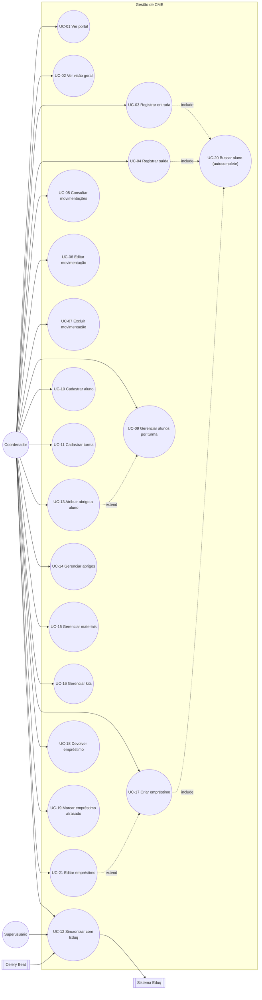

# Documentação — Gestão de CME (`gestao_cme`)

> Documento único e atual do módulo `gestao_cme` (Central de Material e Esterilização,
> app label legado `core`). Consolida a auditoria original, os casos de uso levantados a
> partir do código-fonte e as rodadas de melhoria/ajuste visual feitas até aqui — tudo
> em um só lugar, organizado em: visão geral e casos de uso (o que existe e como
> funciona), o que está pendente, e um histórico resumido de cada rodada. Ver também
> [`jornada-gestao-cme.md`](jornada-gestao-cme.md) para a experiência do usuário.

## 1. Visão geral do sistema

A CME (Central de Material e Esterilização) da ABO Goiás controla o ciclo de vida de
pacotes de instrumentais odontológicos entregues por alunos de pós-graduação para
esterilização, além de cadastros de apoio (turmas, alunos, materiais, kits, armários,
abrigos individuais) e um fluxo paralelo de **empréstimo de kits**.

O sistema depende de uma integração externa, o **Eduq** (sistema acadêmico), fonte de
verdade para turmas e alunos. Não há cadastro de aluno "do zero" pensado como fluxo
principal — o cadastro manual existe como exceção para cobrir lacunas da sincronização.

Módulos internos do app (mapeados às rotas em `gestao_cme/urls.py`):

| Módulo | Rota principal | Função |
|---|---|---|
| Portal | `/` | Landing page com resumo cross-módulo (CME, Lab, Contratos) e tarefas pendentes |
| Visão Geral (Dashboard CME) | `/gestao-cme/visao-geral/` | KPIs de pacotes por período, atividade recente |
| Movimentações | `/gestao-cme/movimentacoes/` | Histórico completo de entradas/saídas, com edição e exclusão |
| Registrar entrada | `/gestao-cme/nova-entrada/` | Dá baixa de N pacotes de um aluno para esterilização |
| Registrar saída | `/gestao-cme/nova-saida/` | Confirma retirada de pacotes já esterilizados |
| Alunos por turma | `/alunos-por-turma/` | Cadastro acadêmico, atribuição de abrigo, sincronização Eduq |
| Abrigos | `/abrigos/` | Espaços físicos individuais de guarda |
| Materiais | `/materiais/` | Catálogo de itens controlados |
| Kits | `/kits/` | Conjuntos de materiais para empréstimo |
| Empréstimos | `/emprestimos/` | Ciclo de empréstimo de kit/material a um aluno |

## 2. Atores

| Ator | Natureza | Descrição |
|---|---|---|
| **Coordenador (operador CME)** | Humano, autenticado | Usuário do dia a dia: registra entradas/saídas, cadastra alunos/materiais, gerencia empréstimos. Hoje **sem distinção de permissão** — qualquer usuário autenticado tem acesso total às telas do CME (ver §4). |
| **Superusuário / Administrador** | Humano, autenticado | Acesso irrestrito, inclusive ao Django Admin (única forma de ajustar quantidade por material em um kit). Em `emprestimos_visiveis`, vê todos os empréstimos; coordenador comum só vê os próprios. |
| **Sistema Eduq** | Ator externo (API) | Fonte de verdade de turmas e alunos. Suporta apenas `listar_turmas()` e `listar_alunos(codigo_turma)` — **não** oferece busca de aluno por nome. |
| **Celery Beat (agendador)** | Ator de sistema | Dispara `sincronizar_eduq_task` diariamente às 04:00, sem intervenção humana. |
| **Aluno de pós-graduação** | Ator passivo (sujeito do registro) | Não acessa o sistema; é o titular dos pacotes, empréstimos e abrigo. |

## 3. Diagrama de casos de uso

## 4. Casos de uso detalhados

Cada caso de uso traz: ator, pré-condições, fluxo principal, fluxos alternativos/exceção
e pós-condições. Este é o comportamento atual, já com todas as decisões de negócio e
ajustes visuais aplicados (histórico resumido em §7).

### UC-01 · Acessar o portal inicial

- **Ator primário:** Coordenador / Superusuário.
- **View/rota:** `views.portal` → `/`
- **Pré-condição:** usuário autenticado (`@login_required`).
- **Fluxo principal:**
  1. Usuário acessa a raiz do sistema.
  2. Sistema agrega contadores dos módulos CME, Laboratório e Contratos (pacotes
     pendentes, materiais, turmas, pedidos de lab ativos, faturamento pendente, contratos
     gerados).
  3. Sistema monta uma lista de **tarefas pendentes** (pacotes aguardando retirada,
     faturamento de lab, moldagens sem pedido, envios de contrato ao Dental Office com
     falha) e uma lista de **atividade recente** (últimos eventos de todos os módulos,
     ordenados por data).
  4. Portal é renderizado com os cartões de resumo e os dois blocos.
- **Pós-condição:** usuário tem visão consolidada e pode navegar a qualquer módulo.
- **Observação sistêmica:** `apps_disponiveis` é um `set` fixo no código — hoje **todo
  usuário autenticado vê todos os apps**, independente de função (ver §5, S-02).

### UC-02 · Consultar a Visão Geral (Dashboard CME)

- **Ator primário:** Coordenador / Superusuário.
- **View/rota:** `views.cme_dashboard` → `/gestao-cme/visao-geral/`
- **Fluxo principal:**
  1. Usuário acessa a Visão Geral.
  2. Sem filtro de data informado, o sistema usa o intervalo **do primeiro registro até
     hoje** (não recorta o mês atual).
  3. Sistema calcula 4 KPIs mutuamente exclusivos e exaustivos: **Total**, **Retirados**,
     **Aguardando**, **Sem status** — todos a partir da mesma função `linhas_de_pacote()`
     usada pela listagem de movimentações (UC-05), garantindo que os números batam.
  4. Sistema lista até 10 pacotes aguardando retirada e até 12 eventos de atividade
     recente (que, diferente dos KPIs, contam eventos — não pacotes).
  5. Cada KPI é um link que abre a listagem de movimentações (UC-05) já filtrada e no
     mesmo intervalo de datas.
- **Filtro de período (widget compartilhado `partials/filtro_periodo.html`):** um único
  controle "Período", no topo da barra de filtros, com dois campos `<input type="date">`
  ("De"/"Até") e botão "Aplicar". É um `
` colapsável; quando há filtro ativo,
  mostra um indicador e um botão "Todo o período" para limpar. Ao abrir, o painel ocupa a
  linha inteira da barra de filtros e empurra o restante do conteúdo para baixo (nunca
  sobrepõe). O mesmo componente é reusado em Movimentações (UC-05) e Empréstimos (UC-19).
- **Regra de negócio:** Total = Retirados + Aguardando + Sem status.
- **Risco sistêmico:** com o padrão "todo o histórico", a Visão Geral varre a tabela
  inteira a cada carga; sem índice em `data_hora` isso degrada com o crescimento do
  volume (ver §5, S-04).

### UC-03 · Registrar entrada de pacotes para esterilização

- **Ator primário:** Coordenador.
- **View/rota:** `views.registrar_entrada` → `/gestao-cme/nova-entrada/`
- **Inclui:** UC-20 (Buscar aluno via autocomplete).
- **Pré-condição:** existe ao menos um aluno ativo cadastrado (via Eduq ou manual).
- **Fluxo principal:**
  1. Coordenador busca o aluno pelo autocomplete (nome/matrícula).
  2. Informa a quantidade de pacotes (1 a 50) e, opcionalmente, data/hora e observações
     (data/hora padrão = agora).
  3. Ao confirmar, o sistema gera um código sequencial por pacote —
     `max(código numérico existente) + n` — e cria N registros `Movimentacao(ENTRADA,
     retirado=False)` em uma única transação atômica.
  4. Sistema grava a confirmação (códigos gerados, aluno, abrigo, quantidade, data/hora)
     na sessão e redireciona para a mesma tela, onde a confirmação fica visível até o
     operador etiquetar os pacotes.
  5. Se o aluno não tiver abrigo cadastrado, o sistema avisa mas não bloqueia o registro.
- **Fluxo de exceção:** formulário inválido → erros exibidos, aluno selecionado é
  preservado.
- **Pós-condição:** N `Movimentacao` criadas com `origem=MANUAL`, `arquivo_origem="painel"`.
- **Risco sistêmico:** a geração de código varre todas as movimentações a cada chamada,
  sem lock — duas entradas concorrentes podem gerar código duplicado (ver §5, S-01).

### UC-04 · Registrar saída (retirada) de pacotes esterilizados

- **Ator primário:** Coordenador.
- **View/rota:** `views.registrar_saida` → `/gestao-cme/nova-saida/`
- **Inclui:** UC-20 (Buscar aluno, restrito a alunos com pendência via `pendencias=1`).
- **Fluxo principal (dois passos):**
  1. **Passo 1 — seleção do aluno:** tela sem `aluno_id` mostra o autocomplete e uma
     lista de "alunos com pendências" pré-calculada.
  2. **Passo 2 — confirmação de pacotes:** com `aluno_id`, o sistema lista os pacotes
     pendentes daquele aluno, ordenados por data de entrada.
  3. Coordenador marca os pacotes a retirar e confirma.
  4. Sistema cria uma `Movimentacao(SAIDA)` por pacote selecionado, vinculando-a
     explicitamente à entrada via `entrada_origem` (self-FK), e marca a entrada
     correspondente como `retirado=True` — tudo em uma transação atômica.
  5. Mensagem de sucesso; redireciona para Movimentações (UC-05).
- **Fluxo de exceção:** nenhum pacote selecionado → mensagem de erro, permanece na tela.
- **Regra de negócio central:** o vínculo entrada↔saída é gravado explicitamente (não
  inferido por `pacote_codigo`, que não é confiável).
- **Pós-condição:** para cada pacote retirado, existem 2 registros ligados (ENTRADA +
  SAIDA), exibidos como 1 linha em UC-05.

### UC-05 · Consultar movimentações (histórico de pacotes)

- **Ator primário:** Coordenador / Superusuário.
- **View/rota:** `views.home` → `/gestao-cme/movimentacoes/`
- **Fluxo principal:**
  1. Sistema lista uma linha por pacote: cada linha é uma `ENTRADA` com colunas
     "Entrada" (sempre preenchida) e "Saída" (preenchida se já retirado). SAIDAs já
     vinculadas a uma entrada não viram linha própria.
  2. Registros LEGADO sem vínculo reconstruível aparecem como linha solta, sinalizado
     como "sem registro" em vez de inventar um par.
  3. Filtros disponíveis: texto livre (nome, matrícula, turma, código do pacote,
     material, arquivo de origem — todos acento-insensível), status (Retirado / Não
     retirado / Sem status), aluno específico (vindo de UC-09), e período.
  4. O resumo de resultados mostra "N aguardando retirada"/"N retirados" apenas quando o
     filtro de Status correspondente está selecionado, na cor do badge.
  5. Cada linha permite: editar (UC-06) e excluir (UC-07). O status de retirada é
     alterado pela edição, não por uma ação de linha própria.
  6. A paginação oferece atalhos textuais "« Primeira" e "Última »", além de
     Anterior/Próxima e números de página.
- **Regra de negócio:** filtro de "Movimentação" (Entrada/Saída) foi removido
  deliberadamente na consolidação por pacote.
- **Pós-condição:** nenhuma (somente leitura, exceto pelas ações de linha).

### UC-06 · Editar movimentação

- **Ator primário:** Coordenador.
- **View/rota:** `views.editar_movimentacao` → `/gestao-cme/<pk>/editar/`
- **Fluxo principal:** edita `pacote_codigo`, `data_hora` e `observacoes` de um registro
  específico (ENTRADA ou SAIDA); aluno/turma/material não são editáveis aqui. Ao salvar,
  grava um `RegistroAuditoriaMovimentacao(acao=EDICAO)` com usuário, pacote e timestamp.
- **Pós-condição:** registro atualizado; mensagem de sucesso; volta para UC-05.
- **Trilha de auditoria:** a tela exibe um bloco "Histórico de alterações" com cada
  edição/exclusão já registrada para aquele pacote. Consulta completa também disponível
  no Django Admin (somente leitura).

### UC-07 · Excluir movimentação

- **Ator primário:** Coordenador.
- **View/rota:** `views.excluir_movimentacao` (POST) → `/gestao-cme/<pk>/excluir/`
- **Fluxo principal:**
  1. Grava um `RegistroAuditoriaMovimentacao(acao=EXCLUSAO)` com usuário, pacote e
     timestamp antes de excluir — a cópia textual do pacote/aluno sobrevive à exclusão
     da movimentação original (a FK usa `SET_NULL`).
  2. Se a movimentação é uma SAIDA, o sistema restaura a(s) `ENTRADA` correspondente(s)
     do mesmo aluno/pacote para `retirado=False` antes de excluir.
  3. Registro é excluído permanentemente (hard delete, sem soft-delete/lixeira).
- **Trilha de auditoria mínima (usuário, ação, timestamp):** implementada — não inclui,
  por decisão de escopo, o valor anterior do campo editado (versionamento completo).

### UC-08 · Alternar status de retirada manualmente *(removido em 2026-07-28)*

Este caso de uso descrevia a view `alternar_retirado` (POST →
`/gestao-cme/<pk>/alternar-retirado/`), que ciclava o campo `retirado` em três
estados (`None → True → False → None`).

**A rota nunca chegou a ser exposta na interface.** O histórico do repositório
confirma que o caminho `alternar-retirado` só apareceu em `urls.py`, `views.py` e
nesta documentação — nenhum template jamais a referenciou, e nenhum teste a
cobria. Foi removida na Etapa 3 do plano de limpeza.

A correção manual do status continua possível pela **edição da movimentação
(UC-06)**, que é a ação de linha realmente oferecida na listagem. O risco que
estava descrito aqui — marcar `retirado=True` sem uma SAIDA correspondente — vale
igualmente para a edição, e segue registrado em §5 (U-03).

### UC-09 · Gerenciar alunos por turma

- **Ator primário:** Coordenador / Superusuário.
- **View/rota:** `views.alunos_por_turma` → `/alunos-por-turma/`
- **Estende:** UC-13 (atribuição de abrigo é feita inline nesta tela).
- **Fluxo principal:**
  1. Lista alunos com busca textual acento-insensível (por nome, matrícula, e-mail ou
     turma) e filtro de status (Ativo/Inativo/Todos).
  2. Exibe a data da última sincronização com o Eduq e o total de alunos exibidos; se
     houver alunos sem abrigo, mostra a contagem em destaque.
  3. Coluna "Movimentações" é clicável e abre UC-05 já filtrado por aquele aluno.
  4. Coluna "Abrigo" é editável inline (UC-13).
  5. Um único botão "Sincronizar alunos e turmas" (`atualizar_alunos_eduq`) busca
     primeiro todas as turmas na API e, em seguida, todos os alunos de cada turma
     (UC-12) — sempre visível, sem depender de nenhuma turma selecionada.
- **Nota:** o filtro dedicado por turma (`<select>`) foi removido — a busca textual já
  cobre nome/código de turma.

### UC-10 · Cadastrar aluno manualmente

- **Ator primário:** Coordenador.
- **View/rota:** `views.cadastrar_aluno` → `/alunos-por-turma/novo/`
- **Fluxo principal:** formulário com nome, matrícula (única), turma, CPF, e-mail,
  telefone. Cria com `origem=MANUAL`.
- **Regra de negócio:** matrícula duplicada é bloqueada por validação de formulário, não
  só por constraint de banco.
- **Navegação:** acessível por um mini-menu sob o item "Alunos por turma" da navegação
  lateral (junto de UC-11), em vez de um botão solto no topo da tela.

### UC-11 · Cadastrar turma manualmente

- **Ator primário:** Coordenador.
- **View/rota:** `views.cadastrar_turma` → `/turmas/nova/`
- **Fluxo principal:** análogo a UC-10, com código único de turma.

### UC-12 · Sincronizar cadastros com o Eduq

- **Ator primário:** Coordenador / Superusuário (acionamento manual); Celery Beat
  (acionamento automático diário às 04:00).
- **Views/rotas acionadas por botão hoje:**
  - `atualizar_alunos_eduq` (POST, turmas e alunos) — botão "Sincronizar alunos e
    turmas" em `alunos_por_turma` (UC-09), `registrar_entrada`, `registrar_saida` e
    `criar_emprestimo`. Nas quatro telas é o mesmo botão de ícone (`.icon-button`),
    com o rótulo revelado no hover/foco.
  - `gestao_cme/tasks.py::sincronizar_eduq_task` (Celery Beat, 04:00 diária).
- **Fluxo principal:** chama `services.eduq_sync.sincronizar_eduq(...)`, que busca todas
  as turmas na API e, para cada turma, busca seus alunos, fazendo `update_or_create` e
  retornando contadores (criados/atualizados/erros) via `messages`.
- **Fluxo de exceção:** `EduqAPIError` (config/autenticação/rede) → mensagem de erro.
- **Limitação estrutural conhecida:** a API Eduq não expõe busca de aluno por nome — só
  `listar_turmas()`/`listar_alunos(codigo_turma)`. Por isso a busca de aluno em UC-20 é
  sempre local (depende de sincronização prévia).
- **Risco sistêmico:** o botão manual roda o sync de forma síncrona no request — pode ser
  lento com muitas turmas (ver §5, S-03).

### UC-13 · Atribuir ou remover abrigo de um aluno

- **Ator primário:** Coordenador.
- **View/rota:** `views.atribuir_abrigo` (POST) → `/alunos-por-turma/<aluno_id>/abrigo/`
- **Fluxo principal:**
  1. Na tela de UC-09, o coordenador escolhe um abrigo (ou "nenhum") para um aluno.
  2. Sistema grava o vínculo e recalcula a ocupação do abrigo anterior e do novo abrigo,
     em transação atômica.
- **Regra de negócio:** "ocupado" é derivado — `True` sse existe ≥1 aluno ativo
  vinculado.
- **Pós-condição:** coluna "Ocupação" em UC-14 reflete o novo estado sem ação manual
  adicional.

### UC-14 · Gerenciar abrigos

- **Ator primário:** Coordenador / Superusuário.
- **Views/rotas:** `views.armarios` (`/abrigos/`), `cadastrar_abrigo`, `editar_abrigo`,
  `excluir_abrigo` (POST).
- **Listagem:** busca textual, filtro de ocupação (`?ocupacao=ocupado|livre`); o rótulo de
  contagem correspondente só aparece quando o filtro está ativo.
- **Fluxo principal (edição):**
  1. Tela mostra o resumo dos alunos atualmente vinculados ao abrigo.
  2. Salvar exige confirmação dupla obrigatória via modal, listando quem ocupa o abrigo
     hoje.
  3. Excluir é irreversível; como `Aluno.abrigo` usa `on_delete=SET_NULL`, os alunos
     vinculados não são apagados, apenas desvinculados.
- **Pós-condição (exclusão):** abrigo removido; alunos antes vinculados ficam com
  `abrigo=None`.

### UC-15 · Gerenciar materiais

- **Ator primário:** Coordenador / Superusuário.
- **Views/rotas:** `views.materiais`, `cadastrar_material`, `editar_material`,
  `excluir_material` (POST).
- **Listagem:** busca textual, filtro de disponibilidade; rótulo de contagem
  correspondente só aparece com o filtro ativo.
- **Fluxo principal (edição/exclusão):**
  1. Edição permite alterar todos os campos, incluindo `ativo` (inativação, reversível).
  2. Tela de edição calcula e exibe quantas unidades estão atualmente em empréstimo,
     como aviso antes de qualquer exclusão.
  3. Exclusão tenta `material.delete()`; se há vínculo protegido, o sistema captura
     `ProtectedError` e orienta a inativar em vez de excluir.
- **Regra de negócio:** `Material` é protegido contra exclusão em cascata.

### UC-16 · Gerenciar kits

- **Ator primário:** Coordenador / Superusuário.
- **Views/rotas:** `views.kits`, `cadastrar_kit`, `editar_kit`, `excluir_kit` (POST).
- **Fluxo principal (cadastro e edição):**
  1. Coordenador informa nome, código único, descrição e quantidade em estoque
     (`Kit.quantidade`), e seleciona os materiais do kit — em edição, os materiais já
     vinculados vêm pré-marcados.
  2. Cada material selecionado tem sua própria quantidade, digitada ao lado do checkbox.
  3. Ao salvar, o sistema sincroniza os itens do kit (`KitMaterial`) com a seleção.
  4. **`Kit.quantidade` é o estoque cadastrado do kit** — quantas unidades físicas
     existem, informado manualmente e independente da disponibilidade dos materiais da
     composição. Os dois números respondem perguntas diferentes ("quantos kits existem"
     vs. "quantos materiais da composição estão livres agora"), e cada coluna do listing
     ganhou um tooltip explicando seu significado.
- **Fluxo principal (exclusão):** botão "Excluir kit" na tela de edição, com
  confirmação; se o kit está referenciado por algum `Emprestimo` (`PROTECT`), a exclusão
  é bloqueada e a tela orienta a marcar o kit como inativo.
- **Pós-condição (exclusão):** kit removido; `KitMaterial` associados são apagados em
  cascata; empréstimos que já usaram o kit não são afetados.
- **Listagem:** busca textual e filtro de Status (Ativo/Inativo/Todos), com rótulo de
  contagem condicionado ao filtro ativo.

### UC-17 · Criar empréstimo de kit/material

- **Ator primário:** Coordenador.
- **View/rota:** `views.criar_emprestimo` → `/emprestimos/novo/`
- **Inclui:** UC-20 (autocomplete de aluno).
- **Fluxo principal:**
  1. Coordenador busca o aluno, opcionalmente escolhe um kit, data prevista de devolução
     e observações.
  2. Sistema cria o `Emprestimo` com `status=EMPRESTADO`,
     `coordenador_usuario=request.user`.
  3. Se um kit foi escolhido, o sistema copia automaticamente cada `KitMaterial` do kit
     para `ItemEmprestimo` do novo empréstimo, preservando a quantidade definida no kit.
- **Regra de negócio (visibilidade):** um coordenador comum só enxerga os empréstimos que
  ele mesmo registrou; superusuário vê todos.
- **Observação:** empréstimo sem kit é permitido — não há tela para adicionar itens
  avulsos ao empréstimo pela interface operacional (só via kit).

### UC-18 · Devolver empréstimo

- **Ator primário:** Coordenador (dono do empréstimo) / Superusuário.
- **View/rota:** `views.devolver_emprestimo` (POST) → `/emprestimos/<pk>/devolver/`
- **Fluxo principal:** marca `status=DEVOLVIDO` e `data_devolucao=agora`.
- **Fluxo de exceção:** empréstimo já devolvido → mensagem de erro, nenhuma alteração.
- **Regra de negócio:** coordenador não pode devolver empréstimo de outro coordenador.

### UC-19 · Empréstimo atrasado (automático) e marcação manual

- **Ator primário:** Sistema (automático); Coordenador (dono do empréstimo) /
  Superusuário (ação manual, caso excepcional).
- **Serviço:** `services.emprestimos.marcar_emprestimos_atrasados()` — muda para
  `ATRASADO` todo `Emprestimo` com `status=EMPRESTADO` e `data_prevista_devolucao`
  anterior a hoje.
- **Gatilhos:** a cada carregamento da listagem de Empréstimos, e uma tarefa periódica
  diária (Celery Beat, 06:00).
- **Filtro de período e paginação:** a listagem tem o mesmo widget "Período" das
  UC-02/UC-05, e a paginação compartilhada traz os atalhos "« Primeira"/"Última »".
- **Alerta visual:** badge "Atrasado" e contador clicável "N atrasado(s)" refletem o
  atraso real sem ação do coordenador.
- **View/rota (ação manual mantida):** `views.marcar_emprestimo_atrasado` (POST), só
  permitida a partir do status `EMPRESTADO` — para casos excepcionais.

### UC-20 · Buscar aluno via autocomplete *(caso de uso incluído / componente compartilhado)*

- **Ator primário:** Coordenador (indiretamente, via UC-03, UC-04, UC-17).
- **View/rota:** `views.buscar_alunos` (HTMX) → `/alunos/buscar/`
- **Fluxo principal:**
  1. Componente HTMX dispara a cada digitação, filtra alunos ativos locais por nome
     normalizado ou matrícula.
  2. Com `pendencias=1` (usado só em UC-04), restringe a alunos com pacote pendente de
     retirada.
- **Fluxo alternativo — busca sem resultado:** quando a busca não encontra nenhum aluno,
  o fragmento oferece sincronizar a turma do aluno sob demanda
  (`views.sincronizar_turma_busca`) — como o Eduq não tem busca por nome, esta é a forma
  de encontrar, ali mesmo, um aluno ainda não sincronizado, sem sair da tela de
  entrada/saída/empréstimo.
- **Regra de negócio:** busca é exclusivamente local — não consulta o Eduq ao vivo
  (diferente do componente equivalente em Gestão de Laboratório).

### UC-21 · Editar empréstimo

- **Ator primário:** Coordenador (dono do empréstimo) / Superusuário.
- **Estende:** UC-17 — mesma tela de listagem (UC-19), ação de linha.
- **View/rota:** `views.editar_emprestimo` → `/emprestimos/<pk>/editar/`
- **Fluxo principal:**
  1. A partir da listagem de Empréstimos, o coordenador abre a tela de edição de um
     empréstimo específico.
  2. A tela mostra um resumo somente leitura e um formulário com apenas dois campos
     editáveis: data prevista de devolução e observações. Aluno, kit e itens do
     empréstimo não são editáveis aqui.
  3. Ao salvar, o registro é atualizado e o coordenador retorna à listagem (UC-19).
- **Pós-condição:** `Emprestimo.data_prevista_devolucao`/`observacoes` atualizados;
  demais campos inalterados.

## 5. Regras de negócio transversais

1. **Origem do dado (`OrigemDados`)** — todo cadastro relevante carrega
   `origem ∈ {MANUAL, EDUQ, LEGADO, EXEMPLO}`. Registros `EXEMPLO` são sistematicamente
   excluídos de listagens, métricas e buscas.
2. **Vínculo explícito entrada↔saída** — `Movimentacao.entrada_origem` é a única fonte
   confiável para parear o ciclo de um pacote; pareamento por `pacote_codigo` foi
   deliberadamente rejeitado.
3. **Integridade referencial diferenciada por risco de perda de dado:** `PROTECT` em
   `Material`/`Turma`/`Kit` (impede exclusão que apagaria histórico); `SET_NULL` em
   `Aluno.abrigo`, `Movimentacao.aluno/turma/material`, `Emprestimo.coordenador_usuario`
   (desvincula sem apagar histórico).
4. **Busca acento-insensível** — campo derivado `nome_normalizado`, recalculado em todo
   `save()`.
5. **Fonte única de verdade para KPIs vs. listagem** — `linhas_de_pacote()` é usada tanto
   pela Visão Geral (UC-02) quanto pela listagem de Movimentações (UC-05).
6. **Rótulo de contagem só aparece com o filtro correspondente ativo** — em
   Movimentações, Abrigos, Materiais e Kits, os rótulos de contagem só aparecem quando o
   filtro de status/situação correspondente está selecionado.
7. **Paginação com atalhos de primeira/última página** — compartilhada por todas as
   listagens do módulo (e também por `gestao_lab`/`gestao_contratos`).
8. **Filtro de período: widget único e reusado** — um `
` colapsável com dois
   `<input type="date">`, reusado sem alteração visual em Visão Geral, Movimentações e
   Empréstimos; ao abrir, empurra o conteúdo abaixo, nunca sobrepõe nem ultrapassa a
   borda do painel.

## 6. Matriz de rastreabilidade (Caso de uso × View × Template)

| UC | View (`views.py`) | Template |
|---|---|---|
| UC-01 | `portal` | `portal.html` |
| UC-02 | `cme_dashboard` | `dashboard_cme.html` |
| UC-03 | `registrar_entrada` | `registrar_entrada.html` |
| UC-04 | `registrar_saida` | `registrar_saida.html` |
| UC-05 | `home` | `home.html` |
| UC-06 | `editar_movimentacao` | `editar_movimentacao.html` |
| UC-07 | `excluir_movimentacao` | — (ação POST a partir de `home.html`) |
| UC-09 | `alunos_por_turma` | `alunos_por_turma.html` |
| UC-10 | `cadastrar_aluno` | `cadastrar_aluno.html` |
| UC-11 | `cadastrar_turma` | `cadastrar_turma.html` |
| UC-12 | `atualizar_alunos_eduq`, `tasks.sincronizar_eduq_task` | botões em `alunos_por_turma.html`, `registrar_entrada.html`, `registrar_saida.html`, `criar_emprestimo.html` |
| UC-13 | `atribuir_abrigo` | ação inline em `alunos_por_turma.html` |
| UC-14 | `armarios`, `cadastrar_abrigo`, `editar_abrigo`, `excluir_abrigo` | `armarios.html`, `form_abrigo.html` |
| UC-15 | `materiais`, `cadastrar_material`, `editar_material`, `excluir_material` | `materiais.html`, `form_material.html` |
| UC-16 | `kits`, `cadastrar_kit`, `editar_kit`, `excluir_kit` | `kits.html`, `form_kit.html` |
| UC-17 | `criar_emprestimo` | `criar_emprestimo.html` |
| UC-18 | `devolver_emprestimo` | ação em `emprestimos.html` |
| UC-19 | `emprestimos` (auto), `marcar_emprestimo_atrasado` (manual), `tasks.marcar_emprestimos_atrasados_task` | `emprestimos.html` |
| UC-20 | `buscar_alunos`, `sincronizar_turma_busca` | `partials/_aluno_results.html` |
| UC-21 | `editar_emprestimo` | `editar_emprestimo.html` |

## 7. Glossário

| Termo | Significado |
|---|---|
| **CME** | Central de Material e Esterilização |
| **Pacote** | Unidade física de instrumental entregue para esterilização; identificado por `pacote_codigo` |
| **Abrigo** | Espaço individual de guarda atribuído a um aluno |
| **Armário** | Local físico de armazenamento de materiais em estoque (distinto de Abrigo) |
| **Kit** | Conjunto pré-definido de materiais, usado em empréstimos |
| **Eduq** | Sistema acadêmico externo, fonte de turmas e alunos |
| **Origem (`OrigemDados`)** | Proveniência de um registro: `MANUAL`, `EDUQ`, `LEGADO`, `EXEMPLO` |
| **Entrada** | Movimentação que registra a entrega de um pacote para esterilização |
| **Saída** | Movimentação que registra a retirada de um pacote já esterilizado |
| **Retirado** | Campo booleano (`True`/`False`/`None`) que indica se o pacote já foi retirado |
| **RegistroAuditoriaMovimentacao** | Trilha mínima (usuário, ação, timestamp) de edições e exclusões de `Movimentacao` |
| **Período ativo** (`periodo_ativo`) | Indica se o usuário informou algum filtro de data explicitamente |

## 8. O que está pendente

Nenhum item abaixo bloqueia o uso normal do sistema hoje — são backlog de priorização.

### 8.1 Maior lacuna estrutural: permissões por grupo

**S-02 — decisão de negócio já registrada: "não implementar agora".** Os grupos
(`recepcao`/`coordenacao`/`gestao`) e o decorator `requer_grupo` existem prontos no
código, mas nenhuma view foi restringida — qualquer usuário autenticado tem acesso total
a todas as ações do CME, inclusive exclusões irreversíveis (movimentação, material,
abrigo, kit). Não é um risco desconhecido — é uma lacuna conhecida e adiada
deliberadamente, para ser retomada quando o time de negócio definir a matriz de quem
pode fazer o quê.

### 8.2 Usabilidade

| Problema | Impacto | Sugestão |
|---|---|---|
| Após gerar N pacotes (UC-03), não há indicação de progresso de etiquetagem física | Risco de trocar/pular etiqueta em lotes grandes (até 50) | Checklist interativo opcional na tela de confirmação |
| Alterar o status de retirada pela edição (UC-06) não avisa que isso pode descolar o registro do vínculo `entrada_origem` real | Divergência de dados sem o operador perceber a causa | Tooltip/confirmação explicando a consequência antes de aplicar |
| Não há histórico de ocupação de um abrigo (UC-14), só a ocupação atual | Perda de contexto para investigar trocas de abrigo | Tela ou seção de histórico de ocupação |
| Nenhuma ação de escrita rápida (alternar retirado, atribuir abrigo) desabilita o botão/mostra spinner | Cliques duplos podem gerar ações repetidas em conexões lentas | Aplicar o mesmo padrão `.js-loading-submit` já usado nos formulários |

### 8.3 Melhorias sistêmicas (arquitetura, dados, integrações)

| Área | Problema | Recomendação |
|---|---|---|
| Geração de código de pacote (UC-03) | `max(código)+n` sem lock — risco de colisão sob concorrência | Sequência dedicada ou lock explícito na transação |
| Sincronização Eduq (UC-12) | Botão manual roda o sync de forma síncrona no request | Mover para tarefa assíncrona (Celery) com feedback de progresso |
| Dashboard (UC-02) | Sem índice em `Movimentacao.data_hora`, com período padrão "todo o histórico" | Adicionar índice (e possivelmente composto com `tipo`/`retirado`) |
| Rótulo do app (`apps.py`) | `label = "core"` legado, divergente do nome funcional | Decidir: manter por compatibilidade ou planejar migração de app label/tabelas |
| Empréstimos sem itens (UC-17) | Sem fluxo de adicionar `ItemEmprestimo` avulso pela interface | Avaliar se "emprestar material avulso, sem kit" é um caso de uso real |
| Observabilidade | Erros de integração Eduq não têm logging estruturado | Padronizar logging de falhas de integração |

## 9. Histórico resumido

O módulo passou por uma auditoria inicial de backend (2026-07-13), três rodadas de
melhoria (2026-07-15, itens de usabilidade e sistema — botão de cadastro de kit,
confirmação dupla ao editar abrigo, tooltips, padronização de botões, sincronização
abrigo↔ocupação, movimentações clicáveis, consolidação da listagem por pacote, KPIs
clicáveis), sete decisões de negócio tomadas em 2026-07-20 (quantidade por material em
kit, edição/exclusão de kit pela interface, permissões adiadas, busca de aluno por
sincronização sob demanda, grafia "Eduq", auditoria mínima de movimentação, job
automático de empréstimo atrasado — todas refletidas nos casos de uso acima) e duas
rodadas de auditoria visual com screenshots (13 + 4 itens: coluna de ações fixa,
autocomplete como overlay, ordem de botões, filtro de período sem sobreposição, remoção
do filtro redundante por turma, atalhos de paginação, entre outros). Todos os itens das
cinco rodadas foram implementados, testados e enviados — nenhum ficou pendente. A suíte
completa do projeto permaneceu verde (581 → 634 testes) ao longo de todas elas.

Em 2026-07-27 o botão de sincronização virou botão de ícone (`.icon-button`, rótulo
revelado no hover/foco e de volta a texto abaixo de 620px, onde não há hover) e teve o
rótulo padronizado em "Sincronizar alunos e turmas" nas quatro telas que o exibem —
fechando o item de usabilidade que apontava o nome impreciso em §8.2. Ver a ressalva
sobre linguagem operacional em `documentacao-portal-contas.md` §2.2.

## 10. Documentos substituídos por este arquivo

Este documento consolida e substitui `casos-de-uso-gestao-cme.md`, `auditoria-gestao-cme.md`,
`avaliacao-visual-gestao-cme.md` e `ajustes-visuais-gestao-cme-rodada-2.md`, além da
seção "Sistema de Gestão de CME" de `melhorias-cme-contratos-2026-07.md`. O conteúdo de
todos foi incorporado acima; as evidências visuais das auditorias seguem preservadas em
`docs/assets/avaliacao-visual-cme/`.
