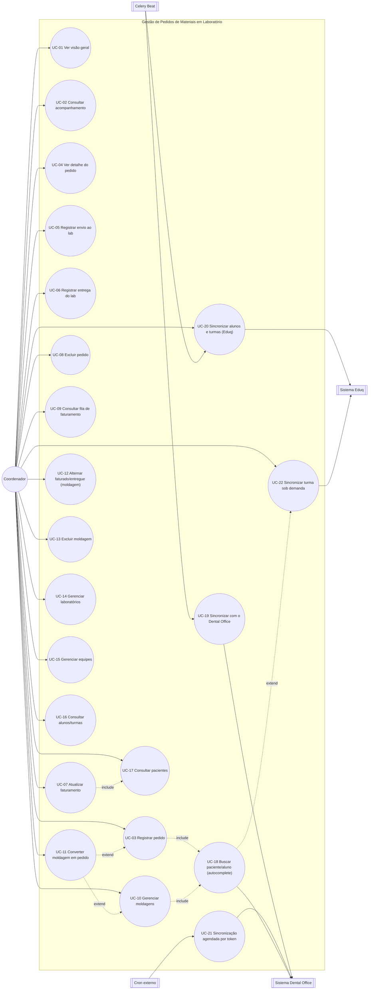

# Documentação — Gestão de Laboratório (`gestao_lab`)

> Documento único e atual do módulo `gestao_lab`. Consolida a auditoria original, os
> casos de uso levantados a partir do código-fonte, os planos de correção/implementação
> e as melhorias feitas até aqui — tudo em um só lugar, organizado em: visão geral e
> casos de uso (o que existe e como funciona), o que está pendente, e um histórico
> resumido de cada rodada. Ver também
> [`jornada-gestao-lab.md`](jornada-gestao-lab.md) para a experiência do usuário.

## 1. Visão geral do sistema

O `gestao_lab` controla o fluxo de pedidos de material odontológico enviados a
laboratórios externos: um aluno realiza uma moldagem do paciente, o material é
encaminhado a um laboratório parceiro, o laboratório devolve a peça finalizada e, por
fim, o pedido é faturado (ao paciente e ao laboratório). O módulo também sincroniza
**pacientes do Dental Office** e **alunos e turmas do Eduq** (desde 2026-07-22; antes
usava o Dental Office para alunos, que nunca teve esse dado real — ver §8), e gerencia
os cadastros de apoio (laboratórios parceiros e equipes de coordenação).

O Dental Office é a fonte de verdade de **pacientes**, com busca por nome/celular "ao
vivo". **Alunos** vêm do **Eduq** — a mesma fonte usada pelo `gestao_cme` — e herdam a
mesma limitação de lá: sem busca por nome, só listagem por turma. Por isso a busca de
aluno é só local, com um botão de sincronizar a turma escolhida quando a busca não
encontra ninguém (UC-18/UC-22) — mesmo padrão de UX já usado no CME.

Módulos internos do app (rotas sob `/laboratorio/`):

| Módulo | Rota principal | Função |
|---|---|---|
| Visão Geral | `/laboratorio/` | KPIs de pedidos por status, próximas entregas, atividade recente |
| Acompanhamento | `/laboratorio/pedidos/` | Listagem de pedidos com filtros de status/período/busca |
| Novo pedido | `/laboratorio/pedidos/novo/` | Registra um pedido de material a um laboratório |
| Detalhe do pedido | `/laboratorio/pedidos/<pk>/` | Linha do tempo do pedido, com ações de envio/entrega/faturamento embutidas |
| Faturamento | `/laboratorio/pedidos/faturamento/` | Fila de pedidos entregues aguardando fechamento financeiro |
| Moldagens | `/laboratorio/moldagens/` | Registro e acompanhamento de moldagens, com conversão em pedido |
| Laboratórios | `/laboratorio/laboratorios/` | Cadastro de laboratórios parceiros |
| Equipes | `/laboratorio/equipes/` | Cadastro de equipes de coordenação |
| Alunos | `/laboratorio/alunos/` | Alunos e turmas sincronizados do Eduq |
| Pacientes | `/laboratorio/pacientes/` | Pacientes sincronizados do Dental Office, com busca ao vivo |

## 2. Atores

| Ator | Natureza | Descrição |
|---|---|---|
| **Coordenador (operador de laboratório)** | Humano, autenticado | Registra pedidos/moldagens, acompanha envios/entregas, fecha faturamento, gerencia laboratórios/equipes. Sem distinção de permissão — qualquer usuário autenticado tem acesso total, inclusive a exclusões irreversíveis. Diferente do CME, nenhum registro tem "dono": todo coordenador vê e altera os pedidos de todos. |
| **Superusuário / Administrador** | Humano, autenticado | Mesmo acesso operacional do coordenador; adicionalmente, é o único ator que pode editar os campos principais de um pedido/moldagem já criado — só pelo Django Admin, não pela interface operacional. |
| **Sistema Dental Office** | Ator externo (API) | Fonte de verdade de pacientes. Busca por nome/celular ao vivo e detalhe de paciente. |
| **Sistema Eduq** | Ator externo (API) | Fonte de verdade de alunos e turmas deste módulo (desde 2026-07-22) — mesmo `EduqClient` do `gestao_cme`, reaproveitado só na camada de integração HTTP; as tabelas locais (`TurmaLab`/`AlunoLab`) são exclusivas do `gestao_lab`. Só lista alunos por turma, sem busca por nome. |
| **Celery Beat (agendador)** | Ator de sistema | Dispara `sincronizar_dental_task` (pacientes) às 04:30, `sincronizar_eduq_lab_task` (turmas/alunos) às 04:15 e `cobrar_pedidos_atrasados_task` às 09:00 — escalonados entre si e com o sync do Eduq do CME (04:00). |
| **Cron externo** (opcional) | Ator de sistema | Pode acionar a sincronização de pacientes via token, redundante com o Celery Beat se ambos estiverem ativos. |
| **Paciente** / **Aluno de pós-graduação** | Ator passivo | Não acessam o sistema; titulares do pedido/moldagem. |
| **Laboratório externo** | Ator passivo | Não acessa o sistema; recebe cobranças automáticas por WhatsApp quando tem pedidos atrasados. |

## 3. Diagrama de casos de uso

Pacientes e alunos usam fontes e rotinas independentes desde 2026-07-22 (Dental para
pacientes às 04:30, Eduq para alunos/turmas às 04:15). UC-22 (sincronizar uma turma
específica) só é acionada a partir de uma busca de aluno sem resultado (UC-18).

## 4. Casos de uso detalhados

### UC-01 · Consultar a Visão Geral

- **Ator primário:** Coordenador / Superusuário.
- **View/rota:** `views.dashboard` → `/laboratorio/`
- **Fluxo principal:**
  1. Sistema calcula as 4 métricas oficiais sobre o período selecionado (padrão: todo o
     histórico): **Em dia**, **Atrasado**, **Entregue — não faturado**, **Concluídos** —
     as mesmas 4 categorias de `PedidoMaterial.status`.
  2. Lista até 5 "próximas entregas" e até 6 "pedidos recentes", recortadas pelo mesmo
     período.
  3. Cada card de métrica é um link para o Acompanhamento (UC-02) ou a fila de
     Faturamento (UC-09), propagando o mesmo recorte de período.
- **Filtro de período:** widget colapsável, recorta por `criado_em`.
- **Fonte única de verdade:** as 4 métricas vêm diretamente de `qs.filter(status=...)` —
  mesmo campo usado pelo Acompanhamento, pelo filtro de status e pelo Django Admin.

### UC-02 · Consultar o acompanhamento de pedidos

- **Ator primário:** Coordenador / Superusuário.
- **View/rota:** `views.acompanhamento_pedidos` → `/laboratorio/pedidos/`
- **Fluxo principal:**
  1. Lista todos os pedidos (não só os em aberto — um pedido concluído precisa continuar
     aparecendo, senão a coluna "Faturado" nunca teria conteúdo).
  2. Segmentação por status em abas com contagem (Todos/Em dia/Atrasados/Entregue — não
     faturado).
  3. Filtros adicionais: busca textual (paciente, aluno, laboratório, descrição) e
     período por um campo de data escolhido pelo usuário (Registro, Previsão de entrega,
     Entrega ou Faturamento).
  4. Colunas: Registro, Previsão (aviso visual quando vencida e não entregue), Entregue,
     Faturado (tooltip "Parcial"), Status, Ações.
  5. Ações por linha: registrar envio (UC-05) ou entrega (UC-06) conforme a etapa atual,
     WhatsApp direto ao laboratório, ver detalhe (UC-04), excluir (UC-08).
- **Regra de negócio:** filtro de status cobre as 3 categorias "em aberto"; `CONCLUIDO`
  não tem aba própria — só aparece na aba "Todos" ou por busca textual.
- **"Registrar pedido"** fica em destaque no bloco "Ações rápidas" da barra lateral, por
  ser a ação de fluxo principal da tela.

### UC-03 · Registrar novo pedido de material

- **Ator primário:** Coordenador.
- **View/rota:** `views.criar_pedido` → `/laboratorio/pedidos/novo/`
- **Inclui:** UC-18 (autocomplete de paciente e aluno).
- **Fluxo principal:**
  1. Coordenador busca e seleciona paciente e aluno, escolhe laboratório e equipe,
     informa previsão de entrega e descreve o serviço.
  2. Ao salvar, `PedidoMaterial` é criado com `status` calculado automaticamente
     (`EM_DIA`).
  3. **A partir de uma moldagem:** com `?moldagem=<pk>`, o formulário vem pré-preenchido
     com paciente/aluno da moldagem; ao salvar, o pedido é vinculado de volta à moldagem,
     que passa a aparecer como "convertida" (UC-11).
- **Pós-condição:** `PedidoMaterial` criado; se veio de moldagem, o vínculo é gravado nos
  dois sentidos.

### UC-04 · Consultar detalhe de um pedido

- **Ator primário:** Coordenador / Superusuário.
- **View/rota:** `views.detalhe_pedido` → `/laboratorio/pedidos/<pk>/`
- **Fluxo principal:**
  1. Mostra os dados do pedido e uma linha do tempo com três etapas: "Pedido criado"
     (sempre concluída), "Envio ao laboratório" e "Entrega do laboratório".
  2. A etapa ativa embute o próprio formulário de ação.
  3. Quando `entregue=True`, exibe também o formulário de faturamento (UC-07) na mesma
     página.

### UC-05 · Registrar envio ao laboratório

- **Ator primário:** Coordenador.
- **View/rota:** `views.marcar_envio` (POST) → `/laboratorio/pedidos/<pk>/marcar-envio/`
- **Fluxo principal:** grava `data_envio`. Não influencia mais o `status` calculado — o
  pedido continua "Em dia" ou "Atrasado" (conforme o prazo) até ser de fato entregue.
- **Fluxo de exceção:** data inválida → mensagem de erro, nenhuma alteração.

### UC-06 · Registrar entrega do laboratório

- **Ator primário:** Coordenador.
- **View/rota:** `views.marcar_entrega` (POST) → `/laboratorio/pedidos/<pk>/marcar-entrega/`
- **Fluxo principal:** grava `entregue=True` e `data_entrega`; `status` recalculado
  (`CONCLUIDO` se já faturado dos dois lados, senão permanece o que era).
- **Pós-condição:** pedido passa a aparecer na fila de faturamento (UC-09), se ainda não
  totalmente faturado.

### UC-07 · Atualizar faturamento de um pedido

- **Ator primário:** Coordenador.
- **Views/rotas:** `views.atualizar_faturamento` (formulário completo, no detalhe do
  pedido) e `alternar_faturado_paciente`/`alternar_faturado_lab` (toggles
  independentes, na fila de faturamento).
- **Fluxo principal:** ao marcar as duas flags (`faturado_paciente` e `faturado_lab`)
  como verdadeiras, o `save()` grava `data_faturamento = hoje` e recalcula `status` para
  `CONCLUIDO`; desfazer qualquer uma limpa `data_faturamento` e volta o status para
  `ENTREGUE_NAO_FATURADO`.
- **Regra de negócio:** `data_faturamento` é derivada, nunca editável diretamente.

### UC-08 · Excluir pedido

- **Ator primário:** Coordenador.
- **View/rota:** `views.excluir_pedido` (POST) → `/laboratorio/pedidos/<pk>/excluir/`
- **Fluxo principal:**
  1. Exclusão é permanente, com modal de confirmação explicando a irreversibilidade.
  2. Se o pedido tinha origem numa moldagem, o vínculo é desfeito e a moldagem volta a
     aparecer como "não convertida" em UC-10.
- **Regra de negócio:** `PedidoMaterial` não é referenciado por nenhuma outra tabela
  além de `Moldagem`, então a exclusão nunca é bloqueada por `ProtectedError`.
- **Limitação conhecida:** não existe forma de **editar** um pedido pela interface — a
  única correção é excluir e recriar, perdendo dados já preenchidos (ver §7).

### UC-09 · Consultar fila de faturamento

- **Ator primário:** Coordenador.
- **View/rota:** `views.pedidos_faturamento` → `/laboratorio/pedidos/faturamento/`
- **Fluxo principal:**
  1. Lista pedidos entregues e não totalmente faturados, ordenados pela data de entrega
     mais antiga primeiro (fila FIFO) — exatamente os pedidos com
     `status=ENTREGUE_NAO_FATURADO`.
  2. Filtros: busca textual, dois selects independentes (Fat. paciente / Fat.
     laboratório) e período por um campo de data escolhido (Registro, Entrega ou
     Vencimento).
  3. Cada linha permite alternar as duas flags de faturamento inline e ir ao detalhe
     para preencher nota fiscal e vencimento.
- **Regra de negócio:** um pedido sai desta fila automaticamente assim que as duas
  flags ficam verdadeiras.

### UC-10 · Gerenciar moldagens

> **Decisão de negócio confirmada:** `Moldagem` não representa um "tipo de serviço" — é
> só o mecanismo de pré-registro do fluxo de moldagem. `PedidoMaterial.descricao_servico`
> permanece texto livre — não haverá campo estruturado de tipo/categoria.

- **Ator primário:** Coordenador.
- **Views/rotas:** `views.moldagens` (listar), `views.criar_moldagem`.
- **Inclui:** UC-18 (autocomplete de paciente e aluno).
- **Fluxo principal:**
  1. Lista moldagens com busca textual, filtro por situação (faturado/entregue/
     convertida) e filtro de período por data de registro.
  2. Métricas fixas na barra lateral: total, faturadas, entregues, convertidas,
     pendentes.
  3. Ações inline por linha: alternar faturado/entregue (UC-12), encaminhar/converter em
     pedido (UC-11), excluir (UC-13).
- **"Nova moldagem"** fica em destaque no bloco "Ações rápidas" da sidebar, mesmo
  critério de UC-02.

### UC-11 · Converter moldagem em pedido

- **Ator primário:** Coordenador.
- **Estende:** UC-10 (ação de linha) e UC-03 (reaproveita o formulário de criação).
- **View/rota:** `views.converter_moldagem` (POST) → `/laboratorio/moldagens/<pk>/converter/`
- **Fluxo principal:**
  1. Se a moldagem já foi convertida, avisa e não faz nada.
  2. Caso contrário, redireciona para o formulário de novo pedido (UC-03) com
     `?moldagem=<pk>`, que pré-preenche paciente e aluno.
- **Regra de negócio:** a conversão em si não cria o `PedidoMaterial` — só prepara o
  formulário; o pedido só existe quando o coordenador confirma o envio em UC-03.

### UC-12 · Alternar faturado/entregue de uma moldagem

- **Ator primário:** Coordenador.
- **Views/rotas:** `alternar_faturado_moldagem` / `alternar_entregue_moldagem` (POST).
- **Fluxo principal:** cicla o respectivo campo booleano (dois estados, sem "indefinido").
- **Regra de negócio:** estes campos são independentes dos campos homônimos do
  `PedidoMaterial` gerado a partir dela — o faturamento "de verdade" é sempre o do
  pedido.

### UC-13 · Excluir moldagem

- **Ator primário:** Coordenador.
- **View/rota:** `views.excluir_moldagem` (POST) → `/laboratorio/moldagens/<pk>/excluir/`
- **Fluxo principal:** exclusão permanente, com modal de confirmação. Não afeta o pedido
  gerado a partir dela, se existir.

### UC-14 · Gerenciar laboratórios

- **Ator primário:** Coordenador / Superusuário.
- **Views/rotas:** `views.laboratorios`, `criar_laboratorio`, `editar_laboratorio`.
- **Fluxo principal:** cadastro com nome, telefone, WhatsApp, e-mail, CNPJ e uma
  multi-seleção de equipes que atendem aquele laboratório.
- **Observação:** o docstring do modelo afirma que ao menos uma equipe deve ser
  vinculada, mas o formulário não impõe essa regra (ver §7). Não há exclusão de
  laboratório pela interface — `PROTECT` em `PedidoMaterial` bloqueia via Admin quando
  há pedidos vinculados.
- **Navegação:** "Novo laboratório" fica num mini-menu na navegação lateral, mesmo
  padrão do CME.

### UC-15 · Gerenciar equipes

- **Ator primário:** Coordenador / Superusuário.
- **Views/rotas:** `views.equipes`, `criar_equipe`, `editar_equipe`.
- **Fluxo principal:** cadastro com nome, coordenador responsável e WhatsApp do
  coordenador.
- **Pós-condição:** mesma observação de UC-14 sobre ausência de exclusão pela interface.

### UC-16 · Consultar alunos e turmas sincronizados

- **Ator primário:** Coordenador / Superusuário.
- **View/rota:** `views.alunos_lab` → `/laboratorio/alunos/`
- **Fluxo principal:**
  1. Lista `AlunoLab` ativos, com busca por nome, matrícula ou nome da turma.
  2. Colunas: Aluno, Celular, Matrícula, Turma, Última atualização.
  3. Mostra a data da última sincronização e o histórico dos 5 últimos `RegistroSync`.
  4. Botão "Sincronizar alunos e turmas" dispara UC-20.
- **Fonte de dados:** Eduq (desde 2026-07-22 — antes era o Dental Office, que nunca teve
  dado real de aluno; ver §8).

### UC-17 · Consultar pacientes sincronizados (com busca ao vivo)

- **Ator primário:** Coordenador / Superusuário.
- **View/rota:** `views.pacientes` → `/laboratorio/pacientes/`
- **Fluxo principal:**
  1. Lista `Paciente` ativos, com busca por nome/celular e filtro "Pedido — todos / Com
     pedido aberto".
  2. **Coluna "Pedido"**: badge "Pedido em aberto" se o paciente tem algum
     `PedidoMaterial` com status diferente de `CONCLUIDO`, senão "Sem pedido".
  3. **Busca ao vivo** (só na 1ª página, só com termo preenchido): além da base local, a
     view consulta o Dental Office em tempo real, unificando os resultados numa única
     tabela com selo de origem por linha. Degradação suave se o Dental Office estiver
     indisponível.
  4. **Ação "Importar":** cada linha "Dental Office" tem um botão "Importar" que
     materializa o paciente na base local, sem precisar passar pelo formulário de
     pedido/moldagem.
- **Pós-condição:** nenhuma para a consulta; a ação "Importar" cria (ou reaproveita) um
  `Paciente` local.

### UC-18 · Buscar paciente/aluno via autocomplete *(caso de uso incluído / componente compartilhado)*

- **Ator primário:** Coordenador (indiretamente, via UC-03 e UC-10).
- **Fluxo principal — paciente:**
  1. Componente HTMX consulta a base local e, em paralelo, a API do Dental Office (1ª
     página), devolvendo uma lista única, sem indicar a origem de cada item.
  2. Registros locais nunca perdem vaga para remotos — o corte pelo limite (20 itens)
     preenche primeiro com o que já está no banco.
  3. Ao escolher um item sem pk (só da API), o clique grava o paciente localmente
     (sempre com os dados da resposta da API, nunca o que o navegador enviou).
  4. Degradação suave: se a API falhar, a busca ainda funciona só com a base local.
- **Fluxo principal — aluno (reescrito em 2026-07-22):**
  1. Consulta somente a base local (`AlunoLab`) — sem chamada ao Eduq nesta view, porque
     o Eduq não tem busca por nome.
  2. Todo resultado já tem pk — o clique nunca precisa materializar.
  3. **Sem resultado:** o fragmento mostra um aviso e um `<select>` das turmas
     existentes no Eduq com um botão "Sincronizar turma" (UC-22).
- **Regra de negócio central:** os dois fluxos têm limitações opostas nas APIs que
  consultam — Dental Office busca por nome ao vivo, Eduq só lista por turma.

### UC-19 · Sincronizar pacientes com o Dental Office

- **Ator primário:** Celery Beat (acionamento automático diário às 04:30); a rota
  continua exposta e testada, mas sem nenhum botão na interface.
- **Fluxo principal:** busca todas as páginas de `/customers`, faz `update_or_create` em
  `Paciente` e grava um `RegistroSync` com contadores, duração e sucesso/erro.
- **Observação operacional:** se um cron externo continuar chamando o endpoint agendado
  (UC-21) além do Celery Beat, a base sincroniza em duplicidade — sem quebrar nada, mas
  sem necessidade.

### UC-20 · Sincronizar alunos e turmas com o Eduq

- **Ator primário:** Coordenador; também Celery Beat (diário, 04:15).
- **Fluxo principal:** reaproveita o `EduqClient` de `gestao_cme` para listar todas as
  turmas e, para cada uma, seus alunos — `update_or_create` em `TurmaLab` e `AlunoLab`,
  gravando um `RegistroSync`. Botão disponível nos formulários de pedido (UC-03) e
  moldagem (UC-10), e na listagem de Alunos (UC-16).
- **Regra de negócio:** sempre grava turmas e alunos juntos, porque o Eduq só lista
  alunos a partir de uma turma.

### UC-21 · Sincronização agendada por token *(endpoint de integração)*

- **Ator primário:** Cron externo.
- **View/rota:** `views.sincronizar_agendado` (`@csrf_exempt`, POST) →
  `/laboratorio/sincronizar-agendado/`
- **Fluxo principal:** autentica por `X-Sync-Token` (comparação em tempo constante),
  executa a mesma sincronização completa de UC-19 e devolve o resultado em JSON.
- **Observação:** só cobre pacientes (Dental) — não existe endpoint de cron equivalente
  para alunos/turmas (Eduq).

### UC-22 · Sincronizar turma sob demanda *(fluxo estendido de UC-18)*

- **Ator primário:** Coordenador (sempre a partir de uma busca de aluno sem resultado).
- **View/rota:** `views.sincronizar_turma_aluno_busca` (POST).
- **Fluxo principal:**
  1. Quando a busca de aluno (UC-18) não encontra ninguém, o fragmento mostra um
     `<select>` com as turmas disponíveis no Eduq e um botão "Sincronizar turma".
  2. Ao confirmar, sincroniza só aquela turma (mais rápido que UC-20) e seus alunos.
- **Regra de negócio:** existe porque o Eduq não tem busca por nome.

## 5. Regras de negócio transversais

1. **Status derivado automaticamente — 4 categorias exatas** — `PedidoMaterial.status`
   nunca é definido diretamente por um formulário; é sempre recalculado em `save()`:
   **Em dia** (não entregue, dentro do prazo), **Atrasado** (não entregue, prazo
   vencido), **Entregue — não faturado** (entregue, falta faturar de um lado ou dos
   dois) e **Concluído** (entregue e faturado dos dois lados).
2. **`data_faturamento` derivada das duas flags** — preenchida quando `faturado_paciente`
   e `faturado_lab` ficam verdadeiras; limpa se qualquer uma for desfeita.
3. **Integridade referencial por `PROTECT`** — `Paciente`, `AlunoLab`, `Laboratorio` e
   `Equipe` são todos `PROTECT` como FK de `PedidoMaterial` (e paciente/aluno de
   `Moldagem`) — nenhum pode ser excluído enquanto tiver pedidos/moldagens vinculados.
   `Moldagem.pedido_material` é a única relação `SET_NULL` do módulo.
4. **Origem do dado (`OrigemDados`)** — `Paciente` carrega `origem ∈ {MANUAL, DENTAL}`;
   `AlunoLab`/`TurmaLab` carregam `origem ∈ {MANUAL, EDUQ}` desde 2026-07-22.
5. **Busca acento-insensível** — mesmo mixin do CME, aplicado a `Paciente` e `AlunoLab`;
   busca por laboratório e descrição do serviço usa `icontains` puro, sem normalização.
6. **Rótulo de contagem em navegação por abas vs. resumo de resultados** — o padrão "só
   mostrar quando o filtro está ativo" se aplica a atalhos no resumo de resultados, não
   a abas de navegação com contagem própria (que sempre mostram a contagem, por ser o
   propósito da navegação).
7. **Busca "ao vivo" com materialização só no clique** — diferente do padrão do CME
   (sincronização prévia obrigatória), a API do Dental Office tem busca por nome, e
   nenhuma escrita acontece até o operador escolher um resultado.
8. **Nenhuma distinção de permissão por grupo/papel** — diferente do CME (que já tem
   `permissoes.py` com grupos definidos, mesmo que não aplicados), o `gestao_lab` não
   possui sequer essa infraestrutura.

## 6. Matriz de rastreabilidade (Caso de uso × View × Template)

| UC | View (`views.py`) | Template |
|---|---|---|
| UC-01 | `dashboard` | `dashboard.html` |
| UC-02 | `acompanhamento_pedidos` | `acompanhamento_pedidos.html` |
| UC-03 | `criar_pedido` | `form_pedido.html` |
| UC-04 | `detalhe_pedido` | `detalhe_pedido.html` |
| UC-05 | `marcar_envio` | ação em `acompanhamento_pedidos.html` / `detalhe_pedido.html` |
| UC-06 | `marcar_entrega` | ação em `acompanhamento_pedidos.html` / `detalhe_pedido.html` |
| UC-07 | `atualizar_faturamento`, `alternar_faturado_paciente`, `alternar_faturado_lab` | `detalhe_pedido.html`, ação em `pedidos_faturamento.html` |
| UC-08 | `excluir_pedido` | ação em `acompanhamento_pedidos.html` |
| UC-09 | `pedidos_faturamento` | `pedidos_faturamento.html` |
| UC-10 | `moldagens`, `criar_moldagem` | `moldagens.html`, `form_moldagem.html` |
| UC-11 | `converter_moldagem` | ação em `moldagens.html` |
| UC-12 | `alternar_faturado_moldagem`, `alternar_entregue_moldagem` | ação em `moldagens.html` |
| UC-13 | `excluir_moldagem` | ação em `moldagens.html` |
| UC-14 | `laboratorios`, `criar_laboratorio`, `editar_laboratorio` | `laboratorios.html`, `form_laboratorio.html` |
| UC-15 | `equipes`, `criar_equipe`, `editar_equipe` | `equipes.html`, `form_equipe.html` |
| UC-16 | `alunos_lab` | `alunos.html`, `partials/sync_eduq.html` |
| UC-17 | `pacientes`, `importar_paciente_dental` | `pacientes.html` |
| UC-18 | `buscar_pacientes`, `buscar_alunos_lab`, `materializar` | `partials/_ac_field.html`, `partials/_ac_results.html`, `partials/_ac_results_aluno.html` |
| UC-19 | `sincronizar_dental`, `tasks.sincronizar_dental_task` | — (sem botão na UI; rota + tarefa agendada) |
| UC-20 | `sincronizar_alunos_eduq`, `tasks.sincronizar_eduq_lab_task` | `partials/atualizar_alunos.html`, `partials/sync_eduq.html` |
| UC-21 | `sincronizar_agendado` | — (endpoint JSON, sem template) |
| UC-22 | `sincronizar_turma_aluno_busca` | ação em `partials/_ac_results_aluno.html` |

## 7. Glossário

| Termo | Significado |
|---|---|
| **Pedido de material** (`PedidoMaterial`) | Solicitação de serviço a um laboratório externo |
| **Moldagem** (`Moldagem`) | Registro da etapa inicial (aluno molda o paciente), antes de ser encaminhada como pedido |
| **Laboratório** (`Laboratorio`) | Prestador externo que recebe o material e entrega a peça finalizada |
| **Equipe** (`Equipe`) | Estrutura de coordenação responsável por um conjunto de laboratórios/pedidos |
| **Status** (`PedidoMaterial.Status`) | `EM_DIA` / `ATRASADO` / `ENTREGUE_NAO_FATURADO` / `CONCLUIDO` — sempre calculado |
| **Faturado (paciente / lab)** | Duas flags independentes; `data_faturamento` é derivada de ambas |
| **Dental Office** | Sistema de gestão clínica externo, fonte de verdade de pacientes deste módulo |
| **Eduq** | Sistema acadêmico externo, fonte de verdade de alunos e turmas (desde 2026-07-22) |
| **Turma** (`TurmaLab`) | Turma do Eduq, sincronizada localmente; tabela exclusiva do `gestao_lab` |
| **Matrícula** | Identificador do aluno no Eduq (`AlunoLab.matricula`, único) |
| **Materializar** | Gravar localmente um paciente escolhido no autocomplete, vindo do Dental Office |
| **RegistroSync** | Auditoria de cada execução de sincronização, com contadores e duração |
| **Cobrança automática** | Mensagem via WhatsApp (Z-API) enviada uma vez por dia a laboratórios com pedidos atrasados, agregando todos num só envio |

## 8. O que está pendente

### 8.1 Segurança: open redirect (prioridade alta)

**Sete views** (`marcar_envio`, `marcar_entrega`, `atualizar_faturamento`,
`alternar_faturado_paciente`, `alternar_faturado_lab`, `alternar_faturado_moldagem`,
`alternar_entregue_moldagem`) fazem `redirect(request.POST.get("next") or "<view>")`
sem validar que `next` é um caminho local — permite redirecionar para um domínio
externo (mesmo achado A-01 documentado em `documentacao-gestao-contratos.md`, que afeta
também `gestao_cme` e `gestao_contratos`). **Ainda não corrigido.** Recomendação:
`django.utils.http.url_has_allowed_host_and_scheme` numa função utilitária única,
aplicada às 7 views de uma vez (mesma correção que resolveria o achado equivalente nas
outras duas apps). Nenhum teste de regressão cobre esse cenário hoje.

### 8.2 Decisões de negócio pendentes

- **Editar pedido/moldagem pela interface operacional** — hoje só é possível pelo Django
  Admin; a interface operacional só permite criar, alternar status e excluir. Falta
  decidir: implementar (mesmo padrão do CME, que restringiu a edição de empréstimo a
  poucos campos) e, se sim, quais campos ficam editáveis.
- **Regra "ao menos uma equipe" em Laboratório** — o docstring do modelo diz que é
  obrigatório, mas o formulário permite salvar sem nenhuma. Decidir: tornar obrigatório
  no formulário, ou ajustar a documentação do modelo.
- **Matriz de permissões por grupo/papel** — mesma pendência do CME (S-02 lá), aqui sem
  sequer a infraestrutura de grupos existir ainda. Decidir: reusar os grupos do CME ou
  criar um esquema próprio.
- **View órfã `buscar_paciente_dental`** — nenhum template a chama mais desde que a
  busca unificada de pacientes (UC-17) substituiu o fluxo antigo; ainda tem testes
  cobrindo a rota. Decidir: remover numa limpeza dedicada (mesmo tipo de achado já
  resolvido no CME) ou manter documentado sem urgência.

### 8.3 Usabilidade (menor prioridade)

- Rótulos de contagem "N não convertida(s)" (Moldagens) e "N com pedido aberto"
  (Pacientes) aparecem sempre que a contagem é > 0, mesmo com o filtro correspondente já
  selecionado — inconsistente com o padrão já adotado no CME (rótulo só quando o filtro
  está ativo).
- Ações de toggle (faturamento, entrega de moldagem) não têm spinner/estado de
  carregamento — cliques duplos em conexão lenta não geram dado incorreto (toggle
  idempotente), só uma pequena confusão visual.

## 9. Histórico resumido

O módulo passou por uma auditoria inicial (2026-07-13), uma rodada de nove melhorias
(2026-07-16 — colunas de data, filtro de período, autocomplete padronizado, busca ao
vivo, menu, textos de login, ícones), uma reforma completa do status do pedido e
confirmação sobre o conceito de moldagem (2026-07-21, `plano-correcao-status-tipos-
gestao-lab.md`), a implementação de 11 itens de ajuste vindos diretamente do time de
negócio (`plano-implementacao-gestao-lab.md` — filtro de período em todas as páginas,
busca unificada de pacientes com importação, sincronização de alunos separada da de
pacientes, mini-menus para cadastros auxiliares, entre outros) e, por fim, a correção da
fonte de dados de alunos (2026-07-22): o módulo sincronizava "alunos" a partir do
Dental Office (sistema clínico, sem noção de matrícula/turma) — nenhum `AlunoLab`
criado por essa rotina correspondia a um aluno real. A fonte passou a ser o Eduq (mesmo
sistema já usado pelo CME), com um novo modelo `TurmaLab`, `AlunoLab.id_dental` renomeado
para `matricula`, e uma migração que apagou todos os registros de origem Dental (e os
pedidos/moldagens vinculados a eles, sem exceção, pois nenhum representava um aluno
real). Todos os itens dessas rodadas foram implementados, testados e enviados — os
únicos itens que seguem em aberto são os listados em §8. A suíte de `gestao_lab` cresceu
de 123 para mais de 130 testes ao longo dessas rodadas, sempre verde.

## 10. Documentos substituídos por este arquivo

Este documento consolida e substitui `casos-de-uso-gestao-lab.md`,
`auditoria-gestao-lab.md`, `melhorias-gestao-lab-2026-07.md`,
`plano-correcao-status-tipos-gestao-lab.md` e `plano-implementacao-gestao-lab.md`. O
conteúdo de todos foi incorporado acima.
